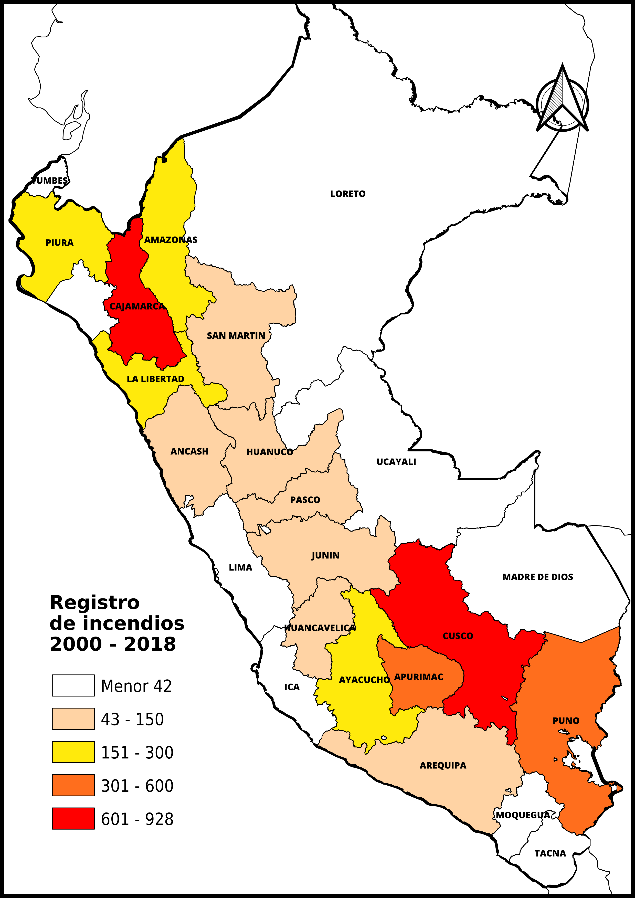
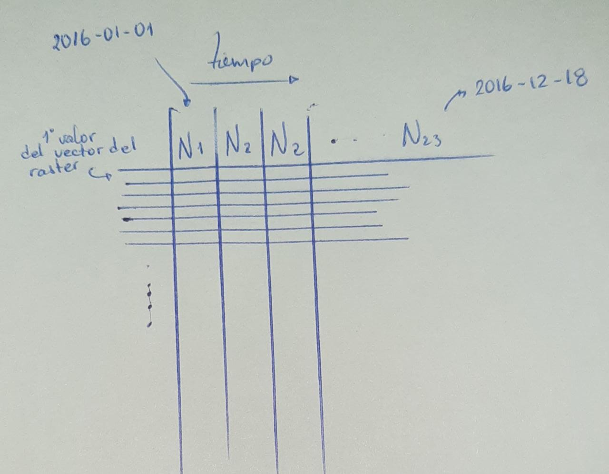
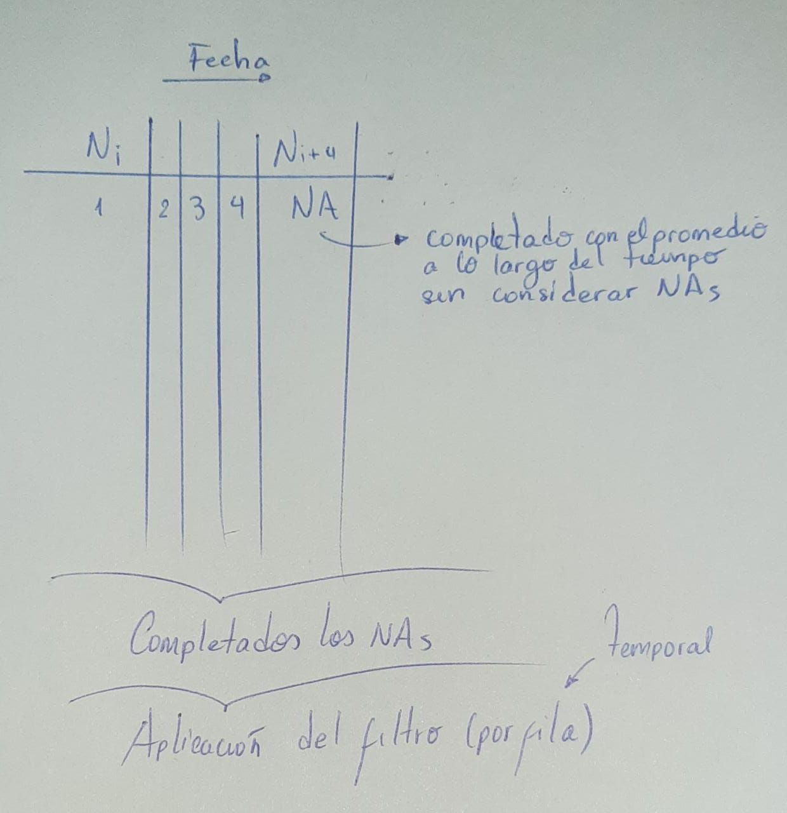

```{r setup, include=FALSE}
knitr::opts_chunk$set(warning = FALSE, message = FALSE, error = FALSE) 
```


# Introducción

<div style = "text-align: justify"> Los incendios forestales se han convertido en un problema ambiental de gran relevancia y gravedad en las últimas décadas; se presenta a nivel mundial, sobre todo en los países con grandes extensiones de áreas forestales (Sabuco, 2013), como es el caso del Perú (FAO, 2004). 
El impacto de los incendios reduce la tasa de crecimiento de los bosques, genera muerte y migración de la fauna silvestre, pérdida de la biodiversidad, trasformación de los suelos e incremento de la erosión, contaminación del aire, reducción de servicios de regulación hídrica del ecosistema, mayor incidencia en derrumbes e inundaciones, incluso la aparición de plagas y enfermedades en los bosques debilitados por dichos incendios. (MINAM, 2019).

En este análisis se evaluará la estacionalidad de las variables bioclimáticas que favorecen a la ocurrencia de incendios, desde el año 2000 al 2018.</div>

# Identificación del problema

## Planteamiento del problema

<div style = "text-align: justify"> La cobertura vegetal y toda la biodiversidad que alberga, viene siendo afectada por los incendios forestales, ocasionando efectos adversos en los diferentes ecosistemas presentes, ademas de consecuencias en todos los niveles (ecológico, económico, social y humano)en el Perú que derivan de este desastre.

Segun los registros historicos del CFOI se puede afirmar que los departamentos con mayor recurrencia de incendios son Cajamarca, Cusco, Puno, Apurímac, Amazonas, Ayacucho y Piura, en estos departamentos todos los años se van a presentar estos eventos entre los meses de junio a enero. 

En el caso de Cajamarca, gran parte de los incendios son por factor antropico, Segun un reportaje de Andina, 2016, la administradora tecnica del ATFFS de Cajamarca, Rosario Alva, explico que la quema constante de los bosques por los pobladores se da en épocas de sequía, al tener una errada idea de que así atraerán lluvias. </div>


<br/>

```{r echo = FALSE, fig.align='center', out.width="70%", fig.cap='Figura 1. Incendios forestales por la quema de malezas o residuos agrículas.'}
knitr::include_graphics('Img/planteamientoproblema.jpg')
```


## Objetivos

### Objetivo general

<div style = "text-align: justify"> El objetivo principal de este estudio es analizar la estacionalidad de variables bioclimáticas como la temperatura máxima, precipitación, NDVI y altitud en el marco del estudio de las condiciones favorables para la ocurrencia de incendios (CFOI).</div>

### Objetivos específicos

<div style = "text-align: justify"> 
* Analizar las variables bioclimáticas (calidad de vegetación, temperatura, preciptación y altitud) de forma interestacional en las zonas con CFOI 
* Ampliar el conocimiento de la influencia de las variables bioclimáticas para las CFOI y así en un futuro generar un modelo de predicción.
* Generar conocimiento y aprender la técnica de la Teledetección, además de aplicar los conocimientos aprendidos en clase.</div>

## Justificación

<div style = "text-align: justify"> Este proyecto de investigación se justifica en lo poco explorado que estan siendo los datos estadísticos relacionados al registro histórico de incendios y su distribución espacial, así como su relación con las condiciones favorables que se encuentran presentes en el momento de la aparición del incendio, aspecto que debe ser la base para el entendimiento de este fenómeno y de la generación de las políticas de Estado para atenderlo, desde una óptica de prevención y reducción del riesgo.</div>


# Antecedentes

* [Monitoreo de las condiciones favorables para la ocurrencia de incendios sobre la cobertura vegetal - CFOI](https://repositoriodigital.minam.gob.pe/bitstream/handle/123456789/652/Monitoreo-CFOI_CV.pdf?sequence=1&isAllowed=y)

* [Cajamarca: incendio forestal afectó a zona boscosa de Cerro Negro](https://andina.pe/agencia/noticia-cajamarca-incendio-forestal-afecto-a-zona-boscosa-cerro-negro-640629.aspx)

* [Ocurrencia de incendios forestales en el Perú durante eventos El Niño](https://repositorio.igp.gob.pe/bitstream/handle/20.500.12816/4704/Zubieta_etal_2019_Ocurrencia-de-incendios-forestales-en-el-Peru-durante-eventos-El-Nino.pdf?sequence=1&isAllowed=y)

* [Análise espacial de eventos](http://www.dpi.inpe.br/gilberto/livro/analise/cap2-eventos.pdf)

* [Evaluacion de algoritmos para estimar la derivada de presion en pruebas de pozos](https://dialnet.unirioja.es/descarga/articulo/5432182.pdf)

* [Uso de estimados de densidad Kernell en  la investigación de grupos cerámicos del Periodo Formativo provenientes de Chavín de Huantar](https://revistasinvestigacion.unmsm.edu.pe/index.php/Arqueo/article/view/12339/11039)  

* [Estadística no paramétrica I - youtube](https://www.youtube.com/watch?v=Q40ESwQbJO8)  

* [La problemática de los incendios forestales y bases para su teledetección en el Perú](http://journals.continental.edu.pe/index.php/apuntes/article/view/198/196)


# Marco teórico

## Importancia de los bosques

<div style = "text-align: justify"> Es necesario mencionar la importancia de los bosques. Estas zonas con este tipo de vegetación o áreas forestales son una parte imprescindible para la vida en el planeta, además de ser parte fundamental en los ciclos de producción y distribución del agua, los bosques se encargan de purificar el aire que respiramos al capturar dióxido de carbono y liberar oxígeno, de la misma forma también, regulan la temperatura y la humedad con lo que se equilibra el clima (Barrios et a., 2020). Estos tipos de vegetación también proporcionan alimento medicinas y refugio a los seres vivos y son un fuente de materia prima en muchas actividades humanas como las actividades forestales, por ejemplo. <div/>

```{r echo = FALSE, fig.align='center', out.width="70%", comment='', fig.cap = 'Figura 2. Más del 60% del territorio peruano es de bosques tropicales y es el cuarto país con más superficie de ecosistemas en el mundo.'}
knitr::include_graphics('Img/importanciaforestal.jpg')
```

## Amenazas forestales

<div style = "text-align: justify"> La vegetación forestal tiene muchos beneficios, sin embargo todos estos procesos vitales se ven amenazados por diversos factores ajenos a las actividades forestales como la degradación de suelos, la deforestación, la tala inmoderada y los fuegos no controlados que muchas veces están relacionados con otras actividades como la agricultura, la ganadería y el desarrollo urbano. Si bien, usualmente, el fuego en los bosques tiene una connotación negativa, el fuego puede tener una influencia positiva en la naturaleza pues ayuda a mantener la biodiversidad e incluso es necesario para la germinación de ciertas plantas. No obstante esta estrategia que tienen algunas plantas de ser estimuladas por el fuego fue producto de la evolución y producto de algunos fuegos estacionales que se producen de manera natural, pero cuando estos fuegos se producen de manera muy frecuente o son provocados por un uso irresponsable o son producto de alguna negligencia puede convertirse en un incendio forestal con unas consecuencias devastadoras para el medio ambiente e incluso para la salud y seguridad de las personas. <div/>

```{r echo = FALSE, fig.align='center', out.width="70%", comment='', fig.cap='Figura 3.Sin bosques no se podría contener las emisiones del dióxido de carbono (CO2) y sin la existencia de esta cobertura vegetal tampoco sería posible la vida en el planeta.'}
knitr::include_graphics('Img/amenazasforestales.jpg')
```

## Fuego

<div style = "text-align: justify"> Según Rodríguez (2010), el fuego se define como la liberación de energía en forma de luz y calor producida por la combustión de un cuerpo, lo que lleva a una descomposición rápida del combustible originada por una temperatura elevada y la presencia de oxígeno. <div/>

```{r echo = FALSE, fig.align='center', comment='', out.width="70%", fig.cap='Figura 4. El incendio es un fuego fuera del control.'}
knitr::include_graphics('Img/fuego.gif')
```

## Triángulo del fuego (origen)

<div style = "text-align: justify"> Para que el fuego se pueda presentar se necesita de tres elementos: Combustible, calor y oxígeno. Si no llegase a presentarse uno de estos, la conflagración no se produciría. La (Figura) en el recuadro (a.) muestra esta representación. 


* **Combustible.** El combustible se define como cualquier sólido, líquido o gas que puede ser oxidado. La mayoría de los combustibles o agentes reductores contienen un gran porcentaje de carbono e hidrógeno. 

* **Oxígeno** (Agente Oxidante). En la mayoría de los casos, el agente oxidante será el oxígeno que se encuentra en el aire; sin embargo la combustión de nitrato de sodio y el cloruro de potasio liberan su propio oxígeno donde no exista un ambiente sin oxígeno. 

* **Calor.** La temperatura es la medida de actividad molecular dentro de una sustancia. En presencia de una gente oxidante, un combustible con un nivel de energía lo suficientemente alto puede arder. 

* **La Gran Triada.** Otra representación característica es la gran tríada en la cual se relacionan los combustibles, el tiempo atmosférico y la topografía, donde el primero de estos es el único elemento donde el hombre puede actuar directamente, a diferencia de los dos últimos, los cuales no pueden modificarse. La (Figura 5) en el recuadro (b.) muestra esta representación. <div/>

```{r echo = FALSE, fig.align='center', out.width="70%", fig.cap='Figura 5. Representación del Triángulo de Fuego. & b. La gran Triada. Fuente: Comisión Nacional Forestal (2010). Incendios Forestales, guía práctica para comunicadores. (Tercera edición), 6-8.'}
knitr::include_graphics('Img/triadafuego.png')
```

## Incendio forestal (IFs)

<div style = "text-align: justify"> Los incendios forestales se pueden definir como aquella situación cuando un fuego sin control se propaga libremente afectando a diversas áreas como selvas, bosques y vegetación de zonas áridas y semiáridas. Una manera más simple de definir un incendio forestal sería como la combustión de la vegetación forestal sin control.

El estudio de IFs sigue siendo un desafío para la ciencia y el manejo forestal, debido a la interacción entre factores naturales y antrópicos (Lippok et a., 2013). <div/>


```{r echo = FALSE, fig.align='center', comment='', out.width="70%", fig.cap='Figura 6. Cuando afecta zonas no boscosas ni aptas para la forestación, se incluye el término incendio rural.'}
knitr::include_graphics('Img/incendioforestal.gif')
```

## Causas de los incendios forestales

<div style = "text-align: justify">Se calcula que las actividades humanas ocasionan el 99% de ellos y solo el resto tiene como causa fenómenos naturales como descargas eléctricas y la erupción de volcanes. Dentro de las principales actividades humanas para el origen de un incendio forestal podemos mencionar situaciones accidentales, por ejemplo, rupturas de líneas eléctricas, accidentes automovilísticos, accidentes ferroviarios e incluso accidentes aéreos, también por negligencias como quemas agropecuarios no controladas, fogatas de excursionistas o incluso actividades de fumadores, quema de basura, la limpieza de vías en carreteras y uso del fuego en otras actividades productivas dentro de las áreas forestales, también una de las causas es por situaciones intencionales como quemas por conflictos entre personas o comunidades, también se puede deber a la tala ilegal o incluso por litigios.<div/>


## Regiones con mayor cantidad de incendios

<div style = "text-align: justify"> En los últimos años los IFs han impactado severamente varias regiones del Perú, como Cusco, Apurímac, Lambayeque, Piura y Cajamarca (INDECI, 2013; El Comercio, 2018). <div/>


```{r eval=FALSE, message=FALSE, echo = FALSE, warning=FALSE, cache=FALSE}
# Incendios acumulados por mes
shp   <- st_read('Materiales/registro_incendios_2000_2018.gpkg')
Departamentos <- st_read('Materiales/Departamentos.gpkg')
y <- st_intersects(Departamentos, shp)

for (i in 1:nrow(Departamentos)) {
  Departamentos[i, "NIncendios"] = length(y[[i]])
}

st_write(Departamentos[,c(2,6)], "Materiales/DepartamentosIncendios.gpkg")
```

```{r echo = FALSE, fig.align='center', comment='', out.width="70%", fig.align='center', fig.cap='Figura 7. Conteo de la incidencia de incendios en el Perú desde el 2000 al 2018.'}
knitr::include_graphics('Img/incendiosporregiones.png')
```

## Monitoreo de bosques

El monitoreo de bosques a nivel nacional, a partir del uso de sensoramiento remoto el cual permite documentar la deforestación/cambio de uso de la tierra y catastro forestal por parte de GEO-BOSQUES, GEOSERVIDOR y GEO-SERFOR de los Ministerios del Ambiente (MINAM) y Agricultura, respectivamente, contribuye a la gestión forestal de los gobiernos regionales y locales. El MINAM, en el marco de sus funciones, al evaluar y monitorear los ecosistemas y la biodiversidad en el territorio nacional, reporta por medio de mapas la existencia de [condiciones favorables para la ocurrencia de IFs](http://geoservidor.minam.gob.pe/monitoreo-y-evaluacion/cfoi/). Estos mapas tienen por objetivo realizar una labor de previsión que contribuya a la toma de decisiones.

```{r echo = FALSE, fig.align='center', comment='', out.width="70%", fig.align='center', fig.cap='Figura 8. Geoservidor del MINAM, permite el acceso a información más detallada de condiciones favorables para la ocurrencia de incendios.'}
knitr::include_graphics('Img/monitoreodebosques.png')
```


## Función kernel

<div style = "text-align: justify">Una alternativa simple para analizar el comportamiento de patrones de puntos, es estimar la *intensidad puntual del proceso en toda la región de estudio*. Para esto usaremos una función bidimensional sobre los eventos considerados, generando una superficie cuyo valor será proporcional a la *intensidad de muestras por unidad de área*. Esta función realiza un conteo de todos los puntos dentro de una región de influencia, ponderándolos por la distancia de cada uno con respecto a la localización de interés.

Para conocer el comportamiento de esta función no parámetrica de probabilidad, plateamos unas carácteristicas:

* Aveces, el Kernel es una funcion de ventana (window function), esto quiere decir que si hay valores que caen dentro de esa ventana (área) tendrá un valor peso asignado.
* Una función ventana fuera de cierto intervalo adopta el valor 0, normalmente, u otro peso.
* Un kernel, a su vez, es una funcion no negativa.
* Usaremos un parámetro de suavizacion o bandwidth $(h)$, que mientras mas alto, mas suavizamos.
* Usaremos el $n$ para definir el número de observaciones que analizaremos (donde cada dato es el centro donde se coloca un kernel)
* Tanto el $n$ como el $h$ determinarán el area de influencia de los puntos a ser interpolados. 

La ecuación para la estimación de la densidad para un punto $x$ sería: </div>

$${\displaystyle {\widehat {f}}_{h}(x)={\frac {1}{n}}\sum _{i=1}^{n}K_{h}(x-x_{i})={\frac {1}{nh}}\sum _{i=1}^{n}K{\Big (}{\frac {x-x_{i}}{h}}{\Big )}}$$

Donde:

* $n  :$ Número de observaciones (cada datos es el centro donde se coloca el kernel).
* $h  :$ Ancho de banda.
* $K  :$ Es la función kernel.

<br/>


## Filtro Digital Savitzky-Golay

<div style = "text-align: justify">Tiene como objetivo la disminucion del ruido de una curva. Esta curva la definimos como los valores de cada pixel a lo largo de un periodo dado, en nuestro caso el valor del píxel será el NDVI. Esta optimización se basó inicialmente en una tabla de términos que suavizaban puntos a partir de la simplificación del método de mínimos cuadrados (puntos equisdistantes al eje X), posteriormente el método incorporó otros métodos de auto-optimización subjetiva (como el ajuste del grado del polinomio y la longitud de ventana) basadas en un prueba F para escoger el grado del polinomio óptimo. *Este método nos servirá para completar los datos del índice NDVI, para lo años de estudio.* </div>


# Descripción del área de estudio

## Localización

<div style = "text-align: justify">Nuestro área de estudio será sustenta con los procedimientos de nuestra metodología, para ello, aplicaremos la función kernel de densidad para estimar los lugares en donde se darían más los incendios. Así, hasta el momento, tenemos como área de estudio a la provincia de Cutervo, departamento de Cajamarca. Como en los apartados posteriores generaremos mapas respecto a la ubicación de esta provincia, solo mostraremos un mapa de ubicación referencial, por ahora.</div>

```{r echo = FALSE, out.width="70%", fig.align='center', fig.cap='Figura 9.'}

```

## Aspecto generales

Describir nuestra área de estudio, que cubre diversas regiones, más en la zonas altoandina, referenciarse del documento del NIÑO, mencionar ecosistemas

# Materiales y herramientas

## Data histórica de incendios 2000-2018

<div style = "text-align: justify">Este registro abarca los años 2000 a 2018, descargados del [Geoservidor del Ministerio del Ambiente (MINAM)](https://geoservidor.minam.gob.pe/monitoreo-y-evaluacion/registros-historicos-cfoi/).</div>

## Datos modis

## Datos pisco

## DEM SRTM V4

<div style = "text-align: justify"> Presentamos el DEM SRTM V4, que fue encontrado en la plataforma Google Earth Engine. Este DEM tiene una resolución espacial de 90 m, y está apto para el estudio de nuestro análisis.</div>


## R

<div style = "text-align: justify">En este proyecto de investigación se utilizó dos lenguajes de programación, tanto R como Python. Para nuestro propósito se necesitará de varios paquetes, se mencionan a continuación: </div>    

### Librerias de R utilizadas 

```{r warning=FALSE, message=FALSE, eval=TRUE}
library(dplyr)
library(ggplot2)
library(tidyverse)
library(sf)
library(rgee)
library(mapedit)
library(raster)
library(cptcity)
library(leaflet)
library(leaflet.extras)
library(leafpop)
library(MASS)
library(dplyr)
library(ncdf4)
library(devtools)
library(velox)
library(signal)
library(foreach)
library(RColorBrewer)
library(reshape2)
```

## Python

### Librerias de Python utilizadas 

```{python warning=FALSE, message=FALSE, eval=FALSE}
import numpy as np ## For array handling
import pandas as pd ## For dataframes
import ee # # Authenticates and initializes Earth Engine
import geemap # A dynamic module of Google Earth Engine
import fiona # For geopackage file handling 
from shapely.geometry import shape ## Shapes f  or geometries
import os #To set and modify filepaths
import json # For json objects
import urllib # For download geopackage files
import matplotlib.pyplot as plt
from scipy import signal ## Aplying Savistky Golay
import rasterio as rio # For raster analysis
```

## Google earth engine

<div style = "text-align: justify">
Cabe mencionar que todos los procesos "pesados" que normalmente consumirían muchos recursos de una computadora convencional, lo realizamos en la plataforma ***Google Earth Engine (GEE)***. Para conectar con esta increíble plataforma nos ayudamos de las APIS para los lenguages seleccionados. Con R usamos el paquete RGEE y para Python, geemap el cual junto con sus procedimientos reproducibles se encuentran en el siguiente [link](https://drive.google.com/drive/u/1/folders/1GmVLzYTJ2QlTP18KXViBaKMdh28uEeya).
</div>

***Iniciamos sesion en GEE***
```{python eval = FALSE, echo = FALSE}
Sys.setenv(RETICULATE_PYTHON = "")
```

```{r eval=TRUE, echo=FALSE, warning=FALSE, message=FALSE, comment='', error=FALSE}
# Inicializando sesion en GEE
# ee_install()
ee_Initialize('juliocontreras1', drive =TRUE)
# ee_clean_pyenv()

# rgee::ee_install_set_pyenv(
  # py_path = "C:/Program Files/QGIS 3.16/bin/python3", # Change it for your own Python PATH
  # py_env = "rgee" # Change it for your own Python ENV
# )
```

# Metodología

## Diagrama de flujo metodológico

<div style = "text-align: justify">Nuestra metodología se resume en cuatro principales etapas, tal y como se describe en la siguiente figura:</div>

```{r echo = FALSE, fig.align='center', comment='Figura 10. Metodología del Trabajo.', out.width="70%"}
knitr::include_graphics('Img/metodologia_4etapas.jpg')
```
<div style = "text-align: justify">Cabe mencionar que esta metodología podría extenderse para la presentanción final del trabajo, ya que dentro de nuestros objetivos especificos tenemos la idea de crear un modelo de predicción, el cual necesitará de más análisis de variables para que sea más consistente.</div>


## Localización del área de estudio

<div style = "text-align: justify"> 
Nuestra investigación empieza con el análisis de las zonas de incendios (puntos) a lo largo de los años, especificamente en el periodo 2000 al 2018. Para este propósito necesitaremos un área en específico de estudio, pero, ¿realmente sabemos en donde hay mayor probalidad de ocurrencia de incendios?, o mejor dicho, ¿dónde hay una mayor tendencia a ocurrir estos fenómenos?. Entonces, para ello, utilizaremos la información del geoservidor del MINAM que nos proporciona información de incendios históricos, así detallaremos los procedimientos para localizar nuestra área de estudio, a partir de los datos mencionados, en los apartados posteriores.
</div> 

## Diagrama de barras de la acumulación de incendios a lo largo del tiempo

<div style = "text-align: justify">Ahora, analizaremos la tendencia de la ocurrencia de los incendios a lo largo del tiempo, para ello, necesitaremos de la estadística, la cual no brida diversas herramientas para nuestro propósito. En este apartado generaremos un histograma de cantidad de incendios en el tiempo. Tendremos como resultado en qué años predominan.</div>

```{r eval=TRUE, message=FALSE, echo = FALSE, warning=FALSE, cache=FALSE, out.width="70%", fig.align='center', fig.cap='Figura 11.'}
# Incendios acumulados por mes
shp   <- 'Materiales/registro_incendios_2000_2018.gpkg'
fires <- st_read(shp, quiet = TRUE) %>% 
  mutate(Date = paste(`AñO`,
                      MES_N, 1, 
                      sep = '-')) %>% 
  group_by(Date) %>% 
  summarise(nfires = length(Date)) %>% 
  mutate(Date = as.Date(Date)) %>%
  arrange(Date) %>% 
  as.data.frame() %>%
  dplyr::select(-geom)
# Como no todos los meses hay incendios se necesita tener todos los meses para generar el histograma
ts    <- data.frame(Date = seq(as.Date('2000-08-01'), 
                               as.Date('2018-12-01'), 
                               by = 'month')) %>% 
  full_join(fires) 

# Generación del histograma

X <- ggplot(ts, aes(x=Date, y=nfires)) + 
  geom_bar(stat="identity", 
           fill="gray", 
           colour="black") +
  theme_bw() + 
  ylab(label = 'Número de incendios\n') +  
  xlab(label = '') + 
  ggtitle(paste('Eventos de incendios \ndel año 2000 al 2018', sep = '')) +
  theme(plot.title = element_text(hjust = 0.5, face = 'bold', size=15),
        axis.text.x  = element_text(size=11, angle = 75, hjust = 1),
        axis.text.y  = element_text(size=11),
        axis.title.y = element_text(size = 12, hjust = 0.5, face = 'bold', vjust = 0.5)) + 
  scale_x_date(limits = c(as.Date('2000-07-01'),
                          as.Date('2019-01-01')),
               date_labels = ("%Y"), 
               breaks = '1 year') +
  scale_y_continuous(breaks = seq(0,500,50))
X
```

<div style = "text-align: justify"> Como se puede observar, el histograma nos muestra que hay un cierta tendencia en los años 2005, 2010 y 2016. Esto quiere decir que han habido gran cantidad de incendios en esas épocas. Vale decir que este gráficos tambien nos muestra que en el año 2001, no hubo recopilación de estos fenómenos por parte de la entidad encarga, o si lo hubo, no han sido publicados. Esta información nos servirá para hacer los análisis temporales a lo largo de los años, y tener presente solo tres años en particular, los ya mencionados.

Nosotros no nos quedamos con la información del este gráfico, sino buscamos alguna influencia para que se diera este fenómeno. Así, dos de estos años con gran tendencia de incendios coinciden con eventos extremos de sequía, en un estudio realizado por el [Senamhi](https://bit.ly/3hX0K8a), se determinó que el año 2005 y 2016, ocurrieron grandes sequías en las zonas altoandinas, para ello, se utilizó el índice estandarizado de precipitación (SPI). El año 2010, tiene también un relativo SPI negativo, pero no llega a niveles extremos como en los años mencionados. Además, mencionamos que el 2004 es el año con mayor SPI, en el rango de los años de estudio, pero las sequías evidenciadas en este año se dieron durante la fase neutra del ENOS. En los demás años (7) de sequías extremas pertenecieron a la fase cálida del El Niño Oscilación Sur (ENOS).</div>

## Distribución de los incendios por años de 2000 - 2018

<div style = "text-align: justify"> En el apartado anterior generamos un histograma, para que se entienda mejor la distribución de los puntos de incendios se procedió a plotear los puntos de una manera más interactiva, así ver tambien, cómo se comporta la distribución de incendios a traves de los años de estudio. <div/>

<style>
.html-widget {
    margin: auto;
}
</style>

```{r leaflet, eval=TRUE, message=FALSE, echo = FALSE, warning=FALSE, cache=FALSE, out.width="825px", fig.align='center', fig.cap='Figura 12.'}
# Incendios acumulados por mes
Departamentos <- st_read('Materiales/DepartamentosIncendios.gpkg', quiet = TRUE)
shp   <- 'Materiales/registro_incendios_2000_2018.gpkg'
fires <- st_read(shp, quiet = TRUE) %>%
  mutate(Date = paste(`AñO`), Fecha = paste(`AñO`, MES_N, DIA, sep = '-')) %>% 
  as.data.frame() %>%
  dplyr::select(Date, Fecha, LOCALIDAD, 
                DES_EMERGE, DES_FUENTE, DES_DANO, 
                NOMBDIST, NOMBPROV, NOMBDEP, COOR_X, COOR_Y, -geom)
names(fires) <- c("Date", "Fecha", "Localidad", 
                  "Causa", "Acción", "Daños",
                  "Distrito", "Provincia", "Departamento", "Longitud", "Latitud")

# Este es más dinámico
Number_JmType <- fires$Date %>% unique() %>% length() # Numero de especies
Names_JmType <- fires$Date %>% unique() ## Nombre de las especies
Colores <- c("#ef3b2c", "#ffffff", "#807dba", "#33a02c", "#fed976", 
             "#000000", "#0570b0", "#a6cee3", "#1f78b4", "#b2df8a",
             "#33a02c", "#fb9a99", "#e31a1c", "#fdbf6f", "#ff7f00",
             "#cab2d6", "#6a3d9a", "#b15928") # colorbrewer2, Colores de las especies seran
pal <- colorFactor(Colores, domain = Names_JmType) # Generamos la paleta


# Partimos un sf en varios sf
Spp_Pres <- list()
for (i in 1:length(Names_JmType)) {
  Spp_Pres[[i]] <- fires %>% dplyr::filter(Date == Names_JmType[i])
}
names(Spp_Pres) <- Names_JmType

# Ploteamos cada sf, pero sin leyenda
Spp_Map <- leaflet() %>% addTiles(urlTemplate = "https://cartodb-basemaps-{s}.global.ssl.fastly.net/dark_all/{z}/{x}/{y}.png") %>%
  addPolygons(data = Departamentos, fillOpacity = 0, weight = 1, opacity = 1,
              label = ~DEPARTAMEN, color = "#ef3b2c", group = "Departamentos")

for (i in 1:length(Spp_Pres)) {
  Spp_Map <- Spp_Map %>%
    addCircleMarkers(data = Spp_Pres[[i]],
                     lat = ~Latitud, lng = ~Longitud, fillColor = ~pal(Date),
                     fillOpacity = 0.8, radius = 6, weight = 0.5, label = ~Provincia,
                     color = ~pal(Date), group =  Names_JmType[i], 
                     popup = popupTable((Spp_Pres[[i]])[,2:length(Spp_Pres[[i]])],
                                        row.numbers = F, feature.id = F))
}


# Agremos leyenda y su visualizador por grupos, tanto leyenda como suelos
Spp_Map <- Spp_Map %>%
  addLegend(data = fires, "bottomleft", pal = pal, 
                values = ~Date, title = "Inc: 2000-2018", 
                opacity = 0.8, group = "Leyenda") %>%
  addLayersControl(overlayGroups = c("Leyenda"), baseGroups = Names_JmType,
                   options = layersControlOptions(collapsed = FALSE), position = "topright")
Spp_Map
```
  
<br/>

## Estimación de densidad de probabilidad 2D: función de densidad no paramétrica

<div style = "text-align: justify"> Se tratará suavizar una serie, que sería la distribución de los incendios por tiempo y espacio, tanto en el eje x e y. Pensabamos que sería algo extraño que ocurriera un incendio en un lugar determinado y no haya alguna probabilidad que ocurra esto en sus alrededores cercanos. Así, nos dimos cuenta la manera en que funciona esta estadística. <div/>

<br/>

<div style = "text-align: justify"> Cuando recordamos nuestro curso de estadística pensabamos en las funciones de densidad parámetricas, donde la función depende de la varianza o media muestral, por ejemplo, la función de probabilidad normal. En este caso la función kernel estima la densidad de probabilidad para calcular en porcentaje la posibilidad de ocurrencia de incendios para cada pixel, clusterizando las regiones con mayor probabilidad por sobre un umbral definido, además se muestra la región a partir de la cual se basará nuestros graficos de análisis posteriores.<div/>

<br/>

<div style = "text-align: justify">Basicamente, esta función del paquete MASS, en R, varía por ubicación (asignandole peso), ese es el porqué de su argumento de coordenadas.</div>

<div style = "text-align: justify"> Cabe mencionar que para ver nuestro trabajo en códigos, visitar la página de nuestro repositorio en [Github](https://github.com/ContrerasNk/AnalisOcurrenIncendiosR). <div/>

<br/>

```{r eval=TRUE, message=FALSE, echo = FALSE, warning=FALSE, comment=FALSE, out.width="825px"}
fires  <- st_read('Materiales/registro_incendios_2000_2018.gpkg', quiet = TRUE)
peru <- st_read('Materiales/Peru.gpkg', quiet = TRUE)
Departamentos <- st_read('Materiales/DepartamentosIncendios.gpkg', quiet = TRUE)

# Extracción de coordenadas de los puntos
fires_df <- st_coordinates(fires) %>% as.data.frame()
names(fires_df) <- c('lon','lat')#here

# Aplicación de la estimación
kde <- kde2d(fires_df$lon, fires_df$lat, n = 250, h = 0.8, lims = c(-86, -65, -19, 0))
kde_raster <- kde %>% raster() %>% crop(peru) %>% mask(peru) %>% disaggregate(fact = 5, method = "bilinear")
kde_raster <- kde_raster * 100

pal <- colorNumeric(c("#3182bd", "#fec44f", "#f03b20"), values(kde_raster), na.color ="transparent")
                   
leaflet() %>% addTiles() %>%
  addRasterImage(kde_raster, colors = pal) %>% 
  addLegend(pal = pal, values = values(kde_raster),title = "% Incendios") %>%
  addPolygons(data = Departamentos, fillOpacity = 0, weight = 2,
              opacity = 1, label = ~DEPARTAMEN, color = "#000000", group = "Departamentos")
```

<br/>

## Elección del área de estudio

```{r eval=TRUE, message=FALSE, echo = FALSE, warning=FALSE, cache=FALSE, out.width="825px"}
Provincias <- st_read('Materiales/Provincias.gpkg', quiet = TRUE)
Cutervo <- st_read('Materiales/area.gpkg', quiet = TRUE) # abajo el guardado

kde_raster_clas <- kde_raster

kde_raster_clas[kde_raster < 5] = NA
kde_raster_clas[kde_raster >= 5] = 1

# writeRaster(kde_raster, 'raster2.tif')

kde_sf <- rasterToPolygons(kde_raster_clas, dissolve = T) %>% # dissolve = no sigue la forma interna de pixeles
  disaggregate() %>% # multipoligon
  st_as_sf() 

# st_write(kde_sf, "Materiales/allareas.gpkg")

kde_sf <-  kde_sf %>% mutate(id = 1:nrow(kde_sf), area = st_area(geometry)/1000000) %>% 
  arrange(desc(area)) %>%
  dplyr::filter(id == 3) %>%
  st_simplify(dTolerance = 1700)

# st_write(kde_sf, "Materiales/area.gpkg")
  
# Posicion para el ploteo
centroid <- st_centroid(Cutervo)
X <- (st_coordinates(centroid))[,"X"]
Y <- (st_coordinates(centroid))[,"Y"]

# Interactivo
leaflet() %>% 
  addTiles(urlTemplate = "https://cartodb-basemaps-{s}.global.ssl.fastly.net/dark_all/{z}/{x}/{y}.png", group = "Dark") %>%
  addTiles(urlTemplate = "https://server.arcgisonline.com/ArcGIS/rest/services/World_Imagery/MapServer/tile/{z}/{y}/{x}", group = "Satellite") %>%
  setView(lng = X, lat = Y, zoom = 6.5) %>%
  addRasterImage(kde_raster_clas, colors = "#f03b20", group = "Density") %>%
  # addLegend(pal = pal, values = values(kde_raster),title = "% Incendios") %>%
  addPolygons(data = Provincias, fillOpacity = 0, weight = 1, opacity = 1, 
              label = ~PROVINCIA, color = "#ffff33", group = "Provincias") %>%
  addPolygons(data = Cutervo, fillOpacity = 0, weight = 4, opacity = 1,
              label = ~area, color = "#54278f",group = "Anta") %>%
  addLayersControl(baseGroups = c("Dark", "Satellite"), overlayGroups = "Density",
                   options = layersControlOptions(collapsed = FALSE), position = "topright")
```


## Variabilidad estacional de la ocurrecia de incendios

<div style = "text-align: justify"> Se verá el comportamiento estacional promedio y máximo, para un registro de incendios 2000 - 2018.</div>


```{r eval=TRUE, message=FALSE, echo = FALSE, warning=FALSE, cache=FALSE, fig.align='center'}
fires <- st_read('Materiales/registro_incendios_2000_2018.gpkg', quiet = TRUE)

yr <- 2005

# CREACION Y MANIPULACION DE TABLA PARA EL PLOTEO
a <- fires %>% group_by(Date = paste(`AñO`, MES_N, sep = '-')) %>%
  summarise(nfires = length(Date)) %>% 
  group_by(MES = substr(Date,6,7)) %>% 
  summarise(fires_mean = mean(nfires, na.rm = T), fires_max  = max(nfires, na.rm = T)) %>%
  mutate(MES = as.numeric(MES)) %>% arrange(MES) %>% as.data.frame() %>% dplyr::select(-geom)

b <- fires %>% dplyr::filter(`AñO`== yr) %>%
  mutate(MES = MES_N) %>%
  group_by(MES) %>% 
  summarise(fires_anom = length(MES)) %>%
  as.data.frame() %>% dplyr::select(-geom)


df <- data.frame(MES = c(1:12)) %>% 
  full_join(a, by = 'MES') %>% 
  full_join(b, by = 'MES') %>% 
  dplyr::select(-MES) %>%
  mutate(Date = seq(as.Date('2018-01-01'), as.Date('2018-12-01'), by='month'),
         fires_mean = ifelse(is.na(fires_mean), 0, fires_mean),
         fires_max  = ifelse(is.na(fires_max), 0, fires_max),
         fires_anom = ifelse(is.na(fires_anom), 0, fires_anom),
         label_mean = 'mean', label_max = 'max', label_anom = 'anom')

# CAMBIO DE IDIOMA

# PLOTEO  
X <- ggplot(df) +
  geom_bar(aes(x = Date, y = fires_mean, fill = label_mean),
           stat = "identity", fill = 'blue', colour = 'blue', alpha = 0.4) +
  geom_bar(aes(x = Date, y = fires_anom, fill = label_anom), 
           stat = "identity", fill = 'gray', colour = 'black', alpha = 0.4) +
  geom_bar(aes(x = Date, y = fires_max,  fill = label_max), 
           stat = "identity", colour = 'red', alpha=0) +
  ggtitle('Comportamiento Mensual de Incendios', 
          subtitle = paste0('Desde 2000 hasta 2018\nAño ', as.character(yr))) +
  theme_bw() + 
  labs(y = 'Número de incendios', x = '') +
  theme(plot.title    = element_text(size = 20, hjust = 0.5, face = 'bold'),
        plot.subtitle = element_text(size = 12, hjust = 0.5, face = 'italic'),
        axis.text.x   = element_text(size = 12, hjust = 1),
        axis.text.y   = element_text(size = 12),
        axis.title.y  = element_text(size = 15, hjust = 0.5, face = 'bold', vjust = 0.5))  + #
  scale_x_date(date_labels = "%b", breaks = '1 month') +
  scale_y_continuous(breaks = seq(0,140,20), limits = c(0, 140)) +
  guides(fill = guide_legend(override.aes = list(color = "blue", fill = "blue")))
  #+ 
  # theme(legend.position = "none")
X


# element_rect(
#   fill = NULL,
#   colour = NULL,
#   size = NULL,
#   linetype = NULL,
#   color = NULL,
#   inherit.blank = FALSE
# )
  # ggtitle(paste('Eventos de incendios \ndel año 2000 al 2018', sep = '')) +
  # theme(plot.title = element_text(hjust = 0.5, face = 'bold', size=15),
  #       axis.text.x  = element_text(size=11, angle = 75, hjust = 1),
  #       axis.text.y  = element_text(size=11),
  #       axis.title.y = element_text(size = 12, hjust = 0.5, face = 'bold', vjust = 0.5)) 
# ggsave(plot = X, filename = paste0('Img/Bar_Fires_', as.character(yr),'.png'), units = "cm", dpi = 500)
```

```{r eval=TRUE, message=FALSE, echo = FALSE, warning=FALSE, cache=FALSE, fig.align='center'}
fires <- st_read('Materiales/registro_incendios_2000_2018.gpkg', quiet = TRUE)

yr <- 2010

# CREACION Y MANIPULACI?N DE TABLA PARA EL PLOTEO
a <- fires %>% group_by(Date = paste(`AñO`, MES_N, sep = '-')) %>%
  summarise(nfires = length(Date)) %>% 
  group_by(MES = substr(Date,6,7)) %>% 
  summarise(fires_mean = mean(nfires, na.rm = T), fires_max  = max(nfires, na.rm = T)) %>%
  mutate(MES = as.numeric(MES)) %>% arrange(MES) %>% as.data.frame() %>% dplyr::select(-geom)

b <- fires %>% dplyr::filter(`AñO`== yr) %>%
  mutate(MES = MES_N) %>%
  group_by(MES) %>% 
  summarise(fires_anom = length(MES)) %>%
  as.data.frame() %>% dplyr::select(-geom)


df <- data.frame(MES = c(1:12)) %>% 
  full_join(a, by = 'MES') %>% 
  full_join(b, by = 'MES') %>% 
  dplyr::select(-MES) %>%
  mutate(Date = seq(as.Date('2018-01-01'), as.Date('2018-12-01'), by='month'),
         fires_mean = ifelse(is.na(fires_mean), 0, fires_mean),
         fires_max  = ifelse(is.na(fires_max), 0, fires_max),
         fires_anom = ifelse(is.na(fires_anom), 0, fires_anom),
         label_mean = 'mean', label_max = 'max', label_anom = 'anom')

# CAMBIO DE IDIOMA

# PLOTEO  
B <- ggplot(df) +
  geom_bar(aes(x = Date, y = fires_mean, fill = label_mean),
           stat = "identity", fill = 'blue', colour = 'blue', alpha = 0.4) +
  geom_bar(aes(x = Date, y = fires_anom, fill = label_anom), 
           stat = "identity", fill = 'gray', colour = 'black', alpha = 0.4) +
  geom_bar(aes(x = Date, y = fires_max,  fill = label_max), 
           stat = "identity", colour = 'red', alpha=0) +
  ggtitle('Comportamiento Mensual de Incendios', 
          subtitle = paste0('Desde 2000 hasta 2018\nAño ', as.character(yr))) +
  theme_bw() + labs(y = 'Número de incendios', x = '') +
  theme(plot.title    = element_text(size = 20, hjust = 0.5, face = 'bold'),
        plot.subtitle = element_text(size = 12, hjust = 0.5, face = 'italic'),
        axis.text.x   = element_text(size = 12, hjust = 1),
        axis.text.y   = element_text(size = 12),
        axis.title.y  = element_text(size = 15, hjust = 0.5, face = 'bold', vjust = 0.5))  + #
  scale_x_date(date_labels = "%b", breaks = '1 month') +
  scale_y_continuous(breaks = seq(0,140,20), limits = c(0, 140)) + 
  theme(legend.position = "none")
B
```

```{r eval=TRUE, message=FALSE, echo = FALSE, warning=FALSE, cache=FALSE, fig.align='center'}
fires <- st_read('Materiales/registro_incendios_2000_2018.gpkg', quiet = TRUE)

yr <- 2016

# CREACION Y MANIPULACI?N DE TABLA PARA EL PLOTEO
a <- fires %>% group_by(Date = paste(`AñO`, MES_N, sep = '-')) %>%
  summarise(nfires = length(Date)) %>% 
  group_by(MES = substr(Date,6,7)) %>% 
  summarise(fires_mean = mean(nfires, na.rm = T), fires_max  = max(nfires, na.rm = T)) %>%
  mutate(MES = as.numeric(MES)) %>% arrange(MES) %>% as.data.frame() %>% dplyr::select(-geom)

b <- fires %>% dplyr::filter(`AñO`== yr) %>%
  mutate(MES = MES_N) %>%
  group_by(MES) %>% 
  summarise(fires_anom = length(MES)) %>%
  as.data.frame() %>% dplyr::select(-geom)


df <- data.frame(MES = c(1:12)) %>% 
  full_join(a, by = 'MES') %>% 
  full_join(b, by = 'MES') %>% 
  dplyr::select(-MES) %>%
  mutate(Date = seq(as.Date('2018-01-01'), as.Date('2018-12-01'), by='month'),
         fires_mean = ifelse(is.na(fires_mean), 0, fires_mean),
         fires_max  = ifelse(is.na(fires_max), 0, fires_max),
         fires_anom = ifelse(is.na(fires_anom), 0, fires_anom),
         label_mean = 'mean', label_max = 'max', label_anom = 'anom')

# CAMBIO DE IDIOMA

# PLOTEO  
A <- ggplot(df) +
  geom_bar(aes(x = Date, y = fires_mean, fill = label_mean),
           stat = "identity", fill = 'blue', colour = 'blue', alpha = 0.4) +
  geom_bar(aes(x = Date, y = fires_anom, fill = label_anom), 
           stat = "identity", fill = 'gray', colour = 'black', alpha = 0.4) +
  geom_bar(aes(x = Date, y = fires_max,  fill = label_max), 
           stat = "identity", colour = 'red', alpha=0) +
  ggtitle('Comportamiento Mensual de Incendios', 
          subtitle = paste0('Desde 2000 hasta 2018\nAño ', as.character(yr))) +
  theme_bw() + labs(y = 'Número de incendios', x = '') +
  theme(plot.title    = element_text(size = 20, hjust = 0.5, face = 'bold'),
        plot.subtitle = element_text(size = 12, hjust = 0.5, face = 'italic'),
        axis.text.x   = element_text(size = 12, hjust = 1),
        axis.text.y   = element_text(size = 12),
        axis.title.y  = element_text(size = 15, hjust = 0.5, face = 'bold', vjust = 0.5))  + #
  scale_x_date(date_labels = "%b", breaks = '1 month') +
  scale_y_continuous(breaks = seq(0,140,20), limits = c(0, 140)) + 
  theme(legend.position = "none")
A
```

<br/>

<div style = "text-align: justify"> En lo gráficos generados tanto para los años 2005, 2010 y 2016, las barras con contorno rojo representan los registros máximos históricos mensuales entre el 2000 y el 2018. Las barras azules representan el número promedio de incendios mensuales y las barras grises representan el registro mensual instantaneo para los años en mención. Ahora vemos que en el año 2005 los meses en los que se supera el registro promedio mensual son julio, agosto, septiembre y noviembre, siendo julio y septiembre los que alcanzan los maximos historicos. En el año 2010, por su parte los meses de junio, agosto, septiembre, octubre y noviembre, son los que superan el promedio, siendo agosto el que alcanza el máximo histórico. Por ultimo, en le 2016, los meses de julio, agosto, septiembre y noviembre son los que superan el promedio historico, siendo septiembre y noviembre los que alcanzan los maximos históricos. En conclusion, lo meses con los más altos registros de incendios, estan comprendidos entre julio y noviembre.</div>


## Analisis temporal de datos bioclimáticos

<div style = "text-align: justify"> Este se obtendrá del producto grillado PISCO, del Servicio Nacional de Meteorología e Hidrología (SENHAMI) </div>

### Precipitacion acumulada mensual

Estos valores han sido extraidos del producto grillado PISCO del SENAMHI.

```{r eval=TRUE, message=FALSE, echo = FALSE, warning=FALSE, fig.align='center', comment='', error=FALSE}
pp_velox <- velox("RasterData/PISCO/PISCOp_v11_area.tif")                 
region <- st_read("Materiales/area.gpkg", quiet = TRUE)

data <- pp_velox$extract(sp=region, 
                         fun = function(x){
                           mean(x,na.rm=T)
                           }) %>%
        as.vector()

date <- seq(as.Date('1981-01-01'),as.Date('2018-02-01'), by='month')

pp <- data.frame(date, data) %>% 
  mutate(mes = substr(date, 6, 7)) %>% 
  group_by(mes) %>%
  summarise(ppmean = mean(data, na.rm = T), ppmax = max(data, na.rm = T), ppmin = min(data, na.rm=T))  

pp2000 <- data.frame(date, pp2000 = data) %>% 
  mutate(mes = substr(date, 6, 7)) %>%
  dplyr::filter(substr(date, 1, 4) == 2000) %>% 
  dplyr::select(-date)

pp2005 <- data.frame(date, pp2005 = data) %>% 
  mutate(mes = substr(date, 6, 7)) %>% 
  dplyr::filter(substr(date, 1, 4) == 2005) %>% 
  dplyr::select(-date)

pp2010 <- data.frame(date, pp2010 = data) %>% 
  mutate(mes = substr(date, 6, 7)) %>%
  dplyr::filter(substr(date, 1, 4) == 2010) %>% 
  dplyr::select(-date)

pp2016 <- data.frame(date, pp2016 = data) %>% 
  mutate(mes = substr(date, 6, 7)) %>%
  dplyr::filter(substr(date, 1, 4) == 2016) %>% 
  dplyr::select(-date)

df <- data.frame(date = seq(as.Date('2018-01-01'), as.Date('2018-12-01'), by = 'month'), pp) %>%
  full_join(pp2000) %>% full_join(pp2005) %>%
  full_join(pp2010) %>% full_join(pp2016)


X <- ggplot(df, aes(date, ppmean)) +
  geom_line(colour = 'black', size=.8) +
  theme_bw() + 
  ylab(label = '[mm]') +
  xlab(label = '') +
  ggtitle('Precipitacion acumulada mensual', subtitle = 'De 1981 hasta 2018') +
  theme(plot.title = element_text(size = 16, hjust = 0.5, face = 'bold'),
        plot.subtitle = element_text(size=13, hjust=0.5, face = 'italic'),
        axis.text.x = element_text(size=12), axis.text.y = element_text(size=12),
        axis.title = element_text(size=20), axis.title.y =  element_text(size=12, face='bold')) +
  scale_x_date(date_labels = '%b', breaks = '1 month') +
  scale_y_continuous(breaks = seq(0,300,50), limits = c(0, 270)) +
  geom_line(aes(date, ppmax),  colour = 'red', linetype = 'dashed', size=.8) +
  geom_line(aes(date, ppmin),  colour = 'red', linetype = 'dashed', size=.8) +
  geom_line(aes(date, pp2000), colour = rgb(233, 228, 91, maxColorValue=255), size=.8) +
  geom_line(aes(date, pp2005), colour = rgb(160, 114, 14, maxColorValue=255), size=.8) +
  geom_line(aes(date, pp2010), colour = 'snow3', size=.8) +
  geom_line(aes(date, pp2016), colour = 'springgreen3', size=.8) +
  geom_point(aes(date, pp2000), colour = rgb(233, 228, 91, maxColorValue=255) , size=2) +
  geom_point(aes(date, pp2005), colour = rgb(160, 114, 14, maxColorValue=255) , size=2) +
  geom_point(aes(date, pp2010), colour = 'snow3', size=2) +
  geom_point(aes(date, pp2016), colour = 'springgreen3', size=2)

X
```

<div style = "text-align: justify"> En la anterior grafica podemos observar la precipitacion acumulada mensual maxima y minima (de color rojo) y promedio (en negro) historico entre los años 1981 - 2018, asimismo las lineas amarillas, marron, gris y verde representan la evolucion mensual de los años 2000, 2005, 2010 y 2016. De ello podemos concluir que en los meses de mayor incendios (de julio a enero) se presentaron valores  por debajo de la media, alcanzando incluso  a los mínimos históricos de precipitación acumulada mensual.

Se ve que el mes de octubre es la excepción, donde la precipitación supera a la media histórica. Aunque, en el gráfico de número de incendios por meses, se ve justo en ese mes dismuye, para luego crecer con gran pendiente en el mes de noviembre, esto para todos los años seleccionados.

Tambien se tomó un año "normal" donde no hay gran cantidad de incendios históricos y se ve un comportamiento donde la precipitación del año supera a la media histórica, justo en la estación de mayor cantidad de incendios.
</div>


### Temperatura maxima mensual

Estos valores han sido extraidos del producto grillado PISCO del SENAMHI

```{r eval=TRUE, message=FALSE, echo = FALSE, warning=FALSE, cache=FALSE, fig.align='center'}
temp_velox <- velox("RasterData/PISCO/PISCOmtx_v11_area.tif")                 
region <- st_read("Materiales/area.gpkg", quiet = TRUE)

data <- temp_velox$extract(sp = region, fun = function(x){ mean(x, na.rm = T) }) %>% as.vector()
date <- seq(as.Date('1981-01-01'), as.Date('2016-12-01'), by = 'month')


temp <- data.frame(date, data) %>% 
  mutate(mes = substr(date,6,7)) %>% 
  group_by(mes) %>%
  summarise(tempmean = mean(data, na.rm = T), 
            tempmax  = max(data, na.rm = T),
            tempmin  = min(data, na.rm = T))

temp2000 <- data.frame(date, temp2000 = data) %>% 
  mutate(mes = substr(date,6,7)) %>% 
  dplyr::filter(substr(date,1,4) == 2000) %>% 
  dplyr::select(-date)

temp2005 <- data.frame(date, temp2005 = data) %>% 
  mutate(mes = substr(date,6,7)) %>% 
  dplyr::filter(substr(date,1,4) == 2005) %>% 
  dplyr::select(-date)

temp2010 <- data.frame(date, temp2010 = data) %>% 
  mutate(mes = substr(date,6,7)) %>% 
  dplyr::filter(substr(date,1,4) == 2010) %>% 
  dplyr::select(-date)

temp2016 <- data.frame(date, temp2016 = data) %>% 
  mutate(mes = substr(date,6,7)) %>% 
  dplyr::filter(substr(date,1,4) == 2016) %>% 
  dplyr::select(-date)

df <- data.frame(date = seq(as.Date('2016-01-01'), as.Date('2016-12-01'), by = 'month'), temp) %>%
  full_join(temp2000) %>% 
  full_join(temp2005) %>% 
  full_join(temp2010) %>% 
  full_join(temp2016)

Sys.setlocale(category = 'LC_ALL', locale = 'spanish')

X <- ggplot(df, aes(date, tempmean)) +
     geom_line(colour = 'black', size=0.8) + 
     theme_bw() + ylab(label = '[°C]') +  xlab(label = '') +
     ggtitle('Temperatura Maxima mensual', subtitle = 'De 1981 hasta 2016') + 
     theme(plot.title = element_text(size = 16, hjust = 0.5, face = 'bold'),
           plot.subtitle = element_text(size=13, hjust=0.5, face = 'italic'),
           axis.text.x = element_text(size=12),
           axis.text.y = element_text(size=12),
           axis.title = element_text(size=12, face='bold'))+
     scale_x_date(date_labels = '%b', breaks = '1 month') +
     scale_y_continuous(breaks = seq(16,25,1), limits = c(17, 24)) +
     geom_line(aes(date, tempmax),  colour = 'red', linetype = 'dashed', size = 0.8) +
     geom_line(aes(date, tempmin),  colour = 'blue', linetype = 'dashed', size = 0.8) +
     geom_line(aes(date, temp2000), colour = rgb(233, 228, 91, maxColorValue = 255), size = 0.8) +
     geom_line(aes(date, temp2005), colour = rgb(160, 114, 14, maxColorValue = 255), size = 0.8) +
     geom_line(aes(date, temp2010), colour = 'snow3', size=0.8) +
     geom_line(aes(date, temp2016), colour = 'springgreen3', size=.8) +
     geom_point(aes(date, temp2000), colour = rgb(233, 228, 91, maxColorValue=255) , size=2) +
     geom_point(aes(date, temp2005), colour = rgb(160, 114, 14, maxColorValue=255) , size=2) +
     geom_point(aes(date, temp2010), colour = 'snow3', size=2) +
     geom_point(aes(date, temp2016), colour = 'springgreen3', size=2)

X
```
<div style = "text-align: justify"> En la anterior grafica podemos observar la tempertaura maxima mensual histórica: al maxima y minima de color rojo y azul, respectivamente. El promedio histórico en negro entre los años 1981 - 2016, asimismo las lineas amarilla, marron, gris y verde representan la evolucion mensual de los años 2000, 2005, 2010 y 2016. De ello podemos concluir que en los meses de mayor incendios (de julio a enero) se presentaron valores  por encima de la media, alcanzando incluso a los máximos históricos de temperatura máxima. Aunque vemos que el año 2005 no sigue esa tendencia, solo para los meses setiembre y octubre.</div>

### Índice de Vegetación Normalizado (NDVI)

<div style = "text-align: justify">Ahora toca trabajar con las variables bioclimáticas...

Este se obtendrá del producto del sensor MODIS (MOD13Q1) del sensor Terra, 2000 - 2018. Este producto es un compuesto de 16 días, bajo el método de valor máximo, tiene una resolución espacial de 250 m, puede encontrarlo en [Google Earth Engine](https://developers.google.com/earth-engine/datasets/catalog/MODIS_006_MOD13Q1?hl=en)


Dentro del producto se tiene sub data sets, donde podemos encontrar el NDVI (006) y EVI, y las bandas que se utilizaron para sus calculos, así mismo encontrarás la banda $qa$ o banda de calidad. La banda de calidad (qa) te muestra el estado de los píxeles, según la presencia de artefactos como las nubes, sombras, cobertura de nieve. Aquí filtraremos los datos de NDVI a través de la ***qa*** (0-65535) con una resolución radiométrica de 16 bits $2^{16}$.</div>


#### Filtro por la banda de calidad

<div style = "text-align: justify">Para entender como se interpreta un banda de calidad no dirigimos a la página de [GRASS GIS](https://grass.osgeo.org/grass78/manuals/i.modis.qc.html), donde nos ofrece un descripción de la ***qa***. Tenemos que pasar nuestros ND de un sistema decimal a uno binario (ahí es donde se hace la interpretación) donde nos resultará 16 dígitos. Los códigos a continuación creará un función filtro **qa**. </div>

En nuestro caso elegimos el $10$ que representa pixeles promedios en el aspecto de aerosoles, pero se tiene que aumentar más los filtros.

```{r warning=FALSE, cache=FALSE, eval=TRUE}

# Función para los filtros con la banda quality pilxles qa
getQABits <- function(image, qa) {
  qa <- sum(2^(which(rev(unlist(strsplit(as.character(qa), "")) == 1))-1)) # Convert binary (character) to decimal (little endian)
  image$bitwiseAnd(qa)$lt(1) # Return a mask band image, giving the qa value.
}

# Usando getQABits construimos una sola variable para la funcion'mod13A2_clean'
mod13Q1_clean <- function(img) {
  # Extraccion de la banda NDVI
  ndvi_values <- img$select("NDVI")

  # Extraccion de la banda de calidad
  ndvi_qa <- img$select("SummaryQA")
  ndvi_qa <- img$select("DetailedQA")

  # Seleccion los pixeles para enmascararlo
  quality_mask <- getQABits(ndvi_qa, "00") # Pixel producido, pero probablemente en la nube

  # Enmascararlo con valor de 0
  ndvi_values$updateMask(quality_mask)
}
```


#### Filtro del producto NDVI - Promedio 2016

```{r eval=TRUE, message=FALSE, echo = FALSE, warning=FALSE, cache=FALSE, out.width="825px"}

# La Region de interes es anta, pero puede variar según sigamos el proceso
# Cajamarca <- st_read('Materiales/Cajamarca.gpkg', quiet = TRUE) # Se activa en la descarga
Ct <- st_read('Materiales/Cutervo_Area.gpkg', quiet = TRUE) %>% st_centroid() %>% st_coordinates()
CtX <- Ct[,1]
CtY <- Ct[,2]
Cutervo_a <- st_read('Materiales/Cutervo_Area.gpkg', quiet = TRUE) %>% st_geometry() %>% sf_as_ee()
Cutervo <- st_read('Materiales/Cutervo.gpkg', quiet = TRUE) %>% st_geometry() %>% sf_as_ee()

# Generamos el centroide para la correcta visualizacion

# ee_roi1 <- Cajamarca %>%
#   st_geometry() %>%
#   sf_as_ee()
# 
# centroid <- st_centroid(Cutervo)
# X <- (st_coordinates(centroid))[,"X"]
# Y <- (st_coordinates(centroid))[,"Y"]
# 
# ee_roi <- Cutervo %>%
#   st_geometry() %>%
#   sf_as_ee()
# 

# Search into the Earth Engine’s public data archive
# ee_search_dataset() %>%
#   ee_search_title("mod13") %>%
#   ee_search_title("1km") %>%
#   ee_search_display()

# Creamos un compuesto mensual: para fines de presentacion

ndvi_composite <- ee$ImageCollection("MODIS/006/MOD13Q1")$
  filter(ee$Filter$date('2000-01-01', '2018-12-31'))$
  filter(ee$Filter$calendarRange(1, field = "month"))$
  map(mod13Q1_clean)$
  mean()$
  clip(Cutervo)

ndvi_composite_c <- ee$ImageCollection("MODIS/006/MOD13Q1")$
  filter(ee$Filter$date('2000-01-01', '2018-12-31'))$
  filter(ee$Filter$calendarRange(1, field = "month"))$
  map(mod13Q1_clean) # Descarga de estos

# ndvi_composite_sc <- ee$ImageCollection("MODIS/006/MOD13Q1")$
#   filter(ee$Filter$calendarRange(1, field = "month"))$
#   filter(ee$Filter$date('2016-01-01', '2016-12-31'))$
#   mean() # Para ploteo no sirve


# Color para el segundo NDVI
# ndviParams <- list(palette = c(
#   "#d73027", "#f46d43", "#fdae61",
#   "#fee08b", "#d9ef8b", "#a6d96a",
#   "#66bd63", "#1a9850"
# ))

# Ploteo de la media de los años
scale <- 0.0001
Map$setCenter(lon = CtX, lat = CtY ,zoom = 9)
Map$addLayer(ndvi_composite, 
             visParams = list(min = 0.2 / scale, max = 0.7 / scale, palette = cpt("grass_ndvi", 10)),
             name = "NDVImean", legend = TRUE) #+
  # Map$addLayer(Cutervo, name = "Cutervo") #+
  # Map$addLayer(Cutervo_a, name = "AreaCorte")


# Download raster
# ee_imagecollection_to_local(ic = ndvi_composite_c,
#                             region = Cutervo_a,
#                             dsn = "RasterData/MODQ1/Filtrado/NDVI_MOD13Q1_Cutervo")
```

<div style = "text-align: justify">El producto de este código, el NVDI con el filtro, podemos encontrarlo en el siguiente [Drive](https://bit.ly/3BrQvk2)

Se estuvo trabajando inicialmente con **GEE** con **geemap** en **Python**, pero vimos necesario filtrar según la imagen en **R** con el **rgee**, podemos ver el proceso en [Google Colaboratory](https://colab.research.google.com/drive/12AK2hDrybYn2eNUN0faJwj5qICmIZP4m?authuser=1#scrollTo=kTKeNg7Husn2).</div>


#### Completación de datos con el método Savitzky Golay
Nociones básicas

```{r echo = FALSE, fig.align='center'}

```

```{r echo = FALSE, fig.align='center'}

```

<div style = "text-align: justify">Este método en el servidor del google earth engine se encuentra en el ejemplo de [David Montero](https://github.com/davemlz/GEE_TimeSeries/blob/master/GEE_TimeSeries_SavGol.py) en **Python**, para este avance se tratará de aplicarlo en la desktop, y solo para el año 2016. 

Este filtro se basa en el cálculo de una regresión polinómica local, donde su principal ventaja en la aproximación que tiende a conservar la características de la distribución iniciales tales como los máximos y mínimos relativos, así como los anchos y picos, que normalmente desaparecen en otras técnicas de filtrado como la *media movil*. Por lo tanto, obtenemos como resultado, datos del NDVI sin vacios, a excepción de los cuerpos de agua que no tuvieron registro alguno de actividad fotosintética.

***La realizacion del filtro de Savitzky Golay es reproducible y se encuentra disponible en el [repositorio de Github](https://github.com/ContrerasNk/AnalisOcurrenIncendiosR/tree/master/RasterData/Script/MODIS_SavGol.ipynb) del proyecto.***

En la creación de la matriz: Apartir de los datos de NDVI, donde cada columna representará a cada una de las imágenes y cada fila, la serie de tiempo para cada pixel.</div>


#### Indice de Vegetación Diferencial Normalizado 2001 - 2018


```{r eval=TRUE, message=FALSE, echo = FALSE, warning=FALSE, cache=FALSE, fig.align='center'}
ndvi_velox <- velox("RasterData/MODQ1/SavGol/savgol_stack.tif")                 
region <- st_read("Materiales/Cutervo.gpkg", quiet = TRUE)

data <- ndvi_velox$extract(sp = region, fun = function(x){ mean(x, na.rm = T) }) %>% as.vector()

data_csv <- read_csv("RasterData/MODQ1/SavGol/data_SavGol.csv")dggitgitgitgiggiitttt
start_date <- as.Date(data_csv$Date)

data_ndvi<-data.frame(start_date,data) %>% 
  mutate(mes=substr(start_date,6,7), year=substr(start_date,1,4)) %>%
  group_by(year,mes) %>% summarise(ndvi = mean(data, na.rm = T))

col_ndvi <- data_ndvi$ndvi

tserie <- seq(as.Date('2001-01-01'), as.Date('2018-12-31'), by = 'month') 

ndvi <- data.frame(date =tserie,col_ndvi) %>% 
  mutate(mes = substr(date,6,7)) %>% 
  group_by(mes) %>%
  summarise(ndvimean = mean(col_ndvi, na.rm = T), 
            ndvimax  = max(col_ndvi, na.rm = T),
            ndvimin  = min(col_ndvi, na.rm = T))

ndvi2005 <- data.frame(tserie, col_ndvi) %>% 
  mutate(mes = substr(tserie,6,7)) %>% 
  dplyr::filter(substr(tserie,1,4) == 2005) %>% 
  group_by(mes) %>% summarise(ndvi2005 = mean(col_ndvi, na.rm=T))

ndvi2010 <- data.frame(tserie, col_ndvi) %>% 
  mutate(mes = substr(tserie,6,7)) %>% 
  dplyr::filter(substr(tserie,1,4) == 2010) %>% 
  group_by(mes) %>% summarise(ndvi2010 = mean(col_ndvi, na.rm=T))

ndvi2016 <- data.frame(tserie, col_ndvi) %>% 
  mutate(mes = substr(tserie,6,7)) %>% 
  dplyr::filter(substr(tserie,1,4) == 2016) %>% 
  group_by(mes) %>% summarise(ndvi2016 = mean(col_ndvi, na.rm=T))

df <- data.frame(date = seq(as.Date('2018-01-01'), as.Date('2018-12-01'), by = 'month'), ndvi) %>%
  full_join(ndvi2005) %>% 
  full_join(ndvi2010) %>% 
  full_join(ndvi2016)

Sys.setlocale(category = 'LC_ALL', locale = 'spanish')

X <- ggplot(df, aes(date, ndvimean)) +
     geom_line(colour = 'black', size=0.8) + 
     theme_bw() + ylab(label = '[NDVI]') +  xlab(label = '') +
     ggtitle('NDVI mensual', subtitle = 'De 2001 hasta 2018') + 
     theme(plot.title = element_text(size = 16, hjust = 0.5, face = 'bold'),
           plot.subtitle = element_text(size=13, hjust=0.5, face = 'italic'),
           axis.text.x = element_text(size=12),
           axis.text.y = element_text(size=12),
           axis.title = element_text(size=12, face='bold'))+
     scale_x_date(date_labels = '%b', breaks = '1 month') +
     scale_y_continuous(breaks = seq(0.52,0.67,0.05), limits = c(0.52,0.67)) +
     geom_line(aes(date, ndvimax),  colour = 'red', linetype = 'dashed', size = 0.8) +
     geom_line(aes(date, ndvimin),  colour = 'red', linetype = 'dashed', size = .8) +
     geom_line(aes(date, ndvi2005), colour = rgb(160, 114, 14, maxColorValue = 255), size = 0.8) +
     geom_line(aes(date, ndvi2010), colour = 'snow3', size=.8) +
     geom_line(aes(date, ndvi2016), colour = 'springgreen3', size=.8) +
     geom_point(aes(date, ndvi2005), colour = rgb(160, 114, 14, maxColorValue=255) , size=2) +
     geom_point(aes(date, ndvi2010), colour = 'snow3', size=2) +
     geom_point(aes(date, ndvi2016), colour = 'springgreen3', size=2)

X
```


<div style = "text-align: justify"> En la anterior gráfica podemos observar la el NDVI, como indicador de la actividad fotosintética de la zona, máxima y mínima (de color rojo) y promedio histórico (en negro) entre los años 2000 - 2018, asímismo las líneas amarilla, marrón, gris y verde representan la evolucion mensual de los años 2000, 2005, 2010 y 2016 respectivamente. Se observan caídas en la actividad fotosintética en los meses de mayor actividad fotosintética, entre junio a diciembre, ninguno ha superado el mínimo histórico sin embargo podemos concluir que la actividad fotosintética y por lo tanto la calidad de la vegetación se ve afectada en los meses de incendios en nuestra zona de estudio.</div>


```{r eval = FALSE, echo=FALSE}
ndvi_list  <- list.files("RasterData/MODQ1/Filtrado/", pattern=".tif$", full.names = T)
ndvi_base <- raster(ndvi_list[1]) # Solo para extraer la caracteristicas de los raster

# Creación de la matriz
for (i in 1:length(ndvi_list)) {
  print(i)
  ndvi = raster(ndvi_list[i]) %>% getValues()
  if (i == 1) {
    df = data.frame(ndvi) # Primera columna en forma de NDVI
  } else {
    df = cbind(df, ndvi) # Se concatenan las siguientes, apartir del 2do raster
  }
}

# Funcion de filtro Savitzky Golay

for (j in 1:nrow(df)) {
  print(j)
  pixel = df[j, ] %>% as.numeric() # vector numerico, porsiaca
  if (any(is.na(pixel) == F)) {
    pixel[is.na(pixel)] = mean(pixel, na.rm = T) # Completación de vacios con el promedio temporal
    pixel = sgolayfilt(x = pixel)
    
    if (j == 1) {
      df_SG = matrix(pixel, nrow = 1)
    } else {
      df_SG = rbind(df_SG, pixel)
    }
    
    if (j == 1) {
      df_SG = matrix(rep(NA, ncol(df)), nrow = 1)
    } else {
      df_SG = rbind(df_SG, rep(NA), ncol(df))
    }
  }
}

```

## Análisis de comportamiento estacional de variables bioclimáticas por rangos de elevación

En este estudio la cota de 1500 msnm fue considerada divisoria de la región andina. Este rango es también considerado en otros estudios de la región (Zubieta et al., 2017; Zulkafli et al., 2014). Debido a que la distribución espacial de IFs en el Perú se concentra en regiones de alta montaña (entre 1500 y 4000 msnm) y en la región andina oriental consideramos incluir los rangos de altitud como variable en nuestro CFOI.

```{r eval=TRUE, message=FALSE, echo = FALSE, warning=FALSE, cache=FALSE, out.width="825px"}
Cutervo <- st_read('Materiales/area.gpkg') %>% st_geometry() %>% sf_as_ee()
# Cajamarca <- st_read('Materiales/Cajamarca.gpkg') %>% st_geometry() %>% sf_as_ee()

Cutervo_dem <- ee$Image('CGIAR/SRTM90_V4')$clip(Cutervo)
# dem_caja_raster <- ee_as_raster(Cutervo_dem, Cutervo)
# writeRaster(dem_caja_raster, 'RasterData/SRTM_90/areaSRTM.tif')
viz <- list(min= 100,
            max = 4500,
            palette = cpt(pal = 'gmt_GMT_dem1', n = 10))

# dem_caja_raster[dem_caja_raster <= 0] = 0
Map$centerObject(Cutervo, zoom = 8)
Map$addLayer(Cutervo_dem,visParams = viz, name = "DEM_SRTM_V4", legend = TRUE) #+
  # Map$addLayer(Cutervo, name = "Lim_Cutervo") #+
  # Map$addLayer(Cajamarca, name = "Cajamarca")
```

 
```{r eval=FALSE, message=FALSE, echo = FALSE, warning=FALSE, cache=FALSE, fig.align='center'}
# Dentro de este apartado vamos a vectorizar el DEM STRM V4 dentro de los intervalos cada 500 m
dem   <- raster('RasterData/SRTM_90/areaSRTM.tif')
dem[dem == 0] = NA
dem[dem > 0 & dem < 500] = 1
dem[dem >= 500 & dem < 1000] = 2
dem[dem >= 1000 & dem < 1500] = 3
dem[dem >= 1500 & dem < 2000] = 4
dem[dem >= 2000 & dem < 2500] = 5
dem[dem >= 2500 & dem < 3000] = 6
dem[dem >= 3000 & dem < 3500] = 7
dem[dem >= 3500 & dem < 4000] = 8
dem[dem >= 4000 & dem < 4500] = 9
dem[dem >= 4500] = 10
plot(dem)

# writeRaster(dem, 'RasterData/SRTM_90/areaAntPoly.tif')


# dem_polygon <- rasterToPolygons(dem, dissolve = T) %>% # dissolve = no sigue la forma interna de pixeles
#   disaggregate() %>% # multipoligon
#   st_as_sf() 


# vec_dem   <- st_read('Materiales/Cutervo_RangoAlt.gpkg') # Raster DEM vectorizado
# writeRaster(dem, 'RasterData/SRTM_90/areaAntPoly.tif')
# dem_poly <- rasterToPolygons(dem) %>% st_as_sf()

```
 

### Variabilidad de incendios por altitud

El objetivo de este apartado es elaborar un histograma sobre la distribución altitudinal de los incendios, en la provincia de Cutervo.


```{r eval=TRUE, message=FALSE, echo = FALSE, warning=FALSE, cache=FALSE, fig.align='center'}
fires <- st_read('Materiales/registro_incendios_2000_2018.gpkg')
dem   <- raster('RasterData/SRTM_90/areaSRTM.tif')

df <- raster::extract(dem,fires) %>% data.frame()
names(df) <- 'elev'

X <- ggplot(df, aes(df$elev)) + geom_histogram(binwidth = 100, fill='gray', col='black') +
  theme_bw() + labs(x = '', y = '') +
  ggtitle('Number of Fires by Elevation', subtitle = 'from 2000 to 2018\nHistogram') +
  theme(plot.title    = element_text(size = 20, hjust = 0.5, face = 'bold'),
        plot.subtitle = element_text(size = 12, hjust = 0.5, face = 'italic'),
        axis.text.x   = element_text(size=12),
        axis.text.y   = element_text(size=12),
        axis.title    = element_text(size=20),
        panel.border  = element_rect(colour = "black", fill=NA, size=1)) +
  scale_y_continuous(breaks = seq(0,70,10), limits = c(0, 80), expand = c(0,0)) +
  scale_x_continuous(breaks = seq(0, 5000, 500), limits = c(800, 4800), expand = c(0,0))
  
X 
# ggsave(plot = X, filename = 'D:/DataBase/Theme_n2/04-Graphics/Number_of_Fires_by_Elev.png',
#        width = 15, height = 15, units = "cm", dpi = 500)
```

Como podemos observar en el histograma los incendios se registran entre los 1000 y 3000 msnm, pero es entre los 4100 y 4300 principalmente donde la cantidad de incendios supera los 10 registros aproximadamente.


### Variabilidad estacional de precipitación por elevación

El objetivo de este apartado es poder graficar la variabilidad mensual de la lluvia por rangos altitudinales y así establecer un umbral de elevación, a partir del cual dicho contrastre estacional deja de ser notorio

```{r eval=TRUE, message=FALSE, echo = FALSE, warning=FALSE, cache=FALSE, fig.align='center'}

pp_velox <- velox('RasterData/PISCO/PISCOp_v11_area.tif')
region_elev <- st_read('Materiales/area_alt_group.gpkg') %>% arrange(DN)

date <- seq(as.Date('1981-01-01'), as.Date('2018-02-01'), by = "month")

data <- pp_velox$extract(sp = region_elev, fun = function(x){ mean(x, na.rm = T) }) %>% t()

df <- data.frame(date,data)[229:446,] %>% 
  mutate(mes = substr(date,6,7)) %>% 
  group_by(mes) %>%
  summarise(inter01 = mean(X1, na.rm = T), inter02 = mean(X2, na.rm = T), inter03 = mean(X3, na.rm = T),
            inter04 = mean(X4, na.rm = T), inter05 = mean(X5, na.rm = T),
            inter06 = mean(X6, na.rm = T), inter07 = mean(X7, na.rm = T),
            inter08 = mean(X8, na.rm = T), inter09 = mean(X9, na.rm = T)) %>%
  mutate(mes = seq(as.Date('2018-01-01'), as.Date('2018-12-01'), by = "month"))

names(df)[2:10] <- seq(500,4500,500) %>% as.character()
df <- df %>% melt(id.vars = 'mes') # transponer los demas cabeceras y sus elementos, respecto a una columna
names(df) <- c('mes','elev','pp')


hm.palette <- colorRampPalette(brewer.pal(8, 'YlGnBu'), space='Lab')

Sys.setlocale(category = 'LC_ALL', locale = 'english')

X <- ggplot(df, aes(mes, elev))+ geom_raster(aes(fill=pp)) +
     scale_fill_gradientn(colours = hm.palette(100)) + theme_bw() +
     ggtitle('Precipitación Mensual por Elevación', subtitle = 'De 2000 a 2018') + 
     labs(x = '', y = 'Altitud\n[msnm]', fill='[mm]') +
     scale_x_date(date_labels = '%b', breaks = '1 month', expand = c(0,0)) +
     scale_y_discrete(expand = c(0,0)) +
     theme(plot.title    = element_text(size = 20, hjust = 0.5, face = 'bold'),
        plot.subtitle = element_text(size = 12, hjust = 0.5, face = 'italic'),
        axis.text.x   = element_text(size = 12, hjust = 1),
        axis.text.y   = element_text(size = 12),
        axis.title.y  = element_text(size = 15, hjust = 0.5, face = 'bold', vjust = 0.5))
X

  # theme(plot.title    = element_text(size = 20, hjust = 0.5, face = 'bold'),
  #       plot.subtitle = element_text(size = 12, hjust = 0.5, face = 'italic'),
  #       axis.text.x   = element_text(size = 12, hjust = 1),
  #       axis.text.y   = element_text(size = 12),
  #       axis.title.y  = element_text(size = 15, hjust = 0.5, face = 'bold', vjust = 0.5))  + #
  # scale_x_date(date_labels = "%b", breaks = '1 month') +
  # scale_y_continuous(breaks = seq(0,140,20), limits = c(0, 140)) + 
  # theme(legend.position = "none")
# ggsave(plot = X, filename = 'D:/DataBase/Theme_n2/04-Graphics/Seasonal_by_Elev_Rainfall.png',
#        width = 15, height = 15, units = "cm", dpi = 500)

```

### Variabilidad estacional de temperatura máxima por elevación

```{r eval=TRUE, message=FALSE, echo = FALSE, warning=FALSE, cache=FALSE, fig.align='center'}

temp_velox <- velox('RasterData/PISCO/PISCOmtx_v11_area.tif')
region_elev <- st_read('Materiales/area_alt_group.gpkg') %>% arrange(DN)
date <- seq(as.Date('1981-01-01'), as.Date('2016-12-01'), by = "month")

data <- temp_velox$extract(sp = region_elev, fun = function(x){ mean(x, na.rm = T) }) %>% t()

df <- data.frame(date,data)[229:432,] %>% 
  mutate(mes = substr(date,6,7)) %>% 
  group_by(mes) %>%
  summarise(inter01 = mean(X1, na.rm = T), inter02 = mean(X2, na.rm = T), inter03 = mean(X3, na.rm = T),
            inter04 = mean(X4, na.rm = T), inter05 = mean(X5, na.rm = T),
            inter06 = mean(X6, na.rm = T), inter07 = mean(X7, na.rm = T),
            inter08 = mean(X8, na.rm = T), inter09 = mean(X9, na.rm = T)) %>%
  mutate(mes = seq(as.Date('2016-01-01'), as.Date('2016-12-01'), by = "month"))

names(df)[2:10] <- seq(500,4500,500) %>% as.character()
df <- df %>% melt(id.vars = 'mes')
names(df) <- c('mes','elev','temp')

hm.palette <- colorRampPalette(brewer.pal(15, 'Reds'), space='Lab')

Sys.setlocale(category = 'LC_ALL', locale = 'english')

X <- ggplot(df, aes(mes, elev))+ geom_raster(aes(fill=temp)) +
     scale_fill_gradientn(colours = hm.palette(100)) + theme_bw() +
     ggtitle('Temperatura Máxima por Elevación', subtitle = 'De 1981 a 2018') + 
     labs(x = '', y = 'Altitud\n[msnm]', fill='[°C]') +
     scale_x_date(date_labels = '%b', breaks = '1 month', expand = c(0,0)) +
     scale_y_discrete(expand = c(0,0)) +
     theme(plot.title    = element_text(size = 20, hjust = 0.5, face = 'bold'),
        plot.subtitle = element_text(size = 12, hjust = 0.5, face = 'italic'),
        axis.text.x   = element_text(size = 12, hjust = 1),
        axis.text.y   = element_text(size = 12),
        axis.title.y  = element_text(size = 15, hjust = 0.5, face = 'bold', vjust = 0.5))

X
# ggsave(plot = X, filename = 'D:/DataBase/Theme_n2/04-Graphics/Seasonal_by_Elev_Temperature.png',
#        width = 15, height = 15, units = "cm", dpi = 500)
```

### Variabilidad estacional del NDVI por elevacion

```{r eval=TRUE, message=FALSE, echo = FALSE, warning=FALSE, cache=FALSE, fig.align='center'}

ndvi_velox <- velox('RasterData/MODQ1/SavGol/savgol_stack.tif')
region_elev <- st_read('Materiales/Cutervo_RangoAlt.gpkg') %>% arrange(DN)

data <- ndvi_velox$extract(sp = region_elev, fun = function(x){ mean(x, na.rm = T) }) %>% t()

data_csv <- read_csv("RasterData/MODQ1/SavGol/data_SavGol.csv")
start_date <- as.Date(data_csv$Date)

df<-data.frame(date=start_date,data)  %>% 
  mutate(mes = substr(date,6,7)) %>% 
  group_by(mes) %>%
  summarise(inter02 = mean(X2, na.rm = T),
            inter03 = mean(X3, na.rm = T),inter04 = mean(X4, na.rm = T),
            inter05 = mean(X5, na.rm = T),inter06 = mean(X6, na.rm = T),
            inter07 = mean(X7, na.rm = T)) %>%
  mutate(mes = seq(as.Date('2018-01-01'), as.Date('2018-12-01'), by = "month"))

names(df)[2:7] <- seq(500,3000,500) %>% as.character()
df <- df %>% melt(id.vars = 'mes')
names(df) <- c('mes','elev','ndvi')


hm.palette <- colorRampPalette(brewer.pal(9, 'YlGnBu'), space='Lab')

Sys.setlocale(category = 'LC_ALL', locale = 'english')

X <- ggplot(df, aes(mes, elev))+ geom_raster(aes(fill=ndvi)) +
     scale_fill_gradientn(colours = hm.palette(100)) + theme_bw() +
     ggtitle('NDVI por Elevación', subtitle = 'De 2001 a 2018') + 
     labs(x = '', y = 'Altitud\n[msnm]', fill='[NDVI]') +
     scale_x_date(date_labels = '%b', breaks = '1 month', expand = c(0,0)) +
     scale_y_discrete(expand = c(0,0)) +
     theme(plot.title    = element_text(size = 20, hjust = 0.5, face = 'bold'),
        plot.subtitle = element_text(size = 12, hjust = 0.5, face = 'italic'),
        axis.text.x   = element_text(size = 12, hjust = 1),
        axis.text.y   = element_text(size = 12),
        axis.title.y  = element_text(size = 15, hjust = 0.5, face = 'bold', vjust = 0.5))

X
# ggsave(plot = X, filename = 'D:/DataBase/Theme_n2/04-Graphics/Seasonal_by_Elev_Temperature.png',
#        width = 15, height = 15, units = "cm", dpi = 500)
```


# Resultados y Análisis

## 2005

## 2010

## 2016


# Discusión de resultados

# Conclusión

De lo expuesto anteriormente, se concluye que es importante carácterizar nuestras variables bioclimáticas por rangos de elevación, en el caso de la precipitación, no hay gran cambio en base a la altitud, pero si sigue un patron estacional, coincidiendo con el gráfico estacional incendios, aquel constraste estacional desaparece registrandose precipitaciones acumuladas mensuales por debajo de 200 mm y conviertiendose en condición favorable para la ocurrencia de incendios, en el caso de la temperatura máxima, por su parte, se observa una homogeneidad de sus valores hasta los 3250 msnm, ya por este umbral se denota un ligero contraste entre la epoca seca y la época húmeda.
Por ultimo el comportamiento estacional del NDVI, al igual que la temperatura máxima pierde homogeneidad a partir de los 3250 msnm con un notorio contrastre de los meses de junio a noviembre respecto a los demás, siendo estos considerados como el periodo con menor actividad fotosintética y condición favorable para la ocurrencia de incendios, con valores debajo de los 0.35 de NDVI, entonces podemos llgar a la conclusión que si analizamos el comportamiento estacional de distintas variables, podemos construir un modelos de pronóstico de incendios, el cual puede llegar a ser un optima herramienta de gestion y conservación de ecosistemas vulnerables frente al cambio climático y la acción antrópica.

Hasta este punto sería todo respecto al análisis de condiciones favorables para la ocurrencia de incendios

De lo expuesto anteriormente, se concluye que es importante carácterizar nuestras variables bioclimáticas por rangos de elevación, en el caso de la precipitación, no hay gran cambio en base a la altitud, pero si sigue un patron estacional, coincidiendo con el gráfico estacional incendios con aquel constraste estacional de precipitaciones acumuladas mensuales por debajo de 200 mm, para los meses de invierno, y conviertiendose en condición favorable para la ocurrencia de incendios, en el caso de la temperatura máxima, por su parte, se observa una homogeneidad de sus valores hasta los 2300 msnm, ya por este umbral se denota un contraste entre la varibilidad estacional y la constancia de este paraámetros, esto nos podría indicar que si bien a esa altitud ya no varía la temperatura máxima, eso donde se dan los mayores incendios en Cutervo.
Por ultimo el comportamiento estacional del NDVI, aún no ha sido analizado de esta forma.

Hasta este punto sería todo respecto al análisis de condiciones favorables para la ocurrencia de incendios

# Referencias

Por ahora las referencias lo encontramos en los antecedentes.


