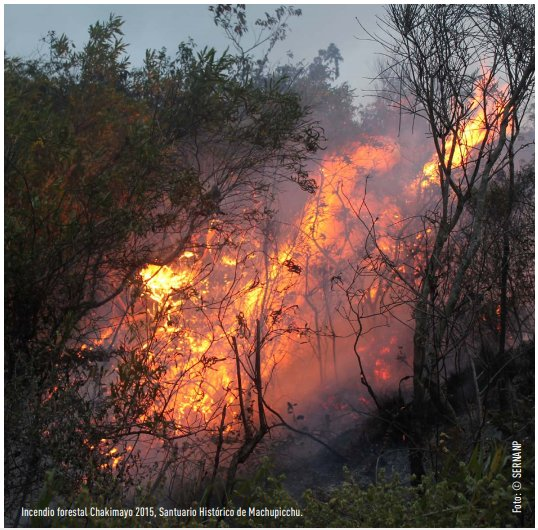
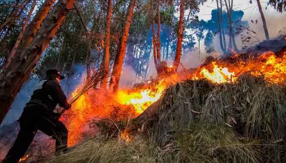
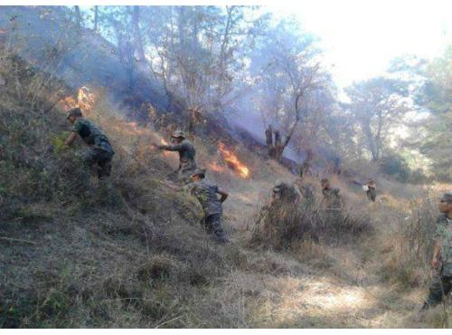
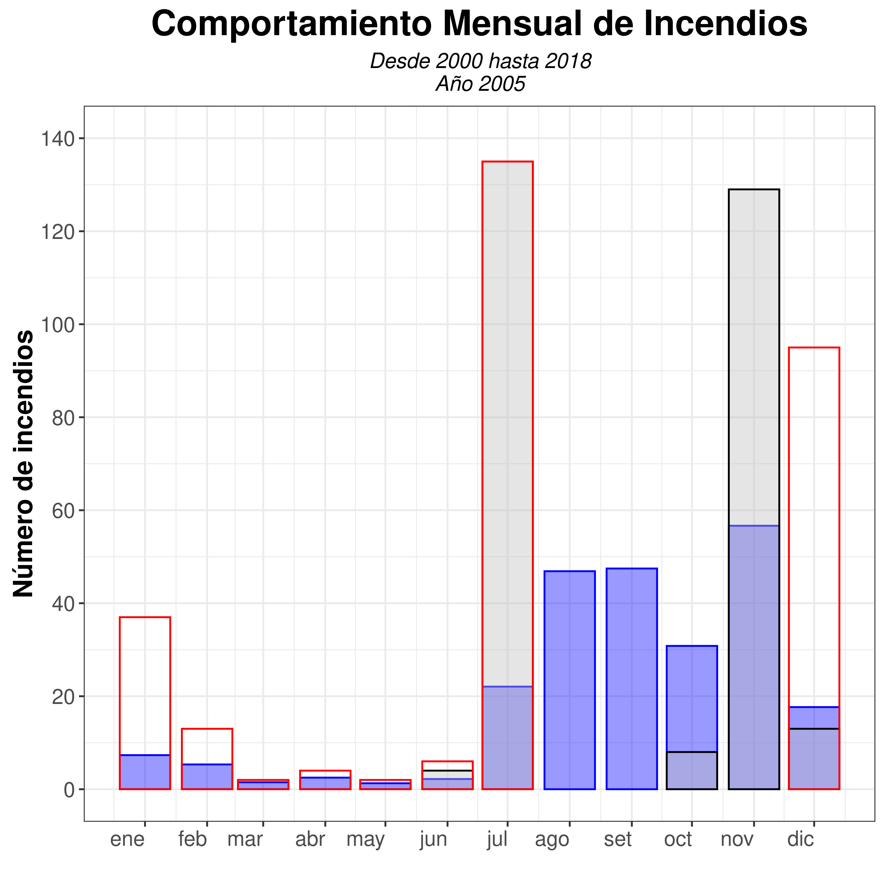
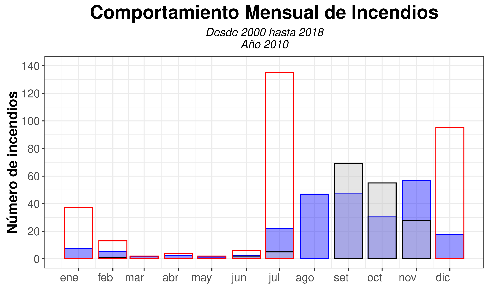
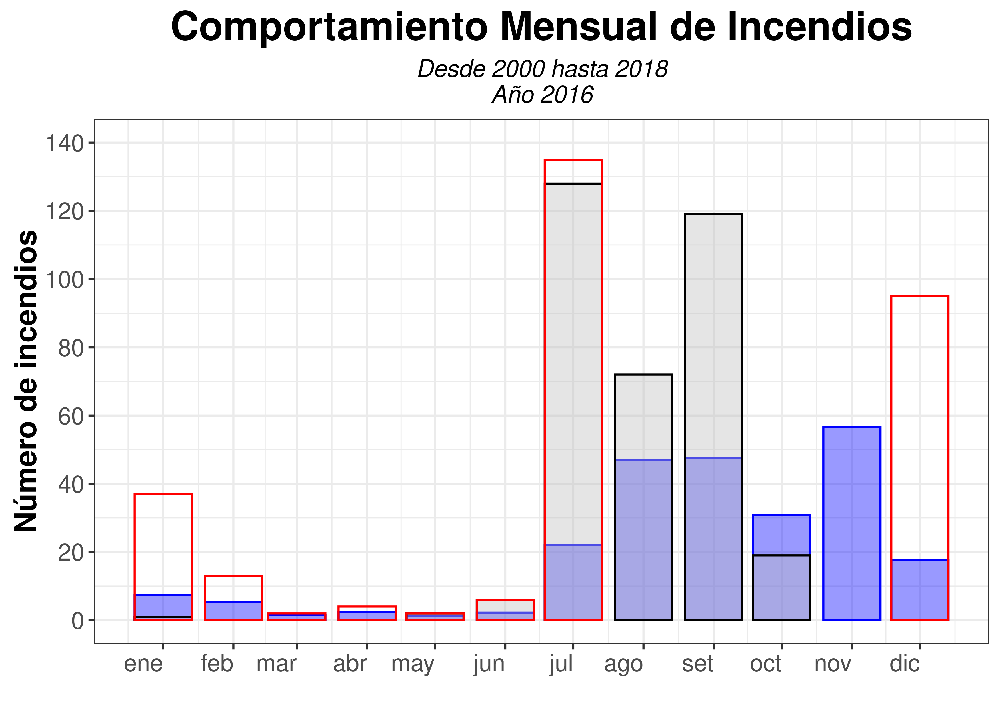

```{r setup, include=FALSE}
knitr::opts_chunk$set(warning = FALSE, message = FALSE) 
```


# **Introducción**
<div style = "text-align: justify"> Los incendios forestales se han convertido en un problema ambiental de gran relevancia y gravedad en las últimas décadas; se presenta a nivel mundial, sobre todo en los países con grandes extensiones de áreas forestales (Sabuco, 2013), como es el caso del Perú (FAO, 2004). 
El impacto de los incendios reduce la tasa de crecimiento de los bosques, genera muerte y migración de la fauna silvestre, pérdida de la biodiversidad, trasformación de los suelos e incremento de la erosión, contaminación del aire, reducción de servicios de regulación hídrica del ecosistema, mayor incidencia en derrumbes e inundaciones, incluso la aparición de plagas y enfermedades en los bosques debilitados por dichos incendios. (MINAM, 2019).

En este análisis se evaluará la estacionalidad de las variables bioclimáticas que favorecen a la ocurrencia de incendios, desde el año 2000 al 2018.</div>

## **1. Identificación del problema**
<div style = "text-align: justify"> La cobertura vegetal y toda la biodiversidad que alberga, viene siendo afectada por los incendios forestales, ocasionando efectos adversos en los diferentes ecosistemas presentes, ademas de consecuencias en todos los niveles (ecológico, económico, social y humano)en el Perú que derivan de este desastre.

Segun los registros historicos del CFOI se puede afirmar que
los departamentos con mayor recurrencia de incendios son Cajamarca, Cusco, Puno, Apurímac, Amazonas, Ayacucho y Piura, en estos departamentos todos los años se van a presentar estos eventos entre los meses de junio a enero. 

En el caso de Cajamarca, gran parte de los incendios son por factor antropico, Segun un reportaje de Andina, 2016, la administradora tecnica del ATFFS de Cajamarca, Rosario Alva, explico que la quema constante de los bosques por los pobladores se da en épocas de sequía, al tener una errada idea de que así atraerán lluvias. 

En los últimos años los incendios han impactado severamente varias regiones del Perú, como Cusco, Lambayeque, Piura y Cajamarca (INDECI, 2013; El Comercio, 2018).
En el caso del Cuzco, los incendios que se presentan anualmente  entre los meses de junio a setiembre, debido principalmente al uso irresponsable del fuego por personas que desarrollan es agrícolas, ganaderas y forestales gracias a los cuales, la calidad de las personas se ve gravemente afectada. </div>

```{r echo = FALSE, fig.align='center'}

```
Según el diario Gestión, 2020, el MINAM y el Gobierno Regional del Cusco a través de la zonificación del CFOI advirtieron que en este departamento todas las provincias presentan condiciones medias a muy altas para la ocurrencia de incendios.
Las provincias de Paruro, Canas, Chumbivilcas,  Quipicachi, Acomayo y Espinar son provincias que tienen más de un 90 % de su territorio en condiciones proclives a los incendios. En tanto, Cusco, Calca, Canchis, Anta y Urubamba, tienen más del 70 % de su territorio con altas condiciones; al igual que más del 40% del territorio de las provincias de Paucartambo, Quispicanchis y La Convención. 

```{r echo = FALSE, fig.align='center'}

```

```{r echo = FALSE, fig.align='center', comment='Figura 2. Evidencia de incendios en la region Cajamarca.', out.width="600px"}

```


### **1.1. Objetivos**
#### **1.1.1. Objetivo General**

<div style = "text-align: justify"> Analizar la estacionalidad de variables bioclimáticas en el marco del estudio de las condiciones favorables para la ocurrencia de incendios (CFOI).</div>

#### **1.1.2. Objetivos Específicos**
* Analizar las variables climáticas (calidad de vegatción, temperatura y preciptación) de forma interestacional en las zonas CFOI
* Analizar el comportamiento estacional de las variables bioclimáticas con respecto a la altitud en las zonas CFOI.

### **1.2. Justificación**

<div style = "text-align: justify"> Este proyecto de investigación se justifica en lo poco explorado que estan siendo los datos estadísticos relacionados al registro histórico de incendios y su distribución espacial, así como su relación con las condiciones favorables que se encuentran presentes en el momento de la aparición del incendio, aspecto que debe ser la base para el entendimiento de este fenómeno y de la generación de las políticas de Estado para atenderlo, desde una óptica de prevención y reducción del riesgo.</div>


## **2. Antecedentes**

* [MONITOREO DE LAS CONDICIONES FAVORABLES PARA LA OCURRENCIA DE INCENDIOS SOBRE LA COBERTURA VEGETAL – CFOI](https://repositoriodigital.minam.gob.pe/bitstream/handle/123456789/652/Monitoreo-CFOI_CV.pdf?sequence=1&isAllowed=y)

* [Cajamarca: incendio forestal afectó a zona boscosa de Cerro Negro](https://andina.pe/agencia/noticia-cajamarca-incendio-forestal-afecto-a-zona-boscosa-cerro-negro-640629.aspx)

* [Ocurrencia de incendios forestales en el Perú durante eventos El Niño](https://repositorio.igp.gob.pe/bitstream/handle/20.500.12816/4704/Zubieta_etal_2019_Ocurrencia-de-incendios-forestales-en-el-Peru-durante-eventos-El-Nino.pdf?sequence=1&isAllowed=y)

* [ANÁLISE ESPACIAL DE EVENTOS](http://www.dpi.inpe.br/gilberto/livro/analise/cap2-eventos.pdf)

* [Evaluacion de algoritmos para estimar la derivada de presion en pruebas de pozos](https://dialnet.unirioja.es/descarga/articulo/5432182.pdf)

* [Uso de estimados de densidad Kernell en  la investigación de grupos cerámicos del Periodo Formativo provenientes de Chavín de Huantar](https://revistasinvestigacion.unmsm.edu.pe/index.php/Arqueo/article/view/12339/11039)  

* [Estadística no paramétrica I - youtube](https://www.youtube.com/watch?v=Q40ESwQbJO8)  


## **3. Marco Teórico**

### **3.1 Función Kernel**

### 3.1 Función Kernel

[En Cusco todas las provincias tienen condiciones de media a muy alta para ocurrencia de incendios](https://gestion.pe/peru/en-cusco-todas-las-provincias-tienen-condiciones-de-medias-a-muy-altas-para-ocurrencia-de-incendios-noticia/)

[Ocurrencia de incendios forestales en el Perú durante eventos El Niño](https://repositorio.igp.gob.pe/bitstream/handle/20.500.12816/4704/Zubieta_etal_2019_Ocurrencia-de-incendios-forestales-en-el-Peru-durante-eventos-El-Nino.pdf?sequence=1&isAllowed=y)

Una alternativa simple para analizar el comportamiento de patrones de puntos, es estimar la *intensidad puntual del proceso en toda la region de estudio*. Para esto usaremos una funcion bidimensional sobre los eventos considerados, componiendo una superficie cuyo valor sera proporcional a la intensidad de muestras por unidad de area. Esta funcion realiza un conteo de todos los puntos dentro de una region de influencia, ponderandolos por la distancia de cada uno con respecto a la loclaizacion de interes.

<div style = "text-align: justify"> Una alternativa simple para analizar el comportamiento de patrones de puntos, es estimar la *intensidad puntual del proceso en toda la region de estudio*. Para esto usaremos una funcion bidimensional sobre los eventos considerados, componiendo una superficie cuyo valor sera proporcional a la intensidad de muestras por unidad de area. Esta funcion realiza un conteo de todos los puntos dentro de una region de influencia, ponderandolos por la distancia de cada uno con respecto a la localizacion de interes. </div>

* Aveces, el Kernel es una funcion de ventana (window function)
* Una window function fuera de cierto intervalo adopta el valor 0 
* Un kernel, a su vez, es una funcion no negativa (no dijimos qué forma
aun)
* Usaremos un parametro de suavizacion o bandwidth (h) mientras mas alto, mas
suavizamos.
* Tanto el n como el h nos determinar el area de influencia de los puntos a ser interpolados. 

Estimación de la densidad para un punto $x$ :

$${\displaystyle {\widehat {f}}_{h}(x)={\frac {1}{n}}\sum _{i=1}^{n}K_{h}(x-x_{i})={\frac {1}{nh}}\sum _{i=1}^{n}K{\Big (}{\frac {x-x_{i}}{h}}{\Big )}}$$

Donde:

* $n  :$ Número de observaciones (cada datos es el centro donde se coloca el kernel).
* $h  :$ Ancho de banda.
* $K  :$ Es la función kernel.


### **3.2. Filtro Digital Savitzky-Golay** 

<div style = "text-align: justify">Tiene como objetivo la disminucion del ruido de una curva, esta optimizacion se baso inicialmente en una tabla de términos que suavizaban puntos a partir de la simplificación del método de mínimos cuadrados (puntos equisdistantes al eje X), posteriormente el metodo incorporó otros métodos de auto-optimización subjetiva (como el ajuste del grado del polinomio y la longitud de ventana) basadas en un prueba F para escoger el grado del polinomio optimo. 

*Este método nos servirá para completar los datos del índice NDVI, para los años de estudio.* </div>

## **4. Área de estudio**

## **5. Metodología**
Nuestra metodología se resume en cuatro principales etapas, tal y como se describe en la siguiente figura:

```{r echo = FALSE, fig.align='center', comment='Figura 1. Metodología del Trabajo.'}
knitr::include_graphics('Img/metodologia_4etapas.jpg')
```

### **Librerias de R utilizadas hasta el momento**

```{r warning=FALSE, message=FALSE, eval=TRUE}
library(dplyr)
library(ggplot2)
library(tidyverse)
library(sf)
library(rgee)
library(mapedit)
library(raster)
library(cptcity)
library(leaflet)
library(leaflet.extras)
library(leafpop)
library(MASS)
library(dplyr)
library(ncdf4)
library(devtools)
library(velox)
library(signal)
library(doParallel)
library(foreach)
```


### **Iniciamos sesion en GEE**

```{r eval=TRUE, echo=TRUE, warning=FALSE, message=FALSE}
# Inicializando sesion en GEE
ee_install()
ee_Initialize('juliocontreras1', drive =TRUE)
```

### **5.1 Localización del área de estudio**

#### **5.1.1 Histograma de la acumulación de incendios a lo largo del tiempo**

```{r eval=TRUE, message=FALSE, echo = FALSE, warning=FALSE, cache=FALSE, fig.align='center'}
# Incendios acumulados por mes
shp   <- 'Materiales/registro_incendios_2000_2018.gpkg'
fires <- st_read(shp, quiet = TRUE) %>% 
  mutate(Date = paste(`AñO`, 
                      MES_N, 1, 
                      sep = '-')) %>% 
  group_by(Date) %>% 
  summarise(nfires = length(Date)) %>% 
  mutate(Date = as.Date(Date)) %>%
  arrange(Date) %>% 
  as.data.frame() %>%
  dplyr::select(-geom)
# Como no todos los meses hay incendios se necesita tener todos los meses para generar el histograma
ts    <- data.frame(Date = seq(as.Date('2000-08-01'), 
                               as.Date('2018-12-01'), 
                               by = 'month')) %>% 
  full_join(fires) 

# Generación del histograma

X <- ggplot(ts, aes(x=Date, y=nfires)) + 
  geom_bar(stat="identity", 
           fill="gray", 
           colour="black") +
  theme_bw() + 
  ylab(label = 'Número de incendios\n') +  
  xlab(label = '') + 
  ggtitle(paste('Eventos de incendios \ndel año 2000 al 2018', sep = '')) +
  theme(plot.title = element_text(hjust = 0.5, face = 'bold', size=15),
        axis.text.x  = element_text(size=11, angle = 75, hjust = 1),
        axis.text.y  = element_text(size=11),
        axis.title.y = element_text(size = 12, hjust = 0.5, face = 'bold', vjust = 0.5)) + 
  scale_x_date(limits = c(as.Date('2000-07-01'),
                          as.Date('2019-01-01')),
               date_labels = ("%Y"), 
               breaks = '1 year') +
  scale_y_continuous(breaks = seq(0,500,50))
X

```
<div style = "text-align: justify"> Dos de eventos de los que vamos a inspeccionar coinciden con eventos extremos, en un estudio realizado por el [Senahmi](https://bit.ly/3hX0K8a), se determinó que el año 2005 y 2016, ocurrieron grandes sequías en las zonas altoandinas, para ello se utilizó el índice estandarizado de precipitación (SPI). El año 2010, tiene también un relativo SPI negativo, pero no llega a niveles extremos como en los años mencionados. Además, mencionamos que el 2004 es el año con mayor SPI, en el rango de los años de estudio, pero las sequías evidenciadas en este año se dieron durante la fase neutra del ENOS. En los demás años (7) de sequías extremas pertenecieron a la fase cálida del El Niño Oscilación Sur (ENOS).</div>

#### **5.1.2 Distribución de los incendios por años de 2000 - 2018**

<style>
.html-widget {
    margin: auto;
}
</style>

```{r leaflet, eval=TRUE, message=FALSE, echo = FALSE, warning=FALSE, cache=FALSE, out.width="825px"}
# Incendios acumulados por mes
Departamentos <- st_read('Materiales/Departamentos.gpkg', quiet = TRUE)
shp   <- 'Materiales/registro_incendios_2000_2018.gpkg'
fires <- st_read(shp, quiet = TRUE) %>% 
  mutate(Date = paste(`AñO`), Fecha = paste(`AñO`, MES_N, DIA, sep = '-')) %>% 
  as.data.frame() %>%
  dplyr::select(Date, Fecha, LOCALIDAD, 
                DES_EMERGE, DES_FUENTE, DES_DANO, 
                NOMBDIST, NOMBPROV, NOMBDEP, COOR_X, COOR_Y, -geom)
names(fires) <- c("Date", "Fecha", "Localidad", 
                  "Causa", "Acción", "Daños",
                  "Distrito", "Provincia", "Departamento", "Longitud", "Latitud")

# Este es más dinámico
Number_JmType <- fires$Date %>% unique() %>% length() # Numero de especies
Names_JmType <- fires$Date %>% unique() ## Nombre de las especies
Colores <- c("#ef3b2c", "#ffffff", "#807dba", "#33a02c", "#fed976", 
             "#000000", "#0570b0", "#a6cee3", "#1f78b4", "#b2df8a",
             "#33a02c", "#fb9a99", "#e31a1c", "#fdbf6f", "#ff7f00",
             "#cab2d6", "#6a3d9a", "#b15928") # colorbrewer2, Colores de las especies seran
pal <- colorFactor(Colores, domain = Names_JmType) # Generamos la paleta


# Partimos un sf en varios sf
Spp_Pres <- list()
for (i in 1:length(Names_JmType)) {
  Spp_Pres[[i]] <- fires %>% dplyr::filter(Date == Names_JmType[i])
}
names(Spp_Pres) <- Names_JmType

# Ploteamos cada sf, pero sin leyenda
Spp_Map <- leaflet() %>% addTiles(urlTemplate = "https://cartodb-basemaps-{s}.global.ssl.fastly.net/dark_all/{z}/{x}/{y}.png") %>%
  addPolygons(data = Departamentos, fillOpacity = 0, weight = 1, opacity = 1,
              label = ~DEPARTAMEN, color = "#ef3b2c", group = "Departamentos")

for (i in 1:length(Spp_Pres)) {
  Spp_Map <- Spp_Map %>%
    addCircleMarkers(data = Spp_Pres[[i]],
                     lat = ~Latitud, lng = ~Longitud, fillColor = ~pal(Date),
                     fillOpacity = 0.8, radius = 6, weight = 0.5, label = ~Provincia,
                     color = ~pal(Date), group =  Names_JmType[i], 
                     popup = popupTable((Spp_Pres[[i]])[,2:length(Spp_Pres[[i]])],
                                        row.numbers = F, feature.id = F))
}


# Agremos leyenda y su visualizador por grupos, tanto leyenda como suelos
Spp_Map <- Spp_Map %>%
  addLegend(data = fires, "bottomleft", pal = pal, 
                values = ~Date, title = "Inc: 2000-2018", 
                opacity = 0.8, group = "Leyenda") %>%
  addLayersControl(overlayGroups = c("Leyenda"), baseGroups = Names_JmType,
                   options = layersControlOptions(collapsed = FALSE), position = "topright")
Spp_Map
```

```{r, include=FALSE}
shp   <- 'Materiales/registro_incendios_2000_2018.gpkg'
fires <- st_read(shp)
peru <- read_sf('Materiales/Peru.gpkg')
Departamentos <- st_read('Materiales/Departamentos.gpkg')
```
<br/>

#### **5.1.3 Estimación de densidad de probabilidad 2D: función de densidad no paramétrica**

<div style = "text-align: justify"> Se tratade suvizar una serie tanto en el eje x e y. Seria raro que pase un incendio en un lugar y no haya la probabilidad que ocurra a sus alrededores cercanos, mientras que a unos cuantos metros paso uno grande.

En realidad existe funciones de densidad parámetricas, donde la función depende de la varianza o media muestral, por ejemplo, la función de probabilidad normal.

Se estima la función de densidad de probabilidad para calcular en porcentaje la posibilidad de ocurrencia de incendios para cada pixel, clusterizando las regiones con mayor probabilidad por sobre un umbral definido, además se muestra la región a partir de la cual se basará nuestros graficos de análisis posteriores.

Basicamente, esta función del paquete MASS, la función kernel varía por ubicación (asignandole peso), ese es el porqué de su argumento de coordenadas.</div>

<br/>

```{r eval=TRUE, message=FALSE, echo = FALSE, warning=FALSE, comment=FALSE, out.width="825px"}
fires  <- st_read('Materiales/registro_incendios_2000_2018.gpkg', quiet = TRUE)
peru <- st_read('Materiales/Peru.gpkg', quiet = TRUE)
Departamentos <- st_read('Materiales/Departamentos.gpkg', quiet = TRUE)

# Extracción de coordenadas de los puntos
fires_df <- st_coordinates(fires) %>% as.data.frame()
names(fires_df) <- c('lon','lat')#here

# Aplicación de la estimación
kde <- kde2d(fires_df$lon, fires_df$lat, n = 250, h = .5, lims = c(-86, -65, -19, 0))
kde_raster <- kde %>% raster() %>% crop(peru) %>% mask(peru)
kde_raster <- kde_raster * 100

pal <- colorNumeric(c("#3182bd", "#fec44f", "#f03b20"), values(kde_raster), na.color ="transparent")
                   
m <- leaflet() %>%
  addTiles() %>%
  addRasterImage(kde_raster, colors = pal) %>%
  addLegend(pal = pal, values = values(kde_raster),title = "% Incendios") %>%
  addPolygons(data = Departamentos,
              fillOpacity = 0,
              weight = 2,
              opacity = 1,
              label = ~DEPARTAMEN,
              color = "#000000",
              group = "Departamentos")
m
```
<br/>
Seguimos con...

#### **5.1.4 Elección del área de estudio**

```{r eval=TRUE, message=FALSE, echo = FALSE, warning=FALSE, cache=FALSE, out.width="825px"}
Provincias <- st_read('Materiales/Provincias.gpkg', quiet = TRUE)
Cutervo <- st_read('Materiales/Cutervo.gpkg', quiet = TRUE)

kde_raster_clas <- kde_raster
kde_raster_clas[kde_raster < 8] = NA
kde_raster_clas[kde_raster >= 8] = 1
# writeRaster(kde_raster, 'raster2.tif')

# Posicion para el ploteo
centroid <- st_centroid(Cutervo)
X <- (st_coordinates(centroid))[,"X"]
Y <- (st_coordinates(centroid))[,"Y"]

# Interactivo
leaflet() %>% 
  addTiles(urlTemplate = "https://cartodb-basemaps-{s}.global.ssl.fastly.net/dark_all/{z}/{x}/{y}.png", group = "Dark") %>%
  addTiles(urlTemplate = "https://server.arcgisonline.com/ArcGIS/rest/services/World_Imagery/MapServer/tile/{z}/{y}/{x}", group = "Satellite") %>%
  setView(lng = X, lat = Y, zoom = 6.5) %>%
  addRasterImage(kde_raster_clas, colors = "#f03b20", group = "Density") %>%
  # addLegend(pal = pal, values = values(kde_raster),title = "% Incendios") %>%
  addPolygons(data = Provincias, fillOpacity = 0, weight = 1, opacity = 1, 
              label = ~PROVINCIA, color = "#ffff33", group = "Provincias") %>%
  addPolygons(data = Cutervo, fillOpacity = 0, weight = 4, opacity = 1,
              label = ~PROVINCIA, color = "#54278f",group = "Anta") %>%
  addLayersControl(baseGroups = c("Dark", "Satellite"), overlayGroups = "Density",
                   options = layersControlOptions(collapsed = FALSE), position = "topright")
```

#### **5.1.5 Variabilidad estacional de la ocurrecia de incendios**

<div style = "text-align: justify"> Se verá el comportamiento estacional promeido y máximo, para un registro de incendios 2000 - 2018.</div>

```{r eval=TRUE, message=FALSE, echo = FALSE, warning=FALSE, cache=FALSE, fig.align='center'}
fires <- st_read('Materiales/registro_incendios_2000_2018.gpkg', quiet = TRUE)

yr <- 2005

# CREACION Y MANIPULACI?N DE TABLA PARA EL PLOTEO
a <- fires %>% group_by(Date = paste(`AñO`, MES_N, sep = '-')) %>%
  summarise(nfires = length(Date)) %>% 
  group_by(MES = substr(Date,6,7)) %>% 
  summarise(fires_mean = mean(nfires, na.rm = T), fires_max  = max(nfires, na.rm = T)) %>%
  mutate(MES = as.numeric(MES)) %>% arrange(MES) %>% as.data.frame() %>% dplyr::select(-geom)

b <- fires %>% dplyr::filter(`AñO`== yr) %>%
  mutate(MES = MES_N) %>%
  group_by(MES) %>% 
  summarise(fires_anom = length(MES)) %>%
  as.data.frame() %>% dplyr::select(-geom)


df <- data.frame(MES = c(1:12)) %>% 
  full_join(a, by = 'MES') %>% 
  full_join(b, by = 'MES') %>% 
  dplyr::select(-MES) %>%
  mutate(Date = seq(as.Date('2018-01-01'), as.Date('2018-12-01'), by='month'),
         fires_mean = ifelse(is.na(fires_mean), 0, fires_mean),
         fires_max  = ifelse(is.na(fires_max), 0, fires_max),
         fires_anom = ifelse(is.na(fires_anom), 0, fires_anom),
         label_mean = 'mean', label_max = 'max', label_anom = 'anom')

# CAMBIO DE IDIOMA

# PLOTEO  
X <- ggplot(df) +
  geom_bar(aes(x = Date, y = fires_mean, fill = label_mean),
           stat = "identity", fill = 'blue', colour = 'blue', alpha = 0.4) +
  geom_bar(aes(x = Date, y = fires_anom, fill = label_anom), 
           stat = "identity", fill = 'gray', colour = 'black', alpha = 0.4) +
  geom_bar(aes(x = Date, y = fires_max,  fill = label_max), 
           stat = "identity", colour = 'red', alpha=0) +
  ggtitle('Comportamiento Mensual de Incendios', 
          subtitle = paste0('Desde 2000 hasta 2018\nAño ', as.character(yr))) +
  theme_bw() + labs(y = 'Número de incendios', x = '') +
  theme(plot.title    = element_text(size = 20, hjust = 0.5, face = 'bold'),
        plot.subtitle = element_text(size = 12, hjust = 0.5, face = 'italic'),
        axis.text.x   = element_text(size = 12, hjust = 1),
        axis.text.y   = element_text(size = 12),
        axis.title.y  = element_text(size = 15, hjust = 0.5, face = 'bold', vjust = 0.5))  + #
  scale_x_date(date_labels = "%b", breaks = '1 month') +
  scale_y_continuous(breaks = seq(0,140,20), limits = c(0, 140)) + 
  theme(legend.position = "none")
# X

# element_rect(
#   fill = NULL,
#   colour = NULL,
#   size = NULL,
#   linetype = NULL,
#   color = NULL,
#   inherit.blank = FALSE
# )
  # ggtitle(paste('Eventos de incendios \ndel año 2000 al 2018', sep = '')) +
  # theme(plot.title = element_text(hjust = 0.5, face = 'bold', size=15),
  #       axis.text.x  = element_text(size=11, angle = 75, hjust = 1),
  #       axis.text.y  = element_text(size=11),
  #       axis.title.y = element_text(size = 12, hjust = 0.5, face = 'bold', vjust = 0.5)) 
ggsave(plot = X, filename = paste0('Img/Bar_Fires_', as.character(yr),'.png'), units = "cm", dpi = 500)

```
```{r echo = FALSE, fig.align='center'}

```

<br/>

```{r echo = FALSE, fig.align='center',}

```

<br/>

```{r echo = FALSE, fig.align='center'}

```

<br/>

<div style = "text-align: justify"> En lo gráficos generados tanto para los años 2005, 2010 y 2016, las barras con contorno rojo representan los registros máximos históricos mensuales entre el 2000 y el 2018. Las barras azules representan el número promedio de incendios mensuales y las barras grises representan el registro mensual instantaneo para los años en mención. Ahora vemos que en el año 2005 los meses en los que se supera el registro promedio mensual son julio, agosto, septiembre y noviembre, siendo julio y septiembre los que alcanzan los maximos historicos. En el año 2010, por su parte los meses de junio, agosto, septiembre, octubre y noviembre, son los que superan el promedio, siendo agosto el que alcanza el máximo histórico. Por ultimo, en le 2016, los meses de julio, agosto, septiembre y noviembre son los que superan el promedio historico, siendo septiembre y noviembre los que alcanzan los maximos históricos. En conclusion, lo meses con los más altos registros de incendios, estan comprendidos entre julio y noviembre.</div>

### **5.2 Materiales**

#### **5.2.1 Data histórica de incendios 2000-2018**

<div style = "text-align: justify">Este registro abarca los años 2000 a 2018, descargados del [Geoservidor del Ministerio del Ambiente (MINAM)](https://geoservidor.minam.gob.pe/monitoreo-y-evaluacion/registros-historicos-cfoi/).</div>


#### **5.2.2 Precipitación acumulada y Temperatura Máxima**

<div style = "text-align: justify"> Este se obtendrá del producto grillado PISCO, del Servicio Nacional de Meteorología e Hidrología (SENHAMI) </div>

##### ***Precipitacion acumulada mensual***

Estos valores han sido extraidos del producto grillado PISCO del SENAMHI.

```{r eval=TRUE, message=FALSE, echo = FALSE, warning=FALSE, fig.align='center'}
pp_velox <- velox("RasterData/PISCO/PISCOp_v211_cajamarca.tif")                 
region <- st_read("Materiales/Cutervo.gpkg", quiet = TRUE)

data <- pp_velox$extract(sp=region, 
                         fun = function(x){
                           mean(x,na.rm=T)
                           }) %>%
        as.vector()

date <- seq(as.Date('1981-01-01'),as.Date('2018-02-01'), by='month')

pp <- data.frame(date, data) %>% 
  mutate(mes = substr(date, 6, 7)) %>% 
  group_by(mes) %>%
  summarise(ppmean = mean(data, na.rm = T), ppmax = max(data, na.rm = T), ppmin = min(data, na.rm=T))  

pp2000 <- data.frame(date, pp2000 = data) %>% 
  mutate(mes = substr(date, 6, 7)) %>%
  dplyr::filter(substr(date, 1, 4) == 2000) %>% 
  dplyr::select(-date)

pp2005 <- data.frame(date, pp2005 = data) %>% 
  mutate(mes = substr(date, 6, 7)) %>% 
  dplyr::filter(substr(date, 1, 4) == 2005) %>% 
  dplyr::select(-date)

pp2010 <- data.frame(date, pp2010 = data) %>% 
  mutate(mes = substr(date, 6, 7)) %>%
  dplyr::filter(substr(date, 1, 4) == 2010) %>% 
  dplyr::select(-date)

pp2016 <- data.frame(date, pp2016 = data) %>% 
  mutate(mes = substr(date, 6, 7)) %>%
  dplyr::filter(substr(date, 1, 4) == 2016) %>% 
  dplyr::select(-date)

df <- data.frame(date = seq(as.Date('2018-01-01'), as.Date('2018-12-01'), by = 'month'), pp) %>%
  full_join(pp2000) %>% full_join(pp2005) %>%
  full_join(pp2010) %>% full_join(pp2016)


Sys.setlocale(category = 'LC_ALL', locale = 'spanish')

X <- ggplot(df, aes(date, ppmean)) +
  geom_line(colour = 'black', size=.8) +
  theme_bw() + 
  ylab(label = '[mm]') +
  xlab(label = '') +
  ggtitle('Precipitacion acumulada mensual', subtitle = 'De 1981 hasta 2018') +
  theme(plot.title = element_text(size = 16, hjust = 0.5, face = 'bold'),
        plot.subtitle = element_text(size=13, hjust=0.5, face = 'italic'),
        axis.text.x = element_text(size=12), axis.text.y = element_text(size=12),
        axis.title = element_text(size=20), axis.title.y =  element_text(size=12, face='bold')) +
  scale_x_date(date_labels = '%b', breaks = '1 month') +
  scale_y_continuous(breaks = seq(0,325,50), limits = c(0, 325)) +
  geom_line(aes(date, ppmax),  colour = 'red', linetype = 'dashed', size=.8) +
  geom_line(aes(date, ppmin),  colour = 'red', linetype = 'dashed', size=.8) +
  geom_line(aes(date, pp2000), colour = rgb(233, 228, 91, maxColorValue=255), size=.8) +
  geom_line(aes(date, pp2005), colour = rgb(160, 114, 14, maxColorValue=255), size=.8) +
  geom_line(aes(date, pp2010), colour = 'snow3', size=.8) +
  geom_line(aes(date, pp2016), colour = 'springgreen3', size=.8) +
  geom_point(aes(date, pp2000), colour = rgb(233, 228, 91, maxColorValue=255) , size=2) +
  geom_point(aes(date, pp2005), colour = rgb(160, 114, 14, maxColorValue=255) , size=2) +
  geom_point(aes(date, pp2010), colour = 'snow3', size=2) +
  geom_point(aes(date, pp2016), colour = 'springgreen3', size=2)

X
```

<div style = "text-align: justify"> En la anterior grafica podemos observar la precipitacion acumulada mensual maxima y minima (de color rojo) y promedio (en negro) historico entre los años 1981 - 2018, asimismo las lineas amarilla, marron, gris y verde representan la evolucion mensual de los años 2000, 2005, 2010 y 2016. De ello podemos concluir que en los meses de mayor incendios (de julio a enero) se presentaron valores  por debajo de la media, alcanzando incluso  a los mínimos históricos de precipitación acumulada mensual.</div>


##### **Temperatura maxima mensual**

Estos valores han sido extraidos del producto grillado PISCO del SENAMHI

```{r eval=TRUE, message=FALSE, echo = FALSE, warning=FALSE, cache=FALSE, fig.align='center'}
temp_velox <- velox("RasterData/PISCO/PISCOmtx_v11_cajamarca.tif")                 
region <- st_read("Materiales/Cutervo.gpkg", quiet = TRUE)

data <- temp_velox$extract(sp = region, fun = function(x){ mean(x, na.rm = T) }) %>% as.vector()
date <- seq(as.Date('1981-01-01'), as.Date('2016-12-01'), by = 'month')


temp <- data.frame(date, data) %>% 
  mutate(mes = substr(date,6,7)) %>% 
  group_by(mes) %>%
  summarise(tempmean = mean(data, na.rm = T), 
            tempmax  = max(data, na.rm = T),
            tempmin  = min(data, na.rm = T))

temp2000 <- data.frame(date, temp2000 = data) %>% 
  mutate(mes = substr(date,6,7)) %>% 
  dplyr::filter(substr(date,1,4) == 2000) %>% 
  dplyr::select(-date)

temp2005 <- data.frame(date, temp2005 = data) %>% 
  mutate(mes = substr(date,6,7)) %>% 
  dplyr::filter(substr(date,1,4) == 2005) %>% 
  dplyr::select(-date)

temp2010 <- data.frame(date, temp2010 = data) %>% 
  mutate(mes = substr(date,6,7)) %>% 
  dplyr::filter(substr(date,1,4) == 2010) %>% 
  dplyr::select(-date)

temp2016 <- data.frame(date, temp2016 = data) %>% 
  mutate(mes = substr(date,6,7)) %>% 
  dplyr::filter(substr(date,1,4) == 2016) %>% 
  dplyr::select(-date)

df <- data.frame(date = seq(as.Date('2016-01-01'), as.Date('2016-12-01'), by = 'month'), temp) %>%
  full_join(temp2000) %>% 
  full_join(temp2005) %>% 
  full_join(temp2010) %>% 
  full_join(temp2016)

Sys.setlocale(category = 'LC_ALL', locale = 'spanish')

X <- ggplot(df, aes(date, tempmean)) +
     geom_line(colour = 'black', size=0.8) + 
     theme_bw() + ylab(label = '[°C]') +  xlab(label = '') +
     ggtitle('Temperatura Maxima mensual', subtitle = 'De 1981 hasta 2016') + 
     theme(plot.title = element_text(size = 16, hjust = 0.5, face = 'bold'),
           plot.subtitle = element_text(size=13, hjust=0.5, face = 'italic'),
           axis.text.x = element_text(size=12),
           axis.text.y = element_text(size=12),
           axis.title = element_text(size=12, face='bold'))+
     scale_x_date(date_labels = '%b', breaks = '1 month') +
     scale_y_continuous(breaks = seq(20,28,1), limits = c(20, 28)) +
     geom_line(aes(date, tempmax),  colour = 'red', linetype = 'dashed', size = 0.8) +
     geom_line(aes(date, tempmin),  colour = 'red', linetype = 'dashed', size = .8) +
     geom_line(aes(date, temp2000), colour = rgb(233, 228, 91, maxColorValue = 255), size = 0.8) +
     geom_line(aes(date, temp2005), colour = rgb(160, 114, 14, maxColorValue = 255), size = 0.8) +
     geom_line(aes(date, temp2010), colour = 'snow3', size=.8) +
     geom_line(aes(date, temp2016), colour = 'springgreen3', size=.8) +
     geom_point(aes(date, temp2000), colour = rgb(233, 228, 91, maxColorValue=255) , size=2) +
     geom_point(aes(date, temp2005), colour = rgb(160, 114, 14, maxColorValue=255) , size=2) +
     geom_point(aes(date, temp2010), colour = 'snow3', size=2) +
     geom_point(aes(date, temp2016), colour = 'springgreen3', size=2)

X
```
<div style = "text-align: justify"> En la anterior grafica podemos observar la tempertaura maxima mensual: al maxima y minima (de color rojo) y promedio (en negro) historico entre los años 1981 - 2016, asimismo las lineas amarilla, marron, gris y verde representan la evolucion mensual de los años 2000, 2005, 2010 y 2016. De ello podemos concluir que en los meses de mayor incendios (de julio a enero) se presentaron valores  por encima de la media, alcanzando incluso a los máximos históricos de temperatura máxima.</div>

#### **5.2.3 Índice de Vegetación Normalizado (NDVI)**

<div style = "text-align: justify">Ahora toca trabajar con las variables bioclimáticas...

Este se obtendrá del producto del sensor MODIS (MOD13Q1) del sensor Terra, 2000 - 2018. Este producto es un compuesto de 16 días, bajo el método de valor máximo, tiene una resolución espacial de 250 m, puede encontrarlo en [Google Earth Engine](https://developers.google.com/earth-engine/datasets/catalog/MODIS_006_MOD13Q1?hl=en)


Dentro del producto se tiene sub data sets, donde podemos encontrar el NDVI (006) y EVI, y las bandas que se utilizaron para sus calculos, así mismo encontrarás la banda $qa$ o banda de calidad. La banda de calidad (qa) te muestra el estado de los píxeles, según la presencia de artefactos como las nubes, sombras, cobertura de nieve. Aquí filtraremos los datos de NDVI a través de la ***qa*** (0-65535) con una resolución radiométrica de 16 bits $2^{16}$.</div>


##### **Filtro por la banda de calidad**
<div style = "text-align: justify">Para entender como se interpreta un banda de calidad no dirigimos a la página de [GRASS GIS](https://grass.osgeo.org/grass78/manuals/i.modis.qc.html), donde nos ofrece un descripción de la ***qa***. Tenemos que pasar nuestros ND de un sistema decimal a uno binario (ahí es donde se hace la interpretación) donde nos resultará 16 dígitos. Los códigos a continuación creará un función filtro **qa**. </div>

```{r warning=FALSE, cache=FALSE, eval=TRUE}

# Función para los filtros con la banda quality pilxles qa
getQABits <- function(image, qa) {
  
  qa <- sum(2^(which(rev(unlist(strsplit(as.character(qa), "")) == 1))-1)) # Convert binary (character) to decimal (little endian)
  image$bitwiseAnd(qa)$lt(1) # Return a mask band image, giving the qa value.
}

# Usando getQABits construimos una sola variable para la funcion'mod13A2_clean'
mod13Q1_clean <- function(img) {
  # Extraccion de la banda NDVI
  ndvi_values <- img$select("NDVI")

  # Extraccion de la banda de calidad
  ndvi_qa <- img$select("SummaryQA")

  # Seleccion los pixeles para enmascararlo
  quality_mask <- getQABits(ndvi_qa, "10") # Pixel producido, pero probablemente en la nube

  # Enmascararlo con valor de 0
  ndvi_values$updateMask(quality_mask)
}
```


#### **Filtro del producto NDVI - Promedio 2016**

```{r eval=TRUE, message=FALSE, echo = FALSE, warning=FALSE, cache=FALSE, out.width="825px"}

# La Region de interes es anta, pero puede variar según sigamos el proceso
Cajamarca <- st_read('Materiales/Cajamarca.gpkg', quiet = TRUE) # Se activa en la descarga
Cutervo <- st_read('Materiales/Cutervo.gpkg', quiet = TRUE)

# Generamos el centroide para la correcta visualizacion

ee_roi1 <- Cajamarca %>%
  st_geometry() %>%
  sf_as_ee()

centroid <- st_centroid(Cutervo)
X <- (st_coordinates(centroid))[,"X"]
Y <- (st_coordinates(centroid))[,"Y"]

ee_roi <- Cutervo %>%
  st_geometry() %>%
  sf_as_ee()


# Search into the Earth Engine’s public data archive
# ee_search_dataset() %>%
#   ee_search_title("mod13") %>%
#   ee_search_title("1km") %>%
#   ee_search_display()

# Creamos un compuesto mensual: para fines de presentacion

ndvi_composite <- ee$ImageCollection("MODIS/006/MOD13Q1")$
  filter(ee$Filter$date('2016-01-01', '2016-12-31'))$
  filter(ee$Filter$calendarRange(1, field = "month"))$
  map(mod13Q1_clean)$
  mean()

# ndvi_composite <- ee$ImageCollection("MODIS/006/MOD13Q1")$
#   filter(ee$Filter$date('2016-01-01', '2016-12-31'))$
#   map(mod13Q1_clean) # Descarga de estos

# ndvi_composite_sc <- ee$ImageCollection("MODIS/006/MOD13Q1")$
#   filter(ee$Filter$calendarRange(1, field = "month"))$
#   filter(ee$Filter$date('2016-01-01', '2016-12-31'))$
#   mean() # Para ploteo no sirve


# Color para el segundo NDVI
# ndviParams <- list(palette = c(
#   "#d73027", "#f46d43", "#fdae61",
#   "#fee08b", "#d9ef8b", "#a6d96a",
#   "#66bd63", "#1a9850"
# ))

# Ploteo de la media de los años
scale <- 0.0001
Map$setCenter(lon = X, lat = Y, zoom = 10)
Map$addLayer(
  eeObject = ndvi_composite,
  visParams = list(
    min = 0.2 / scale,
    max = 0.7 / scale,
    palette = cpt("grass_ndvi", 10)),
  name = "NDVImean") +
  Map$addLayer(ee_roi, name = "Cutervo") +
  Map$addLayer(ee_roi1, name = "Cajamarca")


# Download raster
# ee_imagecollection_to_local(ic = ndvi_composite, 
#                             region = ee_roi, 
#                             dsn = "MODQ1/Filtrado/NDVI_MOD13Q1")
```

<div style = "text-align: justify">El producto de este código, el NVDI con el filtro, podemos encontrarlo en el siguiente [Drive](https://bit.ly/3BrQvk2)

Se estuvo trabajando inicialmente con **GEE** con **geemap** en **Python**, pero vimos necesario filtrar según la imagen en **R** con el **rgee**, podemos ver el proceso en [Google Colaboratory](https://colab.research.google.com/drive/12AK2hDrybYn2eNUN0faJwj5qICmIZP4m?authuser=1#scrollTo=kTKeNg7Husn2).</div>


#### **Completación de datos con el método Savitzky Golay**
<div style = "text-align: justify">Este método en el servidor del google earth engine se encuentra en el ejemplo de [David Montero](https://github.com/davemlz/GEE_TimeSeries/blob/master/GEE_TimeSeries_SavGol.py) en **Python**, para este avance se tratará de aplicarlo en la desktop, y solo para el año 2016. 

Este filtro se basa en el cálculo de una regresión polinómica local, donde su principal ventaja en la aproximación que tiende a conservar la características de la distribución iniciales tales como los máximos y mínimos relativos, así como los anchos y picos, que normalmente desaparecen en otras técnicas de filtrado como la *media movil*. Por lo tanto, obtenemos como resultado, datos del NDVI sin vacios, a excepción de los cuerpos de agua que no tuvieron registro alguno de actividad fotosintética.

En la creación de la matriz: Apartir de los datos de NDVI, donde cada columna representará a cada una de las imágenes y cada fila, la serie de tiempo para cada pixel.</div>

```{r echo = FALSE, fig.align='center'}
knitr::include_graphics('Img/ExplicacionMatriz.jpeg')
```

```{r echo = FALSE, fig.align='center'}
knitr::include_graphics('Img/ExplicacionMatriz2.jpeg')
```

```{r eval = FALSE}
ndvi_list  <- list.files("RasterData/MODQ1/Filtrado/", pattern=".tif$", full.names = T)
ndvi_base <- raster(ndvi_list[1]) # Solo para extraer la caracteristicas de los raster

# Creación de la matriz
for (i in 1:length(ndvi_list)) {
  print(i)
  ndvi = raster(ndvi_list[i]) %>% getValues()
  if (i == 1) {
    df = data.frame(ndvi) # Primera columna en forma de NDVI
  } else {
    df = cbind(df, ndvi) # Se concatenan las siguientes, apartir del 2do raster
  }
}

# Funcion de filtro Savitzky Golay

for (j in 1:nrow(df)) {
  print(j)
  pixel = df[j, ] %>% as.numeric() # vector numerico, porsiaca
  if (any(is.na(pixel) == F)) {
    pixel[is.na(pixel)] = mean(pixel, na.rm = T) # Completación de vacios con el promedio temporal
    pixel = sgolayfilt(x = pixel)
    
    if (j == 1) {
      df_SG = matrix(pixel, nrow = 1)
    } else {
      df_SG = rbind(df_SG, pixel)
    }
    
    if (j == 1) {
      df_SG = matrix(rep(NA, ncol(df)), nrow = 1)
    } else {
      df_SG = rbind(df_SG, rep(NA), ncol(df))
    }
  }
}

```


## **6. Resultados**

## **7. Análisis**

## **8. Discusión de resultados**

## **9. Conclusión**

## **10. Referencias**

http://journals.continental.edu.pe/index.php/apuntes/article/view/198/196
