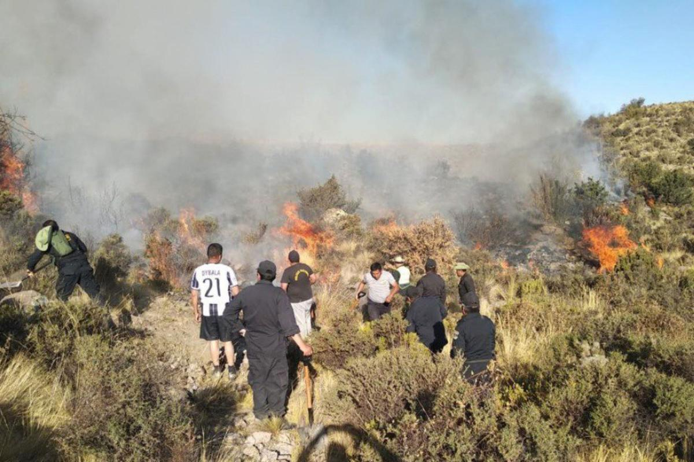
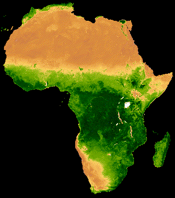

```{r setup, include=FALSE}
knitr::opts_chunk$set(warning = FALSE, message = FALSE, error = FALSE) 
```


# Introducción

<div style = "text-align: justify"> Los incendios forestales se han convertido en un problema ambiental de gran relevancia y gravedad en las últimas décadas; se presenta a nivel mundial, sobre todo en los países con grandes extensiones de áreas forestales (Cárdemas, 2013), como es el caso del Perú. 

El impacto de los incendios reduce la tasa de crecimiento de los bosques, genera muerte y migración de la fauna silvestre, pérdida de la biodiversidad, trasformación de los suelos e incremento de la erosión, contaminación del aire, reducción de servicios de regulación hídrica del ecosistema, mayor incidencia en derrumbes e inundaciones, incluso la aparición de plagas y enfermedades en los bosques debilitados por dichos incendios. (Segura, 2019).

En este análisis se evaluará la estacionalidad de las variables bioclimáticas que favorecen a la ocurrencia de incendios, desde el año 2000 al 2018.</div>

# Identificación del problema

## Planteamiento del problema

<div style = "text-align: justify"> Los incendios ocasionan efectos adversos en los diferentes ecosistemas del país y usos de la tierra, así como en los diferentes sectores, originando pérdidas económicas y en algunos casos pérdida de vidas humanas. Si bien es cierto, el desencadenante de un incendio sobre la cobertura vegetal se debe en un 98 % a las acciones del hombre (Manta, 2017), **las condiciones físicas, biológicas y climáticas deben estar presentes para que se produzca la ignición y se propague el fuego.**

Parte de esta problemática es la carencia de datos estadísticos relacionados al registro histórico de incendios y su distribución espacial, así como su relación con las condiciones favorables que se encuentran presentes en el momento de la aparición del incendio, aspecto que debe ser la base para el entendimiento de este fenómeno y de la generación de las políticas de Estado para atenderlo, desde una óptica de prevención y reducción del riesgo. <div/>

<br/>

```{r echo = FALSE, fig.align='center', out.width="70%", fig.cap='Figura 1. Incendios forestales por la quema de malezas o residuos agrículas.'}

```


## Objetivos

### Objetivo general

<div style = "text-align: justify"> El objetivo principal de este estudio es analizar la estacionalidad de variables bioclimáticas como la temperatura máxima, precipitación, NDVI y altitud en el marco del estudio de las condiciones favorables para la ocurrencia de incendios (CFOI). Producto de esto se generará un laged correlation o correlación rezagada.</div>

### Objetivos específicos

<div style = "text-align: justify"> 
* Analizar las variables bioclimáticas calidad de vegetación y precipitación de forma interestacional en la zona diagnosticada con mejores CFOIs.

* Ampliar el conocimiento de la influencia de las variables bioclimáticas para las CFOI y así en un futuro generar un modelo de predicción.

* Generar conocimiento y aprender la técnica de Teledetección, además de aplicar los conocimientos aprendidos en el curso.</div>

## Justificación

<div style = "text-align: justify"> Este proyecto de investigación se justifica en lo poco explorado que estan siendo los datos estadísticos relacionados al registro histórico de incendios y su distribución espacial, así como su relación con las condiciones favorables que se encuentran presentes en el momento de la aparición del incendio, aspecto que debe ser la base para el entendimiento de este fenómeno y de la generación de las políticas de Estado para atenderlo, desde una óptica de prevención y reducción del riesgo.</div>


# Antecedentes

* [Monitoreo de las condiciones favorables para la ocurrencia de incendios sobre la cobertura vegetal - CFOI](https://repositoriodigital.minam.gob.pe/bitstream/handle/123456789/652/Monitoreo-CFOI_CV.pdf?sequence=1&isAllowed=y)

* [Cajamarca: incendio forestal afectó a zona boscosa de Cerro Negro](https://andina.pe/agencia/noticia-cajamarca-incendio-forestal-afecto-a-zona-boscosa-cerro-negro-640629.aspx)

* [Ocurrencia de incendios forestales en el Perú durante eventos El Niño](https://repositorio.igp.gob.pe/bitstream/handle/20.500.12816/4704/Zubieta_etal_2019_Ocurrencia-de-incendios-forestales-en-el-Peru-durante-eventos-El-Nino.pdf?sequence=1&isAllowed=y)

* [Análise espacial de eventos](http://www.dpi.inpe.br/gilberto/livro/analise/cap2-eventos.pdf)

* [Evaluacion de algoritmos para estimar la derivada de presion en pruebas de pozos](https://dialnet.unirioja.es/descarga/articulo/5432182.pdf)

* [Uso de estimados de densidad Kernell en  la investigación de grupos cerámicos del Periodo Formativo provenientes de Chavín de Huantar](https://revistasinvestigacion.unmsm.edu.pe/index.php/Arqueo/article/view/12339/11039)  

* [Estadística no paramétrica I - youtube](https://www.youtube.com/watch?v=Q40ESwQbJO8)  

* [La problemática de los incendios forestales y bases para su teledetección en el Perú](http://journals.continental.edu.pe/index.php/apuntes/article/view/198/196)

* [Signal Smoothing Algorithms](http://195.134.76.37/applets/AppletSmooth/Appl_Smooth2.html)

* [MODIS Product: MOD13Q1V006](https://lpdaac.usgs.gov/products/mod13q1v006/)

# Marco teórico

## Importancia de los bosques

<div style = "text-align: justify"> Es necesario mencionar la importancia de los bosques. Estas zonas con este tipo de vegetación o áreas forestales son una parte imprescindible para la vida en el planeta, además de ser parte fundamental en los ciclos de producción y distribución del agua, los bosques se encargan de purificar el aire que respiramos al capturar dióxido de carbono y liberar oxígeno, de la misma forma también, regulan la temperatura y la humedad con lo que se equilibra el clima (Barrios et a., 2020). Estos tipos de vegetación también proporcionan alimento medicinas y refugio a los seres vivos y son un fuente de materia prima en muchas actividades humanas como las actividades forestales, por ejemplo. <div/>

<br/>

```{r echo = FALSE, fig.align='center', out.width="70%", comment='', fig.cap = 'Figura 2. Más del 60% del territorio peruano es de bosques tropicales y es el cuarto país con más superficie de ecosistemas en el mundo.'}
knitr::include_graphics('Img/importanciaforestal.jpg')
```

## Amenazas forestales

<div style = "text-align: justify"> La vegetación forestal tiene muchos beneficios, sin embargo todos estos procesos vitales se ven amenazados por diversos factores ajenos a las actividades forestales como la degradación de suelos, la deforestación, la tala inmoderada y los fuegos no controlados que muchas veces están relacionados con otras actividades como la agricultura, la ganadería y el desarrollo urbano. Si bien, usualmente, el fuego en los bosques tiene una connotación negativa, el fuego puede tener una influencia positiva en la naturaleza pues ayuda a mantener la biodiversidad e incluso es necesario para la germinación de ciertas plantas. No obstante esta estrategia que tienen algunas plantas de ser estimuladas por el fuego fue producto de la evolución y producto de algunos fuegos estacionales que se producen de manera natural, pero cuando estos fuegos se producen de manera muy frecuente o son provocados por un uso irresponsable o son producto de alguna negligencia puede convertirse en un incendio forestal con unas consecuencias devastadoras para el medio ambiente e incluso para la salud y seguridad de las personas. <div/>

<br/>

```{r echo = FALSE, fig.align='center', out.width="70%", comment='', fig.cap='Figura 3.Sin bosques no se podría contener las emisiones del dióxido de carbono (CO2) y sin la existencia de esta cobertura vegetal tampoco sería posible la vida en el planeta.'}
knitr::include_graphics('Img/amenazasforestales.jpg')
```

## Fuego

<div style = "text-align: justify"> Según Rodríguez (2010), el fuego se define como la liberación de energía en forma de luz y calor producida por la combustión de un cuerpo, lo que lleva a una descomposición rápida del combustible originada por una temperatura elevada y la presencia de oxígeno. <div/>

<br/>

```{r echo = FALSE, fig.align='center', comment='', out.width="70%", fig.cap='Figura 4. El incendio es un fuego fuera del control.'}

```

## Triángulo del fuego (origen)

<div style = "text-align: justify"> Para que el fuego se pueda presentar se necesita de tres elementos: Combustible, calor y oxígeno. Si no llegase a presentarse uno de estos, la conflagración no se produciría. La (Figura) en el recuadro (a.) muestra esta representación. 


* **Combustible.** El combustible se define como cualquier sólido, líquido o gas que puede ser oxidado. La mayoría de los combustibles o agentes reductores contienen un gran porcentaje de carbono e hidrógeno. 

* **Oxígeno** (Agente Oxidante). En la mayoría de los casos, el agente oxidante será el oxígeno que se encuentra en el aire; sin embargo la combustión de nitrato de sodio y el cloruro de potasio liberan su propio oxígeno donde no exista un ambiente sin oxígeno. 

* **Calor.** La temperatura es la medida de actividad molecular dentro de una sustancia. En presencia de una gente oxidante, un combustible con un nivel de energía lo suficientemente alto puede arder. 

* **La Gran Triada.** Otra representación característica es la gran tríada en la cual se relacionan los combustibles, el tiempo atmosférico y la topografía, donde el primero de estos es el único elemento donde el hombre puede actuar directamente, a diferencia de los dos últimos, los cuales no pueden modificarse. La (Figura 5) en el recuadro (b.) muestra esta representación. <div/>

<br/>

```{r echo = FALSE, fig.align='center', out.width="70%", fig.cap='Figura 5. Representación del Triángulo de Fuego. & b. La gran Triada. Fuente: Comisión Nacional Forestal (2010). Incendios Forestales, guía práctica para comunicadores. (Tercera edición), 6-8.'}
knitr::include_graphics('Img/triadafuego.png')
```

## Incendio forestal (IFs)

<div style = "text-align: justify"> Los incendios forestales se pueden definir como aquella situación cuando un fuego sin control se propaga libremente afectando a diversas áreas como selvas, bosques y vegetación de zonas áridas y semiáridas. Una manera más simple de definir un incendio forestal sería como la combustión de la vegetación forestal sin control.

El estudio de IFs sigue siendo un desafío para la ciencia y el manejo forestal, debido a la interacción entre factores naturales y antrópicos (Lippok et a., 2013). <div/>

<br/>

```{r echo = FALSE, fig.align='center', comment='', out.width="70%", fig.cap='Figura 6. Cuando afecta zonas no boscosas ni aptas para la forestación, se incluye el término incendio rural.'}
knitr::include_graphics('Img/incendioforestal.gif')
```

## Causas de los incendios forestales

<div style = "text-align: justify">Se calcula que las actividades humanas ocasionan el 99% de ellos y solo el resto tiene como causa fenómenos naturales como descargas eléctricas y la erupción de volcanes. Dentro de las principales actividades humanas para el origen de un incendio forestal podemos mencionar situaciones accidentales, por ejemplo, rupturas de líneas eléctricas, accidentes automovilísticos, accidentes ferroviarios e incluso accidentes aéreos, también por negligencias como quemas agropecuarios no controladas, fogatas de excursionistas o incluso actividades de fumadores, quema de basura, la limpieza de vías en carreteras y uso del fuego en otras actividades productivas dentro de las áreas forestales, también una de las causas es por situaciones intencionales como quemas por conflictos entre personas o comunidades, también se puede deber a la tala ilegal o incluso por litigios.<div/>

```{r echo = FALSE, fig.align='center', comment='', out.width="70%", fig.cap='Figura 7. Incendios por causas y motivos conocidos.'}

```

## Regiones con mayor cantidad de incendios

<div style = "text-align: justify"> En los últimos años los IFs han impactado severamente varias regiones del Perú, como Cusco, Apurímac, Lambayeque, Piura y Cajamarca (INDECI, 2013; El Comercio, 2018). <div/>

<br/>

```{r eval=FALSE, message=FALSE, echo = FALSE, warning=FALSE, cache=FALSE}
# Incendios acumulados por mes
shp   <- st_read('Materiales/registro_incendios_2000_2018.gpkg')
Departamentos <- st_read('Materiales/Departamentos.gpkg')
y <- st_intersects(Departamentos, shp)

for (i in 1:nrow(Departamentos)) {
  Departamentos[i, "NIncendios"] = length(y[[i]])
}

st_write(Departamentos[,c(2,6)], "Materiales/DepartamentosIncendios.gpkg")
```

```{r echo = FALSE, fig.align='center', comment='', out.width="70%", fig.align='center', fig.cap='Figura 8. Conteo de la incidencia de incendios por regiones en el Perú desde el 2000 al 2018.'}
knitr::include_graphics('Img/incendiosporregiones.png')
```

## Monitoreo de bosques

El monitoreo de bosques a nivel nacional, a partir del uso de sensoramiento remoto el cual permite documentar la deforestación/cambio de uso de la tierra y catastro forestal por parte de GEO-BOSQUES, GEOSERVIDOR y GEO-SERFOR de los Ministerios del Ambiente (MINAM) y Agricultura, respectivamente, contribuye a la gestión forestal de los gobiernos regionales y locales. El MINAM, en el marco de sus funciones, al evaluar y monitorear los ecosistemas y la biodiversidad en el territorio nacional, reporta por medio de mapas la existencia de [condiciones favorables para la ocurrencia de IFs](http://geoservidor.minam.gob.pe/monitoreo-y-evaluacion/cfoi/). Estos mapas tienen por objetivo realizar una labor de previsión que contribuya a la toma de decisiones.

<br/>

```{r echo = FALSE, fig.align='center', comment='', out.width="70%", fig.align='center', fig.cap='Figura 9. Geoservidor del MINAM, permite el acceso a información más detallada de condiciones favorables para la ocurrencia de incendios.'}
knitr::include_graphics('Img/monitoreodebosques.png')
```


## Función kernel

<div style = "text-align: justify">Una alternativa simple para analizar el comportamiento de patrones de puntos, es estimar la *intensidad puntual del proceso en toda la región de estudio*. Para esto usaremos una función bidimensional sobre los eventos considerados, generando una superficie cuyo valor será proporcional a la *intensidad de muestras por unidad de área*. Esta función realiza un conteo de todos los puntos dentro de una región de influencia, ponderándolos por la distancia de cada uno con respecto a la localización de interés.

Para conocer el comportamiento de esta función no parámetrica de probabilidad, plateamos unas carácteristicas:

* Aveces, el Kernel es una funcion de ventana (window function), esto quiere decir que si hay valores que caen dentro de esa ventana (área) tendrá un valor peso asignado.
* Una función ventana fuera de cierto intervalo adopta el valor 0, normalmente, u otro peso.
* Un kernel, a su vez, es una funcion no negativa.
* Usaremos un parámetro de suavizacion o bandwidth $(h)$, que mientras mas alto, mas suavizamos.
* Usaremos el $n$ para definir el número de observaciones que analizaremos (donde cada dato es el centro donde se coloca un kernel)
* Tanto el $n$ como el $h$ determinarán el area de influencia de los puntos a ser interpolados. 

La ecuación para la estimación de la densidad para un punto $x$ sería: </div>

$${\displaystyle {\widehat {f}}_{h}(x)={\frac {1}{n}}\sum _{i=1}^{n}K_{h}(x-x_{i})={\frac {1}{nh}}\sum _{i=1}^{n}K{\Big (}{\frac {x-x_{i}}{h}}{\Big )}}$$

Donde:

* $n  :$ Número de observaciones (cada datos es el centro donde se coloca el kernel).
* $h  :$ Ancho de banda.
* $K  :$ Es la función kernel.

<br/>

```{r echo = FALSE, fig.align='center', comment='', out.width="70%", fig.align='center', fig.cap='Figura 10. Estimación de la densidad del kernel utilizando diferentes anchos de banda'}

```


## Filtro Digital Savitzky-Golay

<div style = "text-align: justify">Tiene como objetivo la disminucion del ruido de una curva. Esta curva la definimos como los valores de cada pixel a lo largo de un periodo dado, en nuestro caso el valor del píxel será el NDVI. 
El filtro de Savitsky-Golay se basa en el ajuste por minimo cudarados de pequeños conjuntos de datos de longitud $2n +1$ para calcular un polinomio local y tomar al punto central de esa curva polinomial ajustada como el nuevo punto de datos suavizado. 
Savitzky y Golay (A. Savitzky and M. J. E. Golay, Anal. Chem., 1964) demostraron que un conjunto de numeros enteros $({A}_{-n},{A}_{-(n-1)},...,{A}_{n-1},{A}_{n})$ podrían derivarse y se utilizan como coeficientes de ponderacion para realizar la operacion de suavizado. El uso de estos coeficientes de ponderación, conocidos como enteros de convolución, resulta ser exactamente equivalente a ajustar los datos a un polinomio, como se acaba de describir y es computacionalmente más efectivo y mucho más rápido. Por lo tanto, el punto de datos suavizado $Y_{k_{suavizado}}$ por el algoritmo de Savitzky-Golay viene dado por la siguiente ecuación: <div/>

$$Y_{k_{suavizado}}=\frac{\displaystyle\sum_{i=-n}^{n}A_{i}\cdot Y_{k+i}}{\displaystyle\sum_{i=-n}^{n}A_{i}}$$


En donde: 

<div style = "text-align: justify">
* $2n+1$: Es el ancho del filtro, es decir los puntos necesarios para calcular la curva polinomial ajustada de grado $p$, generalmente n es igual a 5 por lo tanto el ancho del filtro son 11 puntos, donde el punto central $k$ equivale a n en la posicion 0.

* ${({Y}_{k+i})}$: Es la funcion polinomial ajustada de grado $p$ empleada para la posicion $k+i$ o simplemente $i$.  

El efecto suavizante del algoritmo Savitzky-Golay no es tan agresivo como en el caso de la media móvil, aunque se debe enfatizar que ambos algoritmos tienen "pérdidas", es decir, parte de la información original se pierde o se distorsiona. Este tipo de suavizado es utilizado principalmente para conservar las características de la distribución inicial, los máximos y mínimos relativos y el ancho entre picos en una serie de datos.
*Este método nos servirá para completar los datos del índice NDVI, para lo años de estudio.* </div>


```{r echo = FALSE, fig.align='center', comment='', out.width="70%", fig.align='center', fig.cap='Figura 11. La principal ventaja de esta aproximación es que tiende a preservar características de la distribución inicial tales como los máximos y mínimos relativos.'}

```


# Descripción del área de estudio

## Localización

<div style = "text-align: justify"> El área de estudio será sustenta con los procedimientos de nuestra metodología, para ello, se aplicó la función kernel de densidad para estimar los lugares en donde se darían más los incendios. Así, tenemos como área de estudio un área que abarca la región de Cusco y Apurimac. La probabilidad que se encuentra en el área es mayor a 5%. </div>

<br/>

```{r echo = FALSE, out.width="100%", fig.align='center', fig.cap='Figura 12. Zona de mayor cantidad de incendios ubicada en los Andes orientales.'}
knitr::include_graphics('Img/mapaubicacion.png')
```


# Materiales y herramientas

## Data histórica de incendios 2000-2018

<div style = "text-align: justify"> Este registro abarca los años 2000 a 2018, fueron descargados del [Geoservidor del Ministerio del Ambiente (MINAM)](https://geoservidor.minam.gob.pe/monitoreo-y-evaluacion/registros-historicos-cfoi/). Esta es la información que viene gestionando el MINAM referido a los registros de ocurrencias de incendios. Dicha información, previo de un proceso de validación con imágenes satelitales, se encuentran georeferenciados y pueden ser descargados en formato shapefile (datos vectoriales).</div>

<br/>

```{r echo = FALSE, out.width="70%", fig.align='center', fig.cap='Figura 13. Plataforma del geoservidor del MINAM, donde encontramos datos vectoriales-puntos con información de incendios forestales.'}

```

## Datos MODIS (MOD13Q1)

Los datos de la versión 6 del espectrorradiómetro de imágenes de resolución moderada (MODIS) Terra (MOD13Q1) se generan cada 16 días a una resolución espacial de 250 metros (m) como un producto de Nivel 3. El producto [MOD13Q1](https://developers.google.com/earth-engine/datasets/catalog/MODIS_006_MOD13Q1) proporciona dos capas de vegetación primarias. El primero es el Índice de Vegetación de Diferencia Normalizada (NDVI), que se conoce como el índice de continuidad del NDVI derivado del Radiómetro Avanzado de Muy Alta Resolución de la Administración Nacional Oceánica y Atmosférica existente (NOAA-AVHRR). 
Para nuestra area de estudio, se hara uso del NDVI procesado a resolucion de 250 m, el cual sera filtrado segun su banda de calidad (QA). 

<br/>

```{r echo = FALSE, out.width="70%", fig.align='center', fig.cap='Figura 14. MOD13Q1.006 Terra Vegetation Indices 16-Day Global 250m.'}

```

## Datos PISCO

El producto grillado [PISCO](https://iridl.ldeo.columbia.edu/SOURCES/.SENAMHI/.HSR/.PISCO/?Set-Language=es#info) (Peruvian Interpolated data of the SENAMHI’s Climatological and hydrological Observations) es una base de datos espacial  de precipitación acumulada y temperatura (maxima y minima) a paso de tiempo mensual, a una resolución de grilla de 0.05º(5 km) para una serie que se inicia en enero de 1981. Sus poductos poseen una escala diaria y mensual y se encuentran disponibles hasta Diciembre del año 2016.  

```{r echo = FALSE, out.width="70%", fig.align='center', fig.cap='Figura 15. Investigadores del senamhi publican artículo científico sobre producto grillado de precipitación..'}

```

## DEM SRTM V4.1

El conjunto de datos de elevación digital Shuttle Radar Topography Mission (SRTM) se produjo originalmente para proporcionar datos de elevación consistentes y de alta calidad en un alcance casi global. Esta versión de los datos digitales de elevación del SRTM se ha procesado para llenar los vacíos de datos y facilitar su uso.
El DEM SRTM V4, que fue encontrado en la plataforma Google Earth Engine y tiene una resolución espacial de 90 m, por lo cual es apto para el estudio de nuestro análisis.

<br/>

```{r eval=FALSE, echo=FALSE, warning=FALSE, cache=FALSE}
#------------------------------------------------------------------------
# require(pacman)
# pacman::p_load(RColorBrewer, ggspatial, raster,colorspace, ggpubr, sf,openxlsx)
#------------------------------------------------------------------------
Peru <- st_read("Materiales/DepartamentosIncendios.gpkg")
# Cuencas_peru       <- st_read ("Materiales/area.gpkg")  
# Rio_libe           <- st_read ("SHP/RIOS_LA_LIBERTAD_geogpsperu_SuyoPomalia_931381206.shp")  
# Rio_caja           <- st_read ("SHP/RIOS_CAJAMARCA_geogpsperu_SuyoPomalia_931381206.shp")  
Cuencas_peru <- st_transform(Cuencas_peru ,crs = st_crs("+proj=longlat +datum=WGS84 +no_defs"))
# Rio_caja           <- st_transform(Rio_caja ,crs = st_crs("+proj=longlat +datum=WGS84 +no_defs"))
# Rio_libe           <- st_transform(Rio_libe  ,crs = st_crs("+proj=longlat +datum=WGS84 +no_defs"))
Cuenca_Chicama <- st_read("Materiales/area.gpkg") %>%
  st_transform(crs = st_crs("+proj=longlat +datum=WGS84 +no_defs"))

# Cuencas_rios1      <- st_intersection(Rio_caja, Cuenca_Chicama)
# Cuencas_rios       <- st_intersection(Rio_libe, Cuenca_Chicama)
# Cuencas_peru_c     <- cbind(Cuencas_peru, st_coordinates(st_centroid(Cuencas_peru$geometry)))

# dem = raster("raster/ASTGTM_S08W080_dem.tif")
# dem2 = raster("raster/ASTGTM_S08W079_dem.tif")
# DEM_total<- raster::merge(dem, dem2,dem)

Cuenca_Chicama_alt<- raster("RasterData/SRTM_90/areaSRTM.tif") #crop(DEM_total, Cuenca_Chicama)
# Cuenca_Chicama_alt <- mask(Cuenca_Chicama_alt, Cuenca_Chicama)
# Cuenca_Chicama_alt[Cuenca_Chicama_alt < 500] = NA
# Cuenca_Chicama_alt     <- Cuenca_Chicama_alt   <- mask(Cuenca_Chicama_alt  , Cuenca_Chicama)
# plot(Cuenca_Chicama_alt)

# dem.p <- rasterToPoints(Cuenca_Chicama_alt)
df <- rasterToPoints(Cuenca_Chicama_alt) %>% 
  as.data.frame() %>% 
  dplyr::filter(!is.na(areaSRTM)) %>%
  rename(lon = x, lat= y, alt = areaSRTM)
  
dfr <- rasterFromXYZ(df)
crs(dfr) <- "+proj=longlat +datum=WGS84 +no_defs +ellps=WGS84 +towgs84=0,0,0" 
# rasterize(df, Cuenca_Chicama_alt, "alt", fun = mean)
# colnames(df) = c("lon", "lat", "alt")

aps <- terrain(dfr , opt = "aspect", unit= "degrees")
# dem.pa <- rasterToPoints(aps)
df_a <- rasterToPoints(aps) %>% 
  as.data.frame() %>% 
  dplyr::filter(!is.na(aspect))
# df_a <- data.frame(dem.pa)

#------------------------------------------------------------------------
Data <- read.xlsx("Materiales/Membrete.xlsx", sheet="Sheet1")
Data[1,1] <- "MAPA DE ELEVACION DE \nÁREA DE ESTUDIO"
Data[2,1] <- "Elaborado por: \nJulio Contreras"
Data[3,1] <- "Escala: Impresión"
Data[4,1] <- "Sistema de Coordenadas Geográficas \nDatum:WGS84 \nEPSG:4326"
colnames(Data ) <- c("Mapa elaborado \nen  R")
Tabla.p <- ggtexttable(Data, rows = NULL,theme =ttheme(base_size =6, "lBlackWhite"))

# Data1     <- read.xlsx("Excel/Embrete.xlsx", sheet="Hoja1")
# Tabla.p1 <- ggtexttable(Data1, rows = NULL,theme =ttheme(base_size =6, "mBlue"))
#-----------------------------------------------------------------------

A <- ggplot() +  
  geom_raster(data = df, aes(lon,lat,fill = alt), alpha = 0.75) +
  geom_raster(data = df_a, aes(x=x, y=y, alpha=aspect), fill="gray20")+ # ,fill="gray20"
  scale_alpha(guide = FALSE,range = c(0, 1.00))   +
  scale_fill_distiller(palette   = "RdYlBu", name="Elevacion \n(m.s.n.m)",
                       labels = c("[500 - 1000] ","[1000-1500]", "[1500-2000]",
                                  "[2000-2500]", "[2500-3000]", "[3000-3500]",
                                  "[3500-4000]", "[4000-4500]", "[4500-5000]"),
                       breaks = c(500, 1000, 1500, 2000, 2500, 3000, 3500, 4000, 4500))+
  theme_bw() +
  coord_equal() +
  guides(fill = guide_legend(title.position = "top",
                             direction = "vertical",
                             title.theme = element_text(angle = 0, 
                                                        size = 5, 
                                                        colour = "black"),
                             barheight = .3, barwidth = .75,
                             title.hjust = 0.5, raster = FALSE,
                             title = 'Elevacion \n(m.s.n.m)'))+
  # geom_sf(data=Cuencas_rios, color="blue", size=0.3)+
  # geom_sf(data=Cuencas_rios1, color="blue", size=0.3)+
  scale_x_continuous(name=expression(paste("Longitude (",degree,")"))) +
  scale_y_continuous(name=expression(paste("Latitude (",degree,")")))+
  annotation_north_arrow(location="tl", which_north="true",
                         style=north_arrow_fancy_orienteering()) +
  ggspatial::annotation_scale(location = "br",
                              width_hint = 0.3,
                              bar_cols = c("grey60", "white"), 
                              text_family = "ArcherPro Book")+
  theme(legend.position = c(0.73,0.20), # posicion leyenda
        panel.grid.major = element_line(color = gray(.25),
                                        linetype = "dashed", size = 0.5),
        legend.background = element_blank(),
        plot.title=element_text(color="#666666", size=2, vjust=1.25,  
                                family="Raleway",  hjust = 0.5),
        legend.box.just = "left",
        legend.text = element_text(size=7,face=2),
        legend.title = element_text(size=10,face=2), 
        legend.key.width = unit(3,"mm"),
        legend.key.height= unit(3, 'mm'),
        legend.title.align = 0.5)+
  guides(fill = guide_legend(nrow = 4, ncol=2))+ # division en los labels de la leyenda
  annotation_custom(ggplotGrob(Tabla.p),
                    xmin = -74, 
                    xmax = -71.5, 
                    ymin = -15.5, 
                    ymax = -14) +
  annotate(geom = "text", x = -72.2, y = -15.3,
           label = ".",
           fontface = "italic", color = "black", size = 2)

B <-ggplot()+
  geom_sf(data= Peru, fill="white")+
  geom_sf(data= Cuenca_Chicama, fill="red")+
  theme_minimal() +
  theme(
    axis.line = element_blank(),
    axis.text = element_blank(),
    axis.title = element_blank(),
    axis.ticks = element_blank(),
    panel.background = element_rect(colour= "black", size= 1))+
  annotation_north_arrow(location="tr",which_north="true",
                         style=north_arrow_fancy_orienteering (),
                         height = unit(0.8, "cm"),# tamaño altura
                         width = unit(0.8, "cm"))+
  ggspatial::annotation_scale(location = "bl",bar_cols = c("grey60", "white"), text_family = "ArcherPro Book")#+
  # annotate(geom = "text", x = -78.5, y = -17,
  #          label = "Mapa de Macrolocalizacion",
  #          fontface = "italic", color = "black", size = 1)

C <-ggplot()+
  geom_sf(data= Peru, fill=NA)+
  geom_sf(data= Cuenca_Chicama, fill="gray")+
  theme_minimal() +
  theme(
    axis.line = element_blank(),
    axis.text = element_blank(),
    axis.title = element_blank(),
    axis.ticks = element_blank(),
    panel.background = element_rect(colour= "black", size= 1))+
  annotation_north_arrow(location="tr", which_north="true",
                         style=north_arrow_fancy_orienteering (),
                         height = unit(.8, "cm"),# tamaño altura
                         width = unit(.8, "cm"))+
  ggspatial::annotation_scale(location = "bl",
                              bar_cols = c("grey60", "white"), 
                              text_family = "ArcherPro Book") +
  # annotate(geom = "text", x = -73, y = -14.25,
  #          label = "Mapa Departamental",
  #          fontface = "italic", color = "black", size = 2)+
  coord_sf(xlim = c(st_bbox(Cuenca_Chicama)$xmin - 0.2, -71.31687 + 0.2), 
           ylim = c(-14.35301 - 0.2, -12.50643 + 0.2),expand = FALSE) #st_bbox -73.23976

D <- ggplot()+ # 
  geom_raster(data = df, aes(lon,lat,fill = alt), show.legend = F) + # Condiciona la leyenda
  # scale_fill_continuous(na.value = "transparent") +
  scale_fill_distiller(na.value = "white", palette   = "RdYlBu",name="Elevacion \n(m.s.n.m)",
                       labels = c("[500 - 1000] ","[1000-1500]", "[1500-2000]", "[2000-2500]", "[2500-3000]", "[3000-3500]", "[3500-4000]", "[4000-4500]", "[4500-5000]"),
                       breaks = c(500, 1000, 1500, 2000, 2500, 3000, 3500, 4000, 4500)) +
  theme_bw()+coord_equal()+
  guides(fill = guide_legend(title.position = "top",direction = "vertical",
                             title.theme = element_text(angle = 0, size = 9, colour = "black"),
                             barheight = .5, barwidth = .95,
                             title.hjust = 0.5, raster = FALSE,
                             title = 'Elevacion \n(m.s.n.m)'))+
  scale_x_continuous(name=expression(paste("Longitude (",degree,")"))) +
  scale_y_continuous(name=expression(paste("Latitude (",degree,")")))+
  annotation_north_arrow(location="tl",which_north="true",
                         style=north_arrow_fancy_orienteering(),
                         height = unit(.8, "cm"),# tamaño altura
                         width = unit(.8, "cm"))+
  ggspatial::annotation_scale(location = "br",
                              bar_cols = c("grey60", "white"), 
                              text_family = "ArcherPro Book")+
  theme(legend.position = c(0.5,0.5), # 0.65,0.15
        panel.grid.major = element_line(color = gray(.5),
        linetype = "dashed", size = 0.5))#,
        # legend.background = element_blank(),
        # plot.title=element_text(color="#666666", size=12, vjust=1.25,  family="Raleway",  hjust = 0.5),
        # legend.box.just = "left",
        # legend.key.size = unit(0.3, "cm"), #alto de cuadrados de referencia
        # legend.key.width = unit(0.3,"cm"), #ancho de cuadrados de referencia
        # legend.text = element_text(size=8,face=2),
        # legend.title = element_text(size=8,face=2))#+
  # guides(fill = guide_legend(nrow = 5, ncol=2))


E <-ggplot()+
  geom_raster(data = df, aes(lon,lat,fill = alt), show.legend = F) +
  geom_raster(data = df_a, aes(x=x, y=y, alpha=aspect), show.legend = F)+
  scale_fill_gradientn(colours = RColorBrewer::brewer.pal(n = 8, name = "Greys"),
                       na.value = 'white')+
  scale_x_continuous(name=expression(paste("Longitude (",degree,")"))) +
  scale_y_continuous(name=expression(paste("Latitude (",degree,")")))+
  annotation_north_arrow(location="tl",
                         which_north="true",
                         style=north_arrow_fancy_orienteering(),
                         height = unit(.8, "cm"),# tamaño altura
                         width = unit(.8, "cm"))+
  ggspatial::annotation_scale(location = "bl",
                              bar_cols = c("grey60", "white"), 
                              text_family = "ArcherPro Book")+
  theme_bw()


Fa <-ggplot() +
  coord_equal(xlim = c(0, 28), ylim = c(0, 20), expand = FALSE) +
  annotation_custom(ggplotGrob(A), xmin = -6, xmax = 23, ymin = 0, ymax = 20)+
  annotation_custom(ggplotGrob(B), xmin = 16.5, xmax = 21.5, ymin = 12.5, ymax = 20) +
  annotation_custom(ggplotGrob(C), xmin = 21.5, xmax = 28, ymin = 12.5, ymax = 20) +
  annotation_custom(ggplotGrob(D), xmin = 15, xmax = 28, ymin = 6.5, ymax = 12.5) +
  annotation_custom(ggplotGrob(E), xmin = 17, xmax = 26, ymin = 0, ymax = 6.5) +
  # annotation_custom(ggplotGrob(Tabla.p1 ),
  #                   xmin = 4, xmax = 10,ymin = 0,ymax = 4)+
  theme_bw() +
  ggtitle('MAPA DE ELEVACIONES DEL ÁREA DE ESTUDIO PARA LAS CFOI', 
          subtitle = 'Elevacion con aspecto con ggplot') +
  labs(
    # title="MAPA DE ELEVACIONES DEL ÁREA DE ESTUDIO PARA LAS CFOI", # Estos no se modifican
    # subtitle="Elevacion con aspecto con ggplot",
    caption="Fuente: https://developers.google.com/earth-engine/datasets/catalog/CGIAR_SRTM90_V4",
    color=NULL) +
  theme(plot.title = element_text(size = 16, hjust = 0.5, face = 'bold'),
        plot.subtitle = element_text(size = 13, hjust=0.5, face = 'italic'))


ggsave(plot = Fa ,"Img/Mapa_elevaciones.png", units = "cm", width = 30,height = 22, dpi = 1000)
```

```{r eval=TRUE, echo=FALSE, warning=FALSE, cache=FALSE, out.width="100%", fig.align='center', fig.cap='Figura 16. Mapa de elevaciones del área de estudio para las CFOI. Fuente: Google Earth Engine - SRTM V4.'}
knitr::include_graphics('Img/Mapa_elevaciones.png')
```

## R y Python

En este proyecto se utilizó dos lenguajes de programación, tanto R como Python. Para nuestro propósito se necesitará de varios paquetes, se mencionan a continuación:
 

### Librerias de R utilizadas 

```{r warning=FALSE, message=FALSE, eval=TRUE}
library(ggspatial)
library(ggpubr)
library(openxlsx)
library(dplyr)
library(ggplot2)
library(tidyverse)
library(sp)
library(sf)
library(rgee)
library(mapedit)
library(raster)
library(cptcity)
library(leaflet)
library(leaflet.extras)
library(leafpop)
library(leafem)
library(MASS)
library(dplyr)
library(ncdf4)
library(devtools)
library(velox)
library(signal)
library(foreach)
library(RColorBrewer)
library(reshape2)
```

### Librerias de Python utilizadas 

```{python warning=FALSE, message=FALSE, eval=FALSE}
import numpy as np ## For array handling
import pandas as pd ## For dataframes
import ee # # Authenticates and initializes Earth Engine
import geemap # A dynamic module of Google Earth Engine
import fiona # For geopackage file handling 
from shapely.geometry import shape ## Shapes f  or geometries
import os #To set and modify filepaths
import json # For json objects
import urllib # For download geopackage files
import matplotlib.pyplot as plt
from scipy import signal ## Aplying Savistky Golay
import rasterio as rio # For raster analysis
```

## Google earth engine

<div style = "text-align: justify">
Cabe mencionar que todos los procesos "pesados" que normalmente consumirían muchos recursos de una computadora convencional, lo realizamos en la plataforma ***Google Earth Engine (GEE)***. Para conectar con esta plataforma se utilizó las APIS para los lenguages seleccionados. Con R usamos el paquete RGEE y para Python, GEEMAP, los junto con sus procedimientos reproducibles en el lenguaje python, para la descarga de datos de NDVI, se encuentran en el siguiente [enlace](https://github.com/ContrerasNk/AnalisOcurrenIncendiosR/blob/master/RasterData/Resultados/Script/NDVI_MODIS.ipynb).
</div>


<div style = "text-align: justify"> ***Como ejemplo, para iniciar sesión en la plataforma GEE por medio de RGEE lo hacemos con el siguiente script, conectando además con nuestro DRIVE.***</div>

```{python eval = FALSE, echo = FALSE}
Sys.setenv(RETICULATE_PYTHON = "")
# Inicializando sesion en GEE
# ee_install()
# ee_clean_pyenv()
# rgee::ee_install_set_pyenv(
  # py_path = "C:/Program Files/QGIS 3.16/bin/python3", # Change it for your own Python PATH
  # py_env = "rgee" # Change it for your own Python ENV
# )
```

```{r eval=FALSE, echo=TRUE, warning=FALSE, message=FALSE, comment='', error=FALSE}
ee_Initialize('juliocontreras1', drive =TRUE)
```

# Metodología

## Diagrama de flujo metodológico

<div style = "text-align: justify"> Nuestra metodología se resume en cuatro principales etapas, tal y como se describe en la siguiente figura: </div>

```{r echo = FALSE, fig.align='center', fig.cap = 'Figura 17. Metodología de la investigación.', out.width="70%"}
knitr::include_graphics('Img/metodologia_4etapas.jpg')
```
<div style = "text-align: justify">Cabe mencionar que esta metodología podría extenderse, con el seguimiento para investigaciones posteriores, ya que esta investigación solo es un EDA, el comienzo para generar un modelo de predicción.</div>


## Diagrama de barras de la acumulación de incendios a lo largo del tiempo

<div style = "text-align: justify"> Se analilzó la tendencia de la ocurrencia de los incendios a lo largo del tiempo, para ello, se necesito de un histograma. En este apartado generaremos un histograma de cantidad de incendios en el tiempo. Tendremos como resultado en qué años predominan estos fenómenos.</div>

<br/>

```{r eval=TRUE, message=FALSE, echo = FALSE, warning=FALSE, cache=FALSE, out.width="80%", fig.align='center', fig.cap='Figura 18. Eventos de incendios a lo largo de los años 2000-2018.'}
# Incendios acumulados por mes
shp   <- 'Materiales/registro_incendios_2000_2018.gpkg'
fires <- st_read(shp, quiet = TRUE) %>% 
  mutate(Date = paste(`AñO`,
                      MES_N, 1, 
                      sep = '-')) %>% 
  group_by(Date) %>% 
  summarise(nfires = length(Date)) %>% 
  mutate(Date = as.Date(Date)) %>%
  arrange(Date) %>% 
  as.data.frame() %>%
  dplyr::select(-geom)
# Como no todos los meses hay incendios se necesita tener todos los meses para generar el histograma
ts    <- data.frame(Date = seq(as.Date('2000-08-01'), 
                               as.Date('2018-12-01'), 
                               by = 'month')) %>% 
  full_join(fires) 

# Generación del histograma

df1 <- data.frame(dt = c(as.Date('2005-09-01'), as.Date('2010-08-15'), as.Date('2016-08-01')), 
           vl = c(300, 190, 435)) # ancho azul de los años señalados

X <- ggplot(ts, aes(x=Date, y=nfires)) + 
  geom_col(data = df1, 
           aes(x=dt,y=vl, fill = "n"), 
           position ="dodge", width = 310, alpha = 0.7, 
           fill = '#fff933') + # , colour = 'blue' borde
  geom_bar(stat="identity", 
           fill="gray", 
           colour="#f03b20") +
  theme_test() + 
  ylab(label = 'Número de incendios\n') +  
  xlab(label = '') + 
  ggtitle(paste('Eventos de incendios \ndel año 2000 al 2018', sep = '')) +
  theme(plot.title = element_text(hjust = 0.5, face = 'bold', size=15, color = "#020722"),
        axis.text.x  = element_text(size=9, angle = 75, hjust = 1, color = "#020722"),
        axis.text.y  = element_text(size=9, color = "#020722"),
        axis.title.y = element_text(size = 12, hjust = 0.5, face = 'bold', vjust = 0.5, color = "#020722")) + 
  scale_x_date(limits = c(as.Date('2000-07-01'),
                          as.Date('2019-01-01')),
               date_labels = ("%Y"), 
               breaks = '1 year') +
  scale_y_continuous(breaks = seq(0,500,50))
X
```

<div style = "text-align: justify"> Se puedo observar en el histograma, muestra que hay un cierta tendencia en los años 2005, 2010 y 2016. Esto quiere decir, que han habido gran cantidad de incendios en esas épocas. Vale decir que este gráfico tambien nos muestra que en el año 2001 no hubo recopilación de estos fenómenos por parte de la entidad encarga, o si lo hubo, no han sido publicados. Esta información nos servirá para hacer los análisis temporales a lo largo de los años, y tener presente solo tres años en particular, los ya mencionados.

Adicional a esta información, se buscó información de sequías, para ver si tenía o no relación con el aumento de incendios en los años seleccionados. Así, dos de estos años coinciden con eventos extremos de sequía, en un estudio realizado por el [Senamhi](https://bit.ly/3hX0K8a), se determinó que el año 2005 y 2016, ocurrieron grandes sequías en las zonas altoandinas, en especial para Cusco y Puno, para ello, se utilizó el índice estandarizado de precipitación (SPI). El año 2010, tiene también un relativo SPI negativo, pero no llega a niveles extremos como en los años mencionados ni a negativos en nuestro área de estudio. Además, mencionamos que el 2004 es el año con mayor SPI, en el rango de los años de estudio, pero las sequías evidenciadas en ese año se dieron durante la fase neutra del ENOS. En los demás años (7) de sequías extremas pertenecieron a la fase cálida del El Niño Oscilación Sur (ENOS).</div>

```{r echo = FALSE, fig.align='center', fig.cap = 'Figura 19. SPI para los años seleccionado para nuestra área de estudio Puno-Cusco.', out.width="70%"}
knitr::include_graphics('Img/metodologia_4etapas.jpg')
```

## Distribución de los incendios por años de 2000 - 2018

<div style = "text-align: justify"> En el apartado anterior generamos un histograma con el fin de ver el comportamiento acumulativo de los incendios desde 2000 al 2018, para que se entienda mejor la distribución de los puntos de incendios se procedió a plotear los puntos de una manera más interactiva, así ver también, cómo se comporta la distribución de incendios a traves de los años de estudio. <div/>

<br/>

<style>
.html-widget {
    margin: auto;
}
</style>

```{r leaflet, eval=TRUE, message=FALSE, echo = FALSE, warning=FALSE, cache=FALSE, out.width="825px", fig.align='center', fig.cap = 'Figura 20. Mapa interactivo para ver la distribución de incendios por años.'}
# Incendios acumulados por mes
Departamentos <- st_read('Materiales/DepartamentosIncendios.gpkg', quiet = TRUE)
shp   <- 'Materiales/registro_incendios_2000_2018.gpkg'
fires <- st_read(shp, quiet = TRUE) %>%
  mutate(Date = paste(`AñO`), Fecha = paste(`AñO`, MES_N, DIA, sep = '-')) %>% 
  as.data.frame() %>%
  dplyr::select(Date, Fecha, LOCALIDAD, 
                DES_EMERGE, DES_FUENTE, DES_DANO, 
                NOMBDIST, NOMBPROV, NOMBDEP, COOR_X, COOR_Y, -geom)
names(fires) <- c("Date", "Fecha", "Localidad", 
                  "Causa", "Acción", "Daños",
                  "Distrito", "Provincia", "Departamento", "Longitud", "Latitud")

# Este es más dinámico
Number_JmType <- fires$Date %>% unique() %>% length() # Numero de especies
Names_JmType <- fires$Date %>% unique() ## Nombre de las especies
Colores <- c("#ef3b2c", "#ffffff", "#807dba", "#33a02c", "#fed976", 
             "#000000", "#0570b0", "#a6cee3", "#1f78b4", "#b2df8a",
             "#33a02c", "#fb9a99", "#e31a1c", "#fdbf6f", "#ff7f00",
             "#cab2d6", "#6a3d9a", "#b15928") # colorbrewer2, Colores de las especies seran
pal <- colorFactor(Colores, domain = Names_JmType) # Generamos la paleta


# Partimos un sf en varios sf
Spp_Pres <- list()
for (i in 1:length(Names_JmType)) {
  Spp_Pres[[i]] <- fires %>% dplyr::filter(Date == Names_JmType[i])
}
names(Spp_Pres) <- Names_JmType

# Ploteamos cada sf, pero sin leyenda
Spp_Map <- leaflet() %>% addTiles(urlTemplate = "https://cartodb-basemaps-{s}.global.ssl.fastly.net/dark_all/{z}/{x}/{y}.png") %>%
  addPolygons(data = Departamentos, fillOpacity = 0, weight = 1, opacity = 1,
              label = ~DEPARTAMEN, color = "#ef3b2c", group = "Departamentos")

for (i in 1:length(Spp_Pres)) {
  Spp_Map <- Spp_Map %>%
    addCircleMarkers(data = Spp_Pres[[i]],
                     lat = ~Latitud, lng = ~Longitud, fillColor = ~pal(Date),
                     fillOpacity = 0.8, radius = 6, weight = 0.5, label = ~Provincia,
                     color = ~pal(Date), group =  Names_JmType[i], 
                     popup = popupTable((Spp_Pres[[i]])[,2:length(Spp_Pres[[i]])],
                                        row.numbers = F, feature.id = F))
}


# Agremos leyenda y su visualizador por grupos, tanto leyenda como suelos8
Spp_Map <- Spp_Map %>%
  addControl(html = "<p><strong><em>MAPA DE DISTRIBUCIÓN DE INCENDIOS</em></strong></p>",
             position = "topright") %>% 
  # addLegend(data = fires, "bottomleft", pal = pal, 
  #               values = ~Date, title = "Incendios", 
  #               opacity = 0.5, group = "Leyenda") %>%
  addLayersControl(baseGroups = Names_JmType, # overlayGroups = c("Leyenda"), 
                   options = layersControlOptions(collapsed = FALSE, color = "blue"), 
                   position = "topright") %>%
  addScaleBar(position = "bottomleft",options = scaleBarOptions(maxWidth = 100,
                                                                 metric = TRUE,
                                                                 imperial = TRUE,
                                                                 updateWhenIdle = TRUE)) %>%
  addMiniMap(tiles = providers$Esri.WorldImagery, toggleDisplay = FALSE, position = "bottomleft") %>%
  addLogo("https://cdn.pixabay.com/photo/2020/09/08/09/49/geography-5554166_960_720.png", #norte
          position = "topleft", offset.x = 65, offset.y = 10,
          width = 48, height = 65) 
Spp_Map
```
  


## Localización del área de estudio

<div style = "text-align: justify"> 
Para el propósito de la investigación se necesitó un área, en específico, de estudio, pero, ¿realmente sabemos en donde hay mayor probalidad de ocurrencia de incendios?, o mejor dicho, ¿dónde hay una mayor tendencia a ocurrir estos fenómenos?. Entonces, para ello, se utilizó la información del geoservidor del MINAM que proporcionó información de incendios históricos, así detallaremos los procedimientos para localizar nuestra área de estudio, a partir de los datos mencionados.
</div> 

### Estimación de densidad de probabilidad 2D: función de densidad no paramétrica

<div style = "text-align: justify"> Se suavizó la serie de incendios (puntos), en función a una matriz, en este caso 250 x 250, tambien definido el tamaño del pixel 0.8 s, además se tuvo en cuenta la matriz movil o kernel (3x3, 5x5, etc).

Con el kernel se determinará la probilidad de ocurrencia, ¿y qué quiere decir eso?. Para pixel central del kernel, de nuestra matriz movil, se calculará la probabilidad de ocurrencia respecto al total de incendios de todo el Perú. Así, la matriz movil irá recorriendo cada pixel y calculando dicha probabilidad.

Las funciones de densidad parámetricas dependen de la varianza o media muestral, por ejemplo, la función de probabilidad normal. En este caso la función kernel estima la densidad de probabilidad para calcular en porcentaje la posibilidad de ocurrencia de incendios para cada pixel, clusterizando las regiones con mayor probabilidad por sobre un umbral definido, además se muestra la región a partir de la cual se basará nuestros graficos de análisis posteriores.

Basicamente, esta función del paquete MASS, en R, varía por ubicación (asignandole peso), sus argumentos de coordenadas son los límites de la matriz ya definida. <div/>

<br/>

```{r eval=TRUE, message=FALSE, echo = FALSE, warning=FALSE, comment=FALSE, out.width="825px", fig.cap='Figura 21. Estimación de la densidad para la ver la zonas más probables de incendios.'}
fires  <- st_read('Materiales/registro_incendios_2000_2018.gpkg', quiet = TRUE)
peru <- st_read('Materiales/Peru.gpkg', quiet = TRUE)
Departamentos <- st_read('Materiales/DepartamentosIncendios.gpkg', quiet = TRUE)

# Extracción de coordenadas de los puntos
fires_df <- st_coordinates(fires) %>% as.data.frame()
names(fires_df) <- c('lon','lat')#here

# Aplicación de la estimación
kde <- kde2d(fires_df$lon, fires_df$lat, n = 250, h = 0.8, lims = c(-86, -65, -19, 0))
kde_raster <- kde %>% raster() %>% crop(peru) %>% mask(peru) %>% disaggregate(fact = 5, method = "bilinear")
kde_raster <- kde_raster * 100

pal <- colorNumeric(c("#3182bd", "#fec44f", "#f03b20"), values(kde_raster), na.color ="transparent")
                   
leaflet() %>% 
  addProviderTiles(providers$OpenStreetMap, group = "OSM")%>%
  addProviderTiles(providers$Esri.WorldImagery, group = "Satellite")%>%
  addControl(html = "<p><strong><em>MAPA DE DISTRIBUCIÓN DE PROBABILIDAD DE INCENDIOS</em></strong></p>",
             position = "topright") %>%
  addRasterImage(kde_raster, colors = pal, group = "prop") %>% 
  addLegend(pal = pal, values = values(kde_raster),title = "%") %>%
  addPolygons(data = Departamentos, fillOpacity = 0, weight = 2,
              opacity = 1, label = ~DEPARTAMEN, color = "#000000", group = "Departamentos") %>%
  addScaleBar(position = "bottomleft", 
              options = scaleBarOptions(maxWidth = 100, metric = TRUE, 
                                        imperial = TRUE, updateWhenIdle = TRUE)) %>%
  addMiniMap(tiles = providers$Esri.WorldImagery, toggleDisplay = FALSE, position = "bottomleft") %>%
  addLogo("https://images.vexels.com/media/users/3/143545/isolated/lists/6b262a6fee14ac40def1be25ca22b5ec-ubicacion-de-la-flecha-norte-nautica.png", #norte
          position = "topleft", 
          offset.x = 65, offset.y = 10,
          width = 75, height = 75) %>%
  addLayersControl(baseGroups = c("OSM","Satellite"),
                   overlayGroups = c("prop"),
                   position = "topright",
                   options = layersControlOptions(collapsed = T)) %>%
  setView(lng = -75, lat = -7.9, zoom = 5)
```


### Elección del área de estudio

Se definió el área de estudió en relación a la distribución de probabilidad. El proceso consistió en rasterizar las áreas probables, previo enmascaramiento de una probabilidad de 5%. Luego, de rasterizado el área, se poligonizó. Se obtuvieron 7 poligonos, se eligió al que se encontraba en la **zona sur**. La zona ya se deifinió anteriormente.

<br/>

```{r eval=TRUE, message=FALSE, echo = FALSE, warning=FALSE, cache=FALSE, out.width="825px", fig.cap='Figura 22. Zona más problable de ocurrencia de incendios, ubicada en el sur, en la zona Andina oriental.'}
Provincias <- st_read('Materiales/Provincias.gpkg', quiet = TRUE)
Cutervo <- st_read('Materiales/area.gpkg', quiet = TRUE) # abajo el guardado

kde_raster_clas <- kde_raster

kde_raster_clas[kde_raster < 5] = NA
kde_raster_clas[kde_raster >= 5] = 1

# writeRaster(kde_raster, 'raster2.tif')

kde_sf <- rasterToPolygons(kde_raster_clas, dissolve = T) %>% # dissolve = no sigue la forma interna de pixeles
  disaggregate() %>% # multipoligon
  st_as_sf() 

# st_write(kde_sf, "Materiales/allareas.gpkg")

kde_sf <-  kde_sf %>% mutate(id = 1:nrow(kde_sf), area = st_area(geometry)/1000000) %>% 
  arrange(desc(area)) %>%
  dplyr::filter(id == 3) %>%
  st_simplify(dTolerance = 1700)

# st_write(kde_sf, "Materiales/area.gpkg")
  
# Posicion para el ploteo
centroid <- st_centroid(Cutervo)
X <- (st_coordinates(centroid))[,"X"]
Y <- (st_coordinates(centroid))[,"Y"]

# Interactivo
leaflet() %>% 
  addTiles(urlTemplate = "https://cartodb-basemaps-{s}.global.ssl.fastly.net/dark_all/{z}/{x}/{y}.png", group = "Dark") %>%
  addProviderTiles(providers$Esri.WorldImagery, group = "Satellite") %>%
  addProviderTiles(providers$OpenStreetMap, group = "OSM" )%>%
addControl(html = "<p><strong><em>MAPA DE LA ZONA MÁS PROBABLE PARA EL ESTUDIO</em></strong></p>",
             position = "topright") %>%
  addRasterImage(kde_raster_clas, colors = "#f03b20", group = "Density") %>%
  # addLegend(pal = pal, values = values(kde_raster),title = "% Incendios") %>%
  addPolygons(data = Provincias, fillOpacity = 0, weight = 1, opacity = 1, 
              label = ~PROVINCIA, color = "#ffff33", group = "Provincias") %>%
  addPolygons(data = Cutervo, fillOpacity = 0, weight = 4, opacity = 1,
              label = ~area, color = "#54278f",group = "Area") %>%
  addScaleBar(position = "bottomleft", 
              options = scaleBarOptions(maxWidth = 100, metric = TRUE,
                                        imperial = TRUE, updateWhenIdle = TRUE)) %>%
  addLayersControl(baseGroups = c("Dark", "Satellite", "OSM"), 
                   overlayGroups = c("Density", "Area", "Provincias"), 
                   options = layersControlOptions(collapsed = TRUE), position = "bottomleft") %>%
  addMiniMap(tiles = providers$Esri.WorldImagery, toggleDisplay = FALSE, position = "topright") %>%
  addLogo("https://cdn.pixabay.com/photo/2020/09/08/09/49/geography-5554166_960_720.png", #norte
          position = "topleft", offset.x = 65, offset.y = 10,
          width = 48, height = 65) %>%
  setView(lng = X, lat = Y, zoom = 6.5) 
```
<br/>

## Preprocesamiento para NDVI del MOD13Q1

<div style = "text-align: justify"> Este se obtendrá del producto del sensor MODIS (MOD13Q1) del sensor Terra, 2000 - 2018. Este producto es un compuesto de 16 días, bajo el método de valor máximo, tiene una resolución espacial de 250 m, puede encontrarlo en [Google Earth Engine](https://developers.google.com/earth-engine/datasets/catalog/MODIS_006_MOD13Q1?hl=en)


Dentro del producto se tiene sub data sets, donde podemos encontrar el NDVI (006) y EVI, y las bandas que se utilizaron para sus calculos, así mismo encontrarás la banda $qa$ o banda de calidad. La banda de calidad (qa) te muestra el estado de los píxeles, según la presencia de artefactos como las nubes, sombras, cobertura de nieve. Aquí filtraremos los datos de NDVI a través de la ***qa*** (0-65535) con una resolución radiométrica de 16 bits $2^{16}$.</div>

***La descarga automática de los datos MOD13Q1 es reproducible y se encuentra disponible en el [repositorio de Github](https://github.com/ContrerasNk/AnalisOcurrenIncendiosR/tree/master/RasterData/Resultados/Script/NDVI_MODIS.ipynb) del proyecto.***

### Filtro por la banda de calidad

<div style = "text-align: justify">Para entender como se interpreta un banda de calidad no dirigimos a la página de [GRASS GIS](https://grass.osgeo.org/grass78/manuals/i.modis.qc.html), donde nos ofrece un descripción de la ***qa***. Tenemos que pasar nuestros ND de un sistema decimal a uno binario (ahí es donde se hace la interpretación) donde nos resultará 16 dígitos. Los códigos a continuación creará un función filtro **qa** (de calidad). </div>


```{r warning=FALSE, cache=FALSE, eval=FALSE}
# Indice de Vegetación Diferencial Normalizado 2000 - 2018 ----

dataBIN <- DecToBin(c(1:65535))
for (i in 1:length(dataBIN)) {
  nceros = 16 - nchar(dataBIN[i])
  dataBIN[i]   = paste(substr('000000000000000', 1, nceros), dataBIN[i], sep = '')
}

dataBIN_DF <- data.frame(bin = dataBIN) %>% mutate(dec = c(1:length(bin))) %>%
                         dplyr::filter(substr(bin ,1,1)  == '1' | substr(bin ,2,2)   == '1'| substr(bin ,3,5)   == '011' | substr(bin ,3,5)  == '000' | substr(bin ,3,5)   == '100' | substr(bin ,3,5)   == '110' | substr(bin ,3,5)  == '111' | substr(bin ,6,6)   == '1'   | substr(bin ,8,8)   == '1'   | substr(bin, 9,10) == '00'  | substr(bin, 9,10)  == '11'  |
substr(bin, 11,14) == '1100'| substr(bin, 11,14)== '1101'| substr(bin, 11,14) == '1110'|    substr(bin, 11,14) == '1111'| substr(bin, 15,16)== '10'  | substr(bin, 15,16) == '11')

# FILTRANDO EL INDICE DE VEGETACION A TRAVES DE LA BANDA DE CALIDAD QA -----
qa_list   = list.files("RasterData/Resultados/QA_MOD13Q1/", pattern = 'QA', full.names = T)
ndvi_list = list.files("RasterData/Resultados/NDVI_MOD13Q1/", pattern = 'NDVI', 
                       full.names = T)

 for (k in 1:length(qa_list)) {# EL length puede ser tanto de la banda QA o del NDVI, es la misma cantidad
  print(k)
  # NOMBRE DEL NUEVO NDVI
  name = ndvi_list[k] %>% strsplit('_') %>% sapply('[',7)
  # LLAMANDO A LAS BANDAS QA Y NDVI
  qa   = raster(qa_list[k])
  ndvi = raster(ndvi_list[k])
  # BANDA QA A VALORES DE 1 Y NA
  qa[qa %in% dataBIN_DF$dec] = NA
  qa[!is.na(qa)] = 1
  # FILTRANDO LOS NDVI
  ndvi_filter = ndvi*qa
  writeRaster(ndvi_filter, paste("RasterData/Resultados/Filtered/",'MOD13Q1_NDVI_filtered_', name, '.tif', sep=''), overwrite = T)
  date()
 }
```

### Remuestreo

***Sustentar el remuestreo***

```{r warning=FALSE, cache=FALSE, eval=TRUE}
ndvi_raster <- list.files("RasterData/Resultados/Filtered/", pattern=".tif$",
                          full.names = TRUE)

for(i in ndvi_raster){
  print(i)
  nom=i
  ndvi= raster(i) %>%  aggregate(fact=0.05/res(raster(i))) ## la resolucion que se quiere es 0.05° 
  writeRaster(ndvi, file.path("RasterData/Resultados/Resampled/",nom))
}
```


### Completación de datos con el método Savitzky Golay

<div style = "text-align: justify"> Este método en el servidor del google earth engine se encuentra en el ejemplo de [David Montero](https://github.com/davemlz/GEE_TimeSeries/blob/master/GEE_TimeSeries_SavGol.py) en **Python**, para este avance se tratará de aplicarlo en R.

Este filtro se basa en el cálculo de una regresión polinómica local, donde su principal ventaja en la aproximación que tiende a conservar la características de la distribución iniciales tales como los máximos y mínimos relativos, así como los anchos y picos, que normalmente desaparecen en otras técnicas de filtrado como la *media movil*. Por lo tanto, obtenemos como resultado, datos del NDVI sin vacios, a excepción de los cuerpos de agua que no tuvieron registro alguno de actividad fotosintética.

```{r warning=FALSE, cache=FALSE, eval=FALSE}
ndvi_resamp <- list.files("RasterData/Resultados/Resampled/", pattern=".tif$", 
                          full.names = TRUE)
ndvi_base <- raster(ndvi_resamp[1])
ndvi_stack <- stack(ndvi_resamp)

# Creación de la matriz ----
for (i in 1:length(ndvi_resamp)) {
  print(i)
  ndvi = raster(ndvi_resamp[i]) %>% getValues()# obtenemos los valores de cada raster
  if (i == 1) { df   = data.frame(ndvi) }else{ df = cbind(df, ndvi) } ## Se crea un dataframe con el primer NDVI y despues se concatenan como columnas los NDVI siguientes.
## El dataframe tiene a cada NDVI como columnas y sus valores como filas (hay 2300)  
}

## Funcion filtro Savitsky Golay ----
for(j in 1:nrow(df)) {
  print(j)
  pixel = df[j,] %>% as.numeric() ## Cada una de las filas representa a un mismo pixel en el dataframe, es decir tenemos la serie del tiempo para cada pixel
  if(any(is.na(pixel) == FALSE)){ 
    pixel[is.na(pixel)] = mean(pixel,na.rm=T) ## Si hay valores nulos NA se reemplaza por la media
    pixel               = sgolayfilt(x=pixel) ## Aplicando el filtro de Savistky Golay
    if(j ==1){df_SG = matrix(pixel, nrow=1)}else{ df_SG = rbind(df_SG, pixel)}
    } else{       ## Se crea una matriz con la primera serie de tiempo del primer pixel y despues se concatenan como filas los siguientes pixeles.
      if(j ==1){ df_SG = matrix(rep(NA, ncol(df)), nrow=1)}else{ df_SG = rbind(df_SG, rep(NA, ncol(df)))}
      ## En cambio si todos la fila posee valores del pixel como NA se creara su respectiva matriz. 
      }
}

## Construcción de Raster  --------------
for(i in 1:length(ndvi_resamp)){ 
  name = ndvi_resamp[i] %>% strsplit("_") %>% sapply("[",4) %>% substr(1,10)
  example = ndvi_base
  ndvi_crs = crs(example)
  ndvi_res = res(example)
  xy = coordinates(example) %>% as.data.frame()
  df_ndvi = cbind(xy, df_SG[,i])
  names(df_ndvi) = c('x','y','z')
  ndvi = rasterFromXYZ(df_ndvi, ndvi_res, ndvi_crs, digits=0)
  writeRaster(ndvi,paste("RasterData/Resultados/SavGol/",name,'_SGolay.tif',sep=''),overwritre=T)
}
ndvi_stack <- stack(list.files("RasterData/Resultados/SavGol/", pattern = '.tif$',
                               full.names=TRUE))
writeRaster(ndvi_stack,"RasterData/Resultados/SavGol/savgol_stack.nc")
```

```{r eval = FALSE, echo=FALSE}
ndvi_list  <- list.files("RasterData/MODQ1/Filtrado/", pattern=".tif$", full.names = T)
ndvi_base <- raster(ndvi_list[1]) # Solo para extraer la caracteristicas de los raster

# Creación de la matriz
for (i in 1:length(ndvi_list)) {
  print(i)
  ndvi = raster(ndvi_list[i]) %>% getValues()
  if (i == 1) {
    df = data.frame(ndvi) # Primera columna en forma de NDVI
  } else {
    df = cbind(df, ndvi) # Se concatenan las siguientes, apartir del 2do raster
  }
}

# Funcion de filtro Savitzky Golay

for (j in 1:nrow(df)) {
  print(j)
  pixel = df[j, ] %>% as.numeric() # vector numerico, porsiaca
  if (any(is.na(pixel) == F)) {
    pixel[is.na(pixel)] = mean(pixel, na.rm = T) # Completación de vacios con el promedio temporal
    pixel = sgolayfilt(x = pixel)
    
    if (j == 1) {
      df_SG = matrix(pixel, nrow = 1)
    } else {
      df_SG = rbind(df_SG, pixel)
    }
    
    if (j == 1) {
      df_SG = matrix(rep(NA, ncol(df)), nrow = 1)
    } else {
      df_SG = rbind(df_SG, rep(NA), ncol(df))
    }
  }
}
```


## Preprocesamiento del Modelo Digital de elevación SRTM V4.1

***Colocar shp de enmascaramiento Figura 23.***

```{r eval=FALSE, message=FALSE, echo = FALSE, warning=FALSE, cache=FALSE, out.width="825px"}
Cutervo <- st_read('Materiales/area.gpkg') %>% st_geometry() %>% sf_as_ee()
# Cajamarca <- st_read('Materiales/Cajamarca.gpkg') %>% st_geometry() %>% sf_as_ee()

Cutervo_dem <- ee$Image('CGIAR/SRTM90_V4')$clip(Cutervo)
# dem_caja_raster <- ee_as_raster(Cutervo_dem, Cutervo)
# writeRaster(dem_caja_raster, 'RasterData/SRTM_90/areaSRTM.tif')
viz <- list(min= 100,
            max = 4500,
            palette = cpt(pal = 'gmt_GMT_dem1', n = 10))

# dem_caja_raster[dem_caja_raster <= 0] = 0
Map$centerObject(Cutervo, zoom = 8)
Map$addLayer(Cutervo_dem,visParams = viz, name = "DEM_SRTM_V4", legend = TRUE) #+
  # Map$addLayer(Cutervo, name = "Lim_Cutervo") #+
  # Map$addLayer(Cajamarca, name = "Cajamarca")
```

 
```{r eval=FALSE, message=FALSE, echo = FALSE, warning=FALSE, cache=FALSE, fig.align='center'}
# Dentro de este apartado vamos a vectorizar el DEM STRM V4 dentro de los intervalos cada 500 m
dem   <- raster('RasterData/SRTM_90/areaSRTM.tif')
dem[dem == 0] = NA
dem[dem > 0 & dem < 500] = 1
dem[dem >= 500 & dem < 1000] = 2
dem[dem >= 1000 & dem < 1500] = 3
dem[dem >= 1500 & dem < 2000] = 4
dem[dem >= 2000 & dem < 2500] = 5
dem[dem >= 2500 & dem < 3000] = 6
dem[dem >= 3000 & dem < 3500] = 7
dem[dem >= 3500 & dem < 4000] = 8
dem[dem >= 4000 & dem < 4500] = 9
dem[dem >= 4500] = 10
plot(dem)

# writeRaster(dem, 'RasterData/SRTM_90/areaAntPoly.tif')


# dem_polygon <- rasterToPolygons(dem, dissolve = T) %>% # dissolve = no sigue la forma interna de pixeles
#   disaggregate() %>% # multipoligon
#   st_as_sf() 


# vec_dem   <- st_read('Materiales/Cutervo_RangoAlt.gpkg') # Raster DEM vectorizado
# writeRaster(dem, 'RasterData/SRTM_90/areaAntPoly.tif')
# dem_poly <- rasterToPolygons(dem) %>% st_as_sf()

```


## Variabilidad de incendios por altitud

El objetivo de este apartado es elaborar un histograma sobre la distribución altitudinal de los incendios, para ello, previamente se realizó el enmascaramiento por rangos de latitud.


```{r eval=TRUE, message=FALSE, echo = FALSE, warning=FALSE, cache=FALSE, fig.align='center', fig.cap='Figura 24. Histograma de las incendios por altitud filtrados cada 500m.'}
fires <- st_read('Materiales/registro_incendios_2000_2018.gpkg')
dem   <- raster('RasterData/SRTM_90/areaSRTM.tif')

df <- raster::extract(dem,fires) %>% data.frame()
names(df) <- 'elev'

ggplot(df, aes(df$elev)) + geom_histogram(binwidth = 100, fill='gray', col='black') +
  theme_bw() + labs(x = '', y = '') +
  ylab(label = 'Número de incendios\n') +
  xlab(label = 'Altitud [msnm]') + 
  ggtitle('Número de incendios por elevación', subtitle = 'Desde 2000 al 2018\nHistograma') +
  theme(plot.title    = element_text(size = 20, hjust = 0.5, face = 'bold'),
        plot.subtitle = element_text(size = 12, hjust = 0.5, face = 'italic'),
        axis.text.x   = element_text(size=12),
        axis.text.y   = element_text(size=12),
        axis.title    = element_text(size=20),
        panel.border  = element_rect(colour = "black", fill=NA, size=1),
        axis.title.y = element_text(size = 12, hjust = 0.5, face = 'bold', vjust = 0.5, color = "#020722"),
        axis.title.x = element_text(size = 12, hjust = 0.5, face = 'bold', vjust = 0.5, color = "#020722")) +
  scale_y_continuous(breaks = seq(0,70,10), limits = c(0, 80), expand = c(0,0)) +
  scale_x_continuous(breaks = seq(0, 5000, 500), limits = c(800, 4800), expand = c(0,0))
  
# ggsave(plot = X, filename = 'D:/DataBase/Theme_n2/04-Graphics/Number_of_Fires_by_Elev.png',
#        width = 15, height = 15, units = "cm", dpi = 500)
```

Como podemos observar en el histograma los incendios se registran entre los 1000 y 3000 msnm, pero es entre los 4100 y 4300 principalmente donde la cantidad de incendios supera los 10 registros aproximadamente.

## Variabilidad estacional de la ocurrecia de incendios

<div style = "text-align: justify"> Se verá el comportamiento estacional, promedio y máximo, para un registro de incendios. La idea es identificar los meses de cada año, donde el registro mensual se comporte igual o cerca de los máximos históricos y que superen los promedios historicos, esos meses debieron tener la mejores condiciones favorables para la ocurrencia de indencios.</div>

<br/>

```{r eval=TRUE, message=FALSE, echo = FALSE, warning=FALSE, cache=FALSE, fig.align='center', fig.cap='Figura 25. Evaluación de la cantidad de incendios en el 2005 con respecto a los históricos.'}
fires <- st_read('Materiales/registro_incendios_2000_2018.gpkg', quiet = TRUE)

yr <- 2005

# CREACION Y MANIPULACION DE TABLA PARA EL PLOTEO
a <- fires %>% group_by(Date = paste(`AñO`, MES_N, sep = '-')) %>%
  summarise(nfires = length(Date)) %>% 
  group_by(MES = substr(Date,6,7)) %>% 
  summarise(fires_mean = mean(nfires, na.rm = T), fires_max  = max(nfires, na.rm = T)) %>%
  mutate(MES = as.numeric(MES)) %>% arrange(MES) %>% as.data.frame() %>% dplyr::select(-geom)

b <- fires %>% dplyr::filter(`AñO`== yr) %>%
  mutate(MES = MES_N) %>%
  group_by(MES) %>% 
  summarise(fires_anom = length(MES)) %>%
  as.data.frame() %>% dplyr::select(-geom)


df <- data.frame(MES = c(1:12)) %>% 
  full_join(a, by = 'MES') %>% 
  full_join(b, by = 'MES') %>% 
  dplyr::select(-MES) %>%
  mutate(Date = seq(as.Date('2018-01-01'), as.Date('2018-12-01'), by='month'),
         fires_mean = ifelse(is.na(fires_mean), 0, fires_mean),
         fires_max  = ifelse(is.na(fires_max), 0, fires_max),
         fires_anom = ifelse(is.na(fires_anom), 0, fires_anom)) %>%
  melt(id.vars = c("Date")) # Todas las columnas que no sean Date seran variable y los valores de esas columnas value

# Nombre leyenda

df$variable <- rep(c("Promedios históricos", "Máximos históricos", "Registro Mensual"), each = 12)
names(df)[2] <- "Incendios"

ggplot(data = df, aes(x = Date, y = value, fill = Incendios, 
                      color = Incendios, alpha = Incendios)) + # , size = rep(c(0.01,0.011,0.01), each = 12)
  geom_bar(stat = "identity", position = "identity") +
  # labs(fill = "Dose (mg)") +
  scale_fill_manual(values = c("red", "blue","gray")) + # ,name="Incendios",labels = c("Promedios históricos", "Máximos históricos", "Registro Mensual")
  scale_colour_manual(values=c("red", "blue", "black")) +
  scale_alpha_manual(values = c(0.2, 0.4, 0)) +
  # labs(alpha='NEW LEGEND TITLE') +
  # scale_size_discrete(0.5, 1, 0.5) +
  # theme(strip.text.x = element_blank(),
  #     strip.background = element_rect(colour="white", fill="white"),
  #     legend.position=c(.2,.75)) + 
  ggtitle('Comportamiento Mensual de Incendios',
          subtitle = paste0('Desde 2000 hasta 2018\nAño ', as.character(yr))) +
  theme_test() +
  labs(y = 'Número de incendios', x = '') +
  theme(plot.title    = element_text(size = 20, hjust = 0.5, face = 'bold'),
        plot.subtitle = element_text(size = 12, hjust = 0.5, face = 'italic'),
        axis.text.x   = element_text(size = 12, hjust = 1),
        axis.text.y   = element_text(size = 12),
        axis.title.y  = element_text(size = 15, hjust = 0.5, face = 'bold', vjust = 0.5),
        legend.position = c(.2,.75), 
        # Change legend background color
        legend.background = element_rect(fill = "white", color = "#fed976", linetype = "solid"),
        legend.key = element_rect(fill = "white"),
        # Change legend key size and key width
        legend.key.size = unit(0.5, "cm"),
        legend.key.width = unit(0.3,"cm"),
        legend.margin = margin(0.1, 0.1, 0.1, 0.1, "cm"),
        legend.title = element_text(face = "bold"),
        legend.title.align = 0.5) + # ,legend.direction = "horizontal"
  # guides(color=guide_legend(title="New Legend Title")) + # size = FALSE
  # scale_fill_discrete(name = "Dose", labels = c("A", "B", "C")) +
  scale_x_date(date_labels = "%b", breaks = '1 month') +
  scale_y_continuous(breaks = seq(0,450,50), limits = c(0, 430)) 


# CAMBIO DE IDIOMA
# 
# # PLOTEO  
# X <- ggplot(df) +
#   geom_bar(aes(x = Date, y = fires_mean, fill = label_mean),
#            stat = "identity", fill = 'blue', colour = 'blue', alpha = 0.4) +
#   geom_bar(aes(x = Date, y = fires_anom, fill = label_anom), 
#            stat = "identity", fill = 'gray', colour = 'black', alpha = 0.4) +
#   
#   geom_bar(aes(x = Date, y = fires_max,  fill = label_max),
#            stat = "identity", colour = 'red', alpha=0) +
#   ggtitle('Comportamiento Mensual de Incendios',
#           subtitle = paste0('Desde 2000 hasta 2018\nAño ', as.character(yr))) +
#   theme_bw() +
#   labs(y = 'Número de incendios', x = '') +
#   theme(plot.title    = element_text(size = 20, hjust = 0.5, face = 'bold'),
#         plot.subtitle = element_text(size = 12, hjust = 0.5, face = 'italic'),
#         axis.text.x   = element_text(size = 12, hjust = 1),
#         axis.text.y   = element_text(size = 12),
#         axis.title.y  = element_text(size = 15, hjust = 0.5, face = 'bold', vjust = 0.5))  + #
#   scale_x_date(date_labels = "%b", breaks = '1 month') +
#   scale_y_continuous(breaks = seq(0,140,20), limits = c(0, 140)) +
#   guides(fill = guide_legend(override.aes = list(color = "blue", fill = "blue"))) +
#   scale_fill_manual(name = "Incendios", values = c("blue", "blue", "blue"), labels = c("max_h", "mean_h", "meansual"))
#   # theme(legend.position = "none")
# X


# element_rect(
#   fill = NULL,
#   colour = NULL,
#   size = NULL,
#   linetype = NULL,
#   color = NULL,
#   inherit.blank = FALSE
# )
  # ggtitle(paste('Eventos de incendios \ndel año 2000 al 2018', sep = '')) +
  # theme(plot.title = element_text(hjust = 0.5, face = 'bold', size=15),
  #       axis.text.x  = element_text(size=11, angle = 75, hjust = 1),
  #       axis.text.y  = element_text(size=11),
  #       axis.title.y = element_text(size = 12, hjust = 0.5, face = 'bold', vjust = 0.5)) 
# ggsave(plot = X, filename = paste0('Img/Bar_Fires_', as.character(yr),'.png'), units = "cm", dpi = 500)
```

<br/>

```{r eval=TRUE, message=FALSE, echo = FALSE, warning=FALSE, cache=FALSE, fig.align='center', fig.cap='Figura 26. Evaluación de la cantidad de incendios en el 2010 con respecto a los históricos.'}
fires <- st_read('Materiales/registro_incendios_2000_2018.gpkg', quiet = TRUE)

yr <- 2010

# CREACION Y MANIPULACION DE TABLA PARA EL PLOTEO
a <- fires %>% group_by(Date = paste(`AñO`, MES_N, sep = '-')) %>%
  summarise(nfires = length(Date)) %>% 
  group_by(MES = substr(Date,6,7)) %>% 
  summarise(fires_mean = mean(nfires, na.rm = T), fires_max  = max(nfires, na.rm = T)) %>%
  mutate(MES = as.numeric(MES)) %>% arrange(MES) %>% as.data.frame() %>% dplyr::select(-geom)

b <- fires %>% dplyr::filter(`AñO`== yr) %>%
  mutate(MES = MES_N) %>%
  group_by(MES) %>% 
  summarise(fires_anom = length(MES)) %>%
  as.data.frame() %>% dplyr::select(-geom)


df <- data.frame(MES = c(1:12)) %>% 
  full_join(a, by = 'MES') %>% 
  full_join(b, by = 'MES') %>% 
  dplyr::select(-MES) %>%
  mutate(Date = seq(as.Date('2018-01-01'), as.Date('2018-12-01'), by='month'),
         fires_mean = ifelse(is.na(fires_mean), 0, fires_mean),
         fires_max  = ifelse(is.na(fires_max), 0, fires_max),
         fires_anom = ifelse(is.na(fires_anom), 0, fires_anom)) %>%
  melt(id.vars = c("Date")) 

# Nombre leyenda
df$variable <- rep(c("Promedios históricos", "Máximos históricos", "Registro Mensual"), each = 12)
names(df)[2] <- "Incendios"

# Ploteo
ggplot(data = df, aes(x = Date, y = value, fill = Incendios, 
                      color = Incendios, alpha = Incendios)) + 
  geom_bar(stat = "identity", position = "identity") +
  scale_fill_manual(values = c("red", "blue","gray")) + 
  scale_colour_manual(values=c("red", "blue", "black")) +
  scale_alpha_manual(values = c(0.2, 0.4, 0)) +
  ggtitle('Comportamiento Mensual de Incendios',
          subtitle = paste0('Desde 2000 hasta 2018\nAño ', as.character(yr))) +
  theme_test() +
  labs(y = 'Número de incendios', x = '') +
  theme(plot.title    = element_text(size = 20, hjust = 0.5, face = 'bold'),
        plot.subtitle = element_text(size = 12, hjust = 0.5, face = 'italic'),
        axis.text.x   = element_text(size = 12, hjust = 1),
        axis.text.y   = element_text(size = 12),
        axis.title.y  = element_text(size = 15, hjust = 0.5, face = 'bold', vjust = 0.5),
        legend.position = c(.2,.75), 
        legend.background = element_rect(fill = "white", 
                                         color = "#fed976", 
                                         linetype = "solid"),
        legend.key = element_rect(fill = "white"),
        legend.key.size = unit(0.5, "cm"),
        legend.key.width = unit(0.3,"cm"),
        legend.margin = margin(0.1, 0.1, 0.1, 0.1, "cm"),
        legend.title = element_text(face = "bold"),
        legend.title.align = 0.5) + 
  scale_x_date(date_labels = "%b", breaks = '1 month') +
  scale_y_continuous(breaks = seq(0,450,50), limits = c(0, 430)) 
```

```{r eval=TRUE, message=FALSE, echo = FALSE, warning=FALSE, cache=FALSE, fig.align='center', fig.cap='Figura 27. Evaluación de la cantidad de incendios en el 2016 con respecto a los históricos.'}
fires <- st_read('Materiales/registro_incendios_2000_2018.gpkg', quiet = TRUE)

yr <- 2016

# CREACION Y MANIPULACION DE TABLA PARA EL PLOTEO
a <- fires %>% group_by(Date = paste(`AñO`, MES_N, sep = '-')) %>%
  summarise(nfires = length(Date)) %>% 
  group_by(MES = substr(Date,6,7)) %>% 
  summarise(fires_mean = mean(nfires, na.rm = T), fires_max  = max(nfires, na.rm = T)) %>%
  mutate(MES = as.numeric(MES)) %>% arrange(MES) %>% as.data.frame() %>% dplyr::select(-geom)

b <- fires %>% dplyr::filter(`AñO`== yr) %>%
  mutate(MES = MES_N) %>%
  group_by(MES) %>% 
  summarise(fires_anom = length(MES)) %>%
  as.data.frame() %>% dplyr::select(-geom)


df <- data.frame(MES = c(1:12)) %>% 
  full_join(a, by = 'MES') %>% 
  full_join(b, by = 'MES') %>% 
  dplyr::select(-MES) %>%
  mutate(Date = seq(as.Date('2018-01-01'), as.Date('2018-12-01'), by='month'),
         fires_mean = ifelse(is.na(fires_mean), 0, fires_mean),
         fires_max  = ifelse(is.na(fires_max), 0, fires_max),
         fires_anom = ifelse(is.na(fires_anom), 0, fires_anom)) %>%
  melt(id.vars = c("Date")) 

# Nombre leyenda
df$variable <- rep(c("Promedios históricos", "Máximos históricos", "Registro Mensual"), each = 12)
names(df)[2] <- "Incendios"

# Ploteo
ggplot(data = df, aes(x = Date, y = value, fill = Incendios, 
                      color = Incendios, alpha = Incendios)) + 
  geom_bar(stat = "identity", position = "identity") +
  scale_fill_manual(values = c("red", "blue","gray")) + 
  scale_colour_manual(values=c("red", "blue", "black")) +
  scale_alpha_manual(values = c(0.2, 0.4, 0)) +
  ggtitle('Comportamiento Mensual de Incendios',
          subtitle = paste0('Desde 2000 hasta 2018\nAño ', as.character(yr))) +
  theme_test() +
  labs(y = 'Número de incendios', x = '') +
  theme(plot.title    = element_text(size = 20, hjust = 0.5, face = 'bold'),
        plot.subtitle = element_text(size = 12, hjust = 0.5, face = 'italic'),
        axis.text.x   = element_text(size = 12, hjust = 1),
        axis.text.y   = element_text(size = 12),
        axis.title.y  = element_text(size = 15, hjust = 0.5, face = 'bold', vjust = 0.5),
        legend.position = c(.2,.75), 
        legend.background = element_rect(fill = "white", 
                                         color = "#fed976", 
                                         linetype = "solid"),
        legend.key = element_rect(fill = "white"),
        legend.key.size = unit(0.5, "cm"),
        legend.key.width = unit(0.3,"cm"),
        legend.margin = margin(0.1, 0.1, 0.1, 0.1, "cm"),
        legend.title = element_text(face = "bold"),
        legend.title.align = 0.5) + 
  scale_x_date(date_labels = "%b", breaks = '1 month') +
  scale_y_continuous(breaks = seq(0,450,50), limits = c(0, 430)) 
```

<br/>

<div style = "text-align: justify"> En lo gráficos generados tanto para los años 2005, 2010 y 2016, las barras con contorno rojo representan los registros máximos históricos mensuales entre el 2000 y el 2018. Las barras azules representan el número promedio de incendios mensuales y las barras grises representan el registro mensual instantaneo para los años en mención. Ahora vemos que en el año 2005 los meses en los que se supera el registro promedio mensual son julio, agosto, septiembre y noviembre, siendo julio y septiembre los que alcanzan los maximos historicos. En el año 2010, por su parte los meses de junio, agosto, septiembre, octubre y noviembre, son los que superan el promedio, siendo agosto el que alcanza el máximo histórico. Por ultimo, en le 2016, los meses de julio, agosto, septiembre y noviembre son los que superan el promedio historico, siendo septiembre y noviembre los que alcanzan los maximos históricos. En conclusion, lo meses con los más altos registros de incendios, estan comprendidos entre julio y noviembre.</div>


## Analisis temporal de datos bioclimáticos

<div style = "text-align: justify"> En este apartado se analizará temporalemte el comportamiento tanto del NDVI, precipitación y temperatura, ***para justificar su uso en el analisis posterior.***</div>

### Precipitacion acumulada mensual


```{r eval=TRUE, message=FALSE, echo = FALSE, warning=FALSE, fig.align='center', comment='', error=FALSE, fig.cap='Figura 28. Comparación de la precipitación acumulada mensual de los años 2000, 2005, 2010, y 2016 con respecto a los históricos.'}
pp_velox <- velox("RasterData/PISCO/PISCOp_v11_area.tif")
region <- st_read("Materiales/area.gpkg", quiet = TRUE)

data <- pp_velox$extract(sp=region, 
                         fun = function(x){
                           mean(x,na.rm=T)
                           }) %>%
        as.vector() # Por que no usar max para los maximos (en ese caso seria para cada pixel)

date <- seq(as.Date('1981-01-01'),as.Date('2018-02-01'), by='month')

# df
pp <- data.frame(date, data) %>% 
  mutate(mes = substr(date, 6, 7)) %>% 
  group_by(mes) %>%
  summarise(ppmean = mean(data, na.rm = T), 
            ppmax = max(data, na.rm = T), 
            ppmin = min(data, na.rm=T)) 
names(pp) <- c("mes", "PP media histórica", "PP máxima histórica", "PP mínima histórica")
pp <- melt(pp, id.vars = c("mes")) 

pps <- data.frame(date, value = data) %>% 
  mutate(mes = substr(date, 6, 7)) %>%
  dplyr::filter(substr(date, 1, 4) %in% c(2000, 2005, 2010, 2016)) %>% 
  add_column(variable = rep(c("PP 2000", "PP 2005", "PP 2010", "PP 2016"), each = 12)) %>%
  dplyr::select(-date)

# Union filas
PP <- pp %>% add_row(pps) 
PP$date <- rep(seq(as.Date('2018-01-01'), as.Date('2018-12-01'), by = 'month'), 7)

names(PP)[2] <- "Precipitación [mm]" # name leyenda

# Plot
ggplot(data = PP, aes(x = date, y = value, 
                      fill = `Precipitación [mm]`, color = `Precipitación [mm]`, 
                      alpha = `Precipitación [mm]`, group = `Precipitación [mm]`)) + # , size = variable 
  geom_line(aes(linetype = `Precipitación [mm]`)) +
  geom_point() +
  scale_linetype_manual(values=c("solid", "solid", "solid", "solid", 
                                 "dotted", "twodash", "dotted")) +
  scale_colour_manual(values=c("#e9c612", "#e31a1c", "#54278f", "#3fce1e", 
                               "#0555f4", "black", "#0555f4")) +
  scale_alpha_manual(values = c(1, 1, 1, 1, 1, 1, 1)) +
  # scale_size_manual(values=c(0.2, 0.2, 0.2, 0.2, 0.5, 0.5, 0.5)) +
  theme_test() + 
  ylab(label = '[mm]') +
  xlab(label = '') +
  ggtitle('Precipitacion acumulada mensual', subtitle = 'De 1981 hasta 2018') +
  theme(plot.title = element_text(size = 16, hjust = 0.5, face = 'bold'),
        plot.subtitle = element_text(size=13, hjust=0.5, face = 'italic'),
        axis.text.x = element_text(size=11), 
        axis.text.y = element_text(size=10),
        axis.title = element_text(size=20), 
        axis.title.y =  element_text(size=12, face='bold'),
        legend.position = c(.5,.83), # posicion de la leyenda
        legend.background = element_rect(fill = "white", 
                                         color = "#fed976", 
                                         linetype = "solid"),
        legend.key = element_rect(fill = "white"),
        legend.key.height= unit(0.1, 'cm'), 
        legend.key.width = unit(0.5,"cm"), # ancho de simbolo leyenda
        legend.margin = margin(0.1, 0.1, 0.1, 0.1, "cm"),
        legend.title = element_text(face = "bold", size=8.5), # modificar letra del titulo
        legend.text = element_text(size=7), # tamano letra etiqueta
        legend.title.align = 0.5,
        legend.spacing.y = unit(0.1, "cm")) + # distancia entre titulo legend y los labels
  scale_x_date(date_labels = '%b', breaks = '1 month') + # , breaks = '1 month', date_labels = '%b'
  scale_y_continuous(breaks = seq(0,300,50), limits = c(0, 270)) 


# pp_velox <- velox("RasterData/PISCO/PISCOp_v11_area.tif")
# region <- st_read("Materiales/area.gpkg", quiet = TRUE)
# 
# data <- pp_velox$extract(sp=region, 
#                          fun = function(x){
#                            mean(x,na.rm=T)
#                            }) %>%
#         as.vector() # Por que no usar max para los maximos (en ese caso seria para cada pixel)
# 
# date <- seq(as.Date('1981-01-01'),as.Date('2018-02-01'), by='month')
# 
# pp <- data.frame(date, data) %>% 
#   mutate(mes = substr(date, 6, 7)) %>% 
#   group_by(mes) %>%
#   summarise(ppmean = mean(data, na.rm = T), 
#             ppmax = max(data, na.rm = T), 
#             ppmin = min(data, na.rm=T))  
# 
# pp2000 <- data.frame(date, pp2000 = data) %>% 
#   mutate(mes = substr(date, 6, 7)) %>%
#   dplyr::filter(substr(date, 1, 4) == 2000) %>% 
#   dplyr::select(-date)
# 
# pp2005 <- data.frame(date, pp2005 = data) %>% 
#   mutate(mes = substr(date, 6, 7)) %>% 
#   dplyr::filter(substr(date, 1, 4) == 2005) %>% 
#   dplyr::select(-date)
# 
# pp2010 <- data.frame(date, pp2010 = data) %>% 
#   mutate(mes = substr(date, 6, 7)) %>%
#   dplyr::filter(substr(date, 1, 4) == 2010) %>% 
#   dplyr::select(-date)
# 
# pp2016 <- data.frame(date, pp2016 = data) %>% 
#   mutate(mes = substr(date, 6, 7)) %>%
#   dplyr::filter(substr(date, 1, 4) == 2016) %>% 
#   dplyr::select(-date)
# 
# df <- data.frame(date = seq(as.Date('2018-01-01'), as.Date('2018-12-01'), by = 'month'), pp) %>%
#   full_join(pp2000) %>% full_join(pp2005) %>%
#   full_join(pp2010) %>% full_join(pp2016)
# 
# 
# X <- ggplot(df, aes(date, ppmean)) +
#   geom_line(colour = 'black', size=.8) +
#   theme_bw() + 
#   ylab(label = '[mm]') +
#   xlab(label = '') +
#   ggtitle('Precipitacion acumulada mensual', subtitle = 'De 1981 hasta 2018') +
#   theme(plot.title = element_text(size = 16, hjust = 0.5, face = 'bold'),
#         plot.subtitle = element_text(size=13, hjust=0.5, face = 'italic'),
#         axis.text.x = element_text(size=12), axis.text.y = element_text(size=12),
#         axis.title = element_text(size=20), axis.title.y =  element_text(size=12, face='bold')) +
#   scale_x_date(date_labels = '%b', breaks = '1 month') +
#   scale_y_continuous(breaks = seq(0,300,50), limits = c(0, 270)) +
#   geom_line(aes(date, ppmax),  colour = 'red', linetype = 'dashed', size=.8) +
#   geom_line(aes(date, ppmin),  colour = 'red', linetype = 'dashed', size=.8) +
#   geom_line(aes(date, pp2000), colour = rgb(233, 228, 91, maxColorValue=255), size=.8) +
#   geom_line(aes(date, pp2005), colour = rgb(160, 114, 14, maxColorValue=255), size=.8) +
#   geom_line(aes(date, pp2010), colour = 'snow3', size=.8) +
#   geom_line(aes(date, pp2016), colour = 'springgreen3', size=.8) +
#   geom_point(aes(date, pp2000), colour = rgb(233, 228, 91, maxColorValue=255) , size=2) +
#   geom_point(aes(date, pp2005), colour = rgb(160, 114, 14, maxColorValue=255) , size=2) +
#   geom_point(aes(date, pp2010), colour = 'snow3', size=2) +
#   geom_point(aes(date, pp2016), colour = 'springgreen3', size=2)
# 
# X
```

<div style = "text-align: justify"> De esto podemos inferir que en los meses de mayor incendios (de julio a enero) se presentaron valores  por debajo de la media, alcanzando incluso  a los mínimos históricos de precipitación acumulada mensual.

Se ve que el mes de octubre es la excepción, donde la precipitación supera a la media histórica. Aunque, en el gráfico de número de incendios por meses, se ve justo en ese mes dismuye, para luego crecer con gran pendiente en el mes de noviembre, esto para todos los años seleccionados.

Tambien se tomó un año "normal" donde no hay gran cantidad de incendios históricos y se ve un comportamiento donde la precipitación del año supera a la media histórica, justo en la estación de mayor cantidad de incendios.
</div>


### Temperatura máxima mensual


```{r eval=TRUE, message=FALSE, echo = FALSE, warning=FALSE, cache=FALSE, fig.align='center', fig.cap='Figura 29. Comparación de la temperatura máxima mensual de los años 2000, 2005, 2010, y 2016 con respecto a los históricos.'}
temp_velox <- velox("RasterData/PISCO/PISCOmtx_v11_area.tif")                 
region <- st_read("Materiales/area.gpkg", quiet = TRUE)

data <- temp_velox$extract(sp = region, fun = function(x){ mean(x, na.rm = T) }) %>% 
  as.vector()
date <- seq(as.Date('1981-01-01'), as.Date('2016-12-01'), by = 'month')


temp <- data.frame(date, data) %>% 
  mutate(mes = substr(date,6,7)) %>% 
  group_by(mes) %>%
  summarise(tempmean = mean(data, na.rm = T), 
            tempmax  = max(data, na.rm = T),
            tempmin  = min(data, na.rm = T))
names(temp) <- c("mes", "TempM media histórica", "TempM máxima histórica", "TempM mínima histórica")
temp <- melt(temp, id.vars = c("mes"))

temps <- data.frame(date, value = data) %>% 
  mutate(mes = substr(date,6,7)) %>% 
  dplyr::filter(substr(date, 1, 4) %in% c(2000, 2005, 2010, 2016)) %>% 
  add_column(variable = rep(c("TemM 2000", "TemM 2005", "TemM 2010", "TemM 2016"), each = 12)) %>%
  dplyr::select(-date)

# Union filas
TEMP <- temp %>% add_row(temps) 
TEMP$date <- rep(seq(as.Date('2018-01-01'), as.Date('2018-12-01'), by = 'month'), 7)

names(TEMP)[2] <- "Temperatura [°C]" # name leyenda


# Plot
ggplot(data = TEMP, aes(x = date, y = value, 
                      fill = `Temperatura [°C]`, color = `Temperatura [°C]`, 
                      alpha = `Temperatura [°C]`, group = `Temperatura [°C]`)) + # , size = variable 
  geom_line(aes(linetype = `Temperatura [°C]`)) +
  geom_point() +
  scale_linetype_manual(values=c("solid", "solid", "solid", "solid", 
                                 "dotted", "twodash", "dotted")) +
  scale_colour_manual(values=c("#e9c612", "blue", "#54278f", "#3fce1e", 
                               "red", "black", "red")) +
  scale_alpha_manual(values = c(1, 1, 1, 1, 1, 1, 1)) +
  # scale_size_manual(values=c(0.2, 0.2, 0.2, 0.2, 0.5, 0.5, 0.5)) +
  theme_test() + 
  ylab(label = '[Temperatura °C]') +
  xlab(label = '') +
  ggtitle('Temperatura Maxima mensual', subtitle = 'De 1981 hasta 2018') +
  theme(plot.title = element_text(size = 16, hjust = 0.5, face = 'bold'),
        plot.subtitle = element_text(size=13, hjust=0.5, face = 'italic'),
        axis.text.x = element_text(size=11), 
        axis.text.y = element_text(size=10),
        axis.title = element_text(size=20), 
        axis.title.y =  element_text(size=12, face='bold'),
        legend.position = c(0.25, 0.83), # posicion de la leyenda
        legend.background = element_rect(fill = "#fffeeb", 
                                         color = "black", 
                                         linetype = "dotted"),
        legend.key = element_rect(fill = "white"),
        legend.key.height= unit(0.1, 'cm'), 
        legend.key.width = unit(0.6, "cm"), # ancho de simbolo leyenda
        legend.margin = margin(0.1, 0.1, 0.1, 0.1, "cm"),
        legend.title = element_text(face = "bold", size=8.5), # modificar letra del titulo
        legend.text = element_text(size=7), # tamano letra etiqueta
        legend.title.align = 0.5,
        legend.spacing.y = unit(0.1, "cm")) + # distancia entre titulo legend y los labels
     scale_x_date(date_labels = '%b', breaks = '1 month') +
     scale_y_continuous(breaks = seq(16,25,1), limits = c(17, 25)) 

# 
# temp2005 <- data.frame(date, temp2005 = data) %>% 
#   mutate(mes = substr(date,6,7)) %>% 
#   dplyr::filter(substr(date,1,4) == 2005) %>% 
#   dplyr::select(-date)
# 
# temp2010 <- data.frame(date, temp2010 = data) %>% 
#   mutate(mes = substr(date,6,7)) %>% 
#   dplyr::filter(substr(date,1,4) == 2010) %>% 
#   dplyr::select(-date)
# 
# temp2016 <- data.frame(date, temp2016 = data) %>% 
#   mutate(mes = substr(date,6,7)) %>% 
#   dplyr::filter(substr(date,1,4) == 2016) %>% 
#   dplyr::select(-date)
# 
# df <- data.frame(date = seq(as.Date('2016-01-01'), as.Date('2016-12-01'), by = 'month'), temp) %>%
#   full_join(temp2000) %>% 
#   full_join(temp2005) %>% 
#   full_join(temp2010) %>% 
#   full_join(temp2016)
# 
# Sys.setlocale(category = 'LC_ALL', locale = 'spanish')
# 
# X <- ggplot(df, aes(date, tempmean)) +
#      geom_line(colour = 'black', size=0.8) + 
#      theme_bw() + ylab(label = '[°C]') +  xlab(label = '') +
#      ggtitle('Temperatura Maxima mensual', subtitle = 'De 1981 hasta 2016') + 
#      theme(plot.title = element_text(size = 16, hjust = 0.5, face = 'bold'),
#            plot.subtitle = element_text(size=13, hjust=0.5, face = 'italic'),
#            axis.text.x = element_text(size=12),
#            axis.text.y = element_text(size=12),
#            axis.title = element_text(size=12, face='bold'))+
#      scale_x_date(date_labels = '%b', breaks = '1 month') +
#      scale_y_continuous(breaks = seq(16,25,1), limits = c(17, 24)) +
#      geom_line(aes(date, tempmax),  colour = 'red', linetype = 'dashed', size = 0.8) +
#      geom_line(aes(date, tempmin),  colour = 'blue', linetype = 'dashed', size = 0.8) +
#      geom_line(aes(date, temp2000), colour = rgb(233, 228, 91, maxColorValue = 255), size = 0.8) +
#      geom_line(aes(date, temp2005), colour = rgb(160, 114, 14, maxColorValue = 255), size = 0.8) +
#      geom_line(aes(date, temp2010), colour = 'snow3', size=0.8) +
#      geom_line(aes(date, temp2016), colour = 'springgreen3', size=.8) +
#      geom_point(aes(date, temp2000), colour = rgb(233, 228, 91, maxColorValue=255) , size=2) +
#      geom_point(aes(date, temp2005), colour = rgb(160, 114, 14, maxColorValue=255) , size=2) +
#      geom_point(aes(date, temp2010), colour = 'snow3', size=2) +
#      geom_point(aes(date, temp2016), colour = 'springgreen3', size=2)
# 
# X
```
<div style = "text-align: justify"> Podemos inferir que en los meses de mayores incendios (de julio a enero) se presentaron valores  por encima de la media, alcanzando incluso a los máximos históricos de temperatura máxima. Aunque vemos que el año 2005 no sigue esa tendencia, solo para los meses setiembre y octubre.</div>


### NDVI Mensual

***Falta argumentar el porqué de su uso. Los anteriores tambien***

```{r eval=TRUE, message=FALSE, echo = FALSE, warning=FALSE, cache=FALSE, fig.align='center', fig.cap='Figura 30. Comparación del NDVI mensual de los años 2004, 2005, 2010, y 2016 con respecto a los históricos.'}
ndvi_velox <- velox("RasterData/Resultados/SavGol/savgol_stack.nc")                 
region <- st_read("Materiales/area.gpkg", quiet = TRUE)

data <- ndvi_velox$extract(sp = region, fun = function(x){ mean(x, na.rm = T) }) %>% as.vector()

ndvi_lista <- list.files("RasterData/Resultados/SavGol/", pattern = '.tif$')

for(i in 1:length(ndvi_lista)){ 
  date = ndvi_lista[i] %>% strsplit("_") %>% sapply("[",1) %>% substr(1,10) # lo ultimo no se si va
  if (i == 1) {dt = data.frame(date)} else{dt = rbind(dt,date)} # raro dt sii existe
}

dates <- as.Date(dt$date)

data_ndvi <- data.frame(dates,data) %>% 
  mutate(mes=substr(dates,6,7), year=substr(dates,1,4)) %>%
  group_by(year,mes) %>% summarise(ndvi = mean(data, na.rm = T))

col_ndvi <- data_ndvi$ndvi
tserie <- seq(as.Date('2000-02-01'), as.Date('2018-12-31'), by = 'month') 

# df
ndvi <- data.frame(date =tserie,col_ndvi) %>% 
  mutate(mes = substr(date,6,7)) %>% 
  group_by(mes) %>%
  summarise(ndvimean = mean(col_ndvi, na.rm = T), 
            ndvimax  = max(col_ndvi, na.rm = T),
            ndvimin  = min(col_ndvi, na.rm = T))
names(ndvi) <- c("mes", "NDVI medio histórico", "NDVI máximo histórico", "NDVI mínimo histórico")
ndvi <- melt(ndvi, id.vars = c("mes")) 

ndvis <- data.frame(tserie, value = col_ndvi) %>% 
  mutate(mes = substr(tserie, 6, 7)) %>%
  dplyr::filter(substr(tserie, 1, 4) %in% c(2004, 2005, 2010, 2016)) %>% 
  add_column(variable = rep(c("NDVI 2004", "NDVI 2005", "NVDI 2010", "NDVI 2016"), each = 12)) %>%
  dplyr::select(-tserie)

# Union filas
NDVI <- ndvi %>% add_row(ndvis) 
NDVI$date <- rep(seq(as.Date('2018-01-01'), as.Date('2018-12-01'), by = 'month'), 7)

names(NDVI)[2] <- "NDVIs" # name leyenda

# plot
ggplot(data = NDVI, aes(x = date, y = value, 
                      fill = NDVIs, color = NDVIs, 
                      alpha = NDVIs, group = NDVIs)) + # , size = variable 
  geom_line(aes(linetype = NDVIs)) +
  geom_point() +
  scale_linetype_manual(values=c("solid", "solid", "solid", "dotted", 
                                 "twodash", "dotted", "solid")) +
  scale_colour_manual(values=c("#fd8d3c", "#e31a1c", "#54278f", "#317800", 
                               "black", "#96ff00", "#0555f4")) +
  scale_alpha_manual(values = c(1, 1, 1, 1, 1, 1, 1)) +
  # scale_size_manual(values=c(0.2, 0.2, 0.2, 0.2, 0.5, 0.5, 0.5)) +
  theme_test() + 
  ylab(label = '[NDVI]') +
  xlab(label = '') +
  ggtitle('NDVI Mensual', subtitle = 'De 2000 hasta 2018') +
  theme(plot.title = element_text(size = 16, hjust = 0.5, face = 'bold'),
        plot.subtitle = element_text(size=13, hjust=0.5, face = 'italic'),
        axis.text.x = element_text(size=11), 
        axis.text.y = element_text(size=10),
        axis.title = element_text(size=20), 
        axis.title.y =  element_text(size=12, face='bold'),
        legend.position = c(0.65, 0.8), # posicion de la leyenda
        legend.background = element_rect(fill = "#f1ffdc", 
                                         color = "#00441b", 
                                         linetype = "dotted"),
        legend.key = element_rect(fill = "white"),
        legend.key.height= unit(0.1, 'cm'), 
        legend.key.width = unit(0.6, "cm"), # ancho de simbolo leyenda
        legend.margin = margin(0.1, 0.1, 0.1, 0.1, "cm"),
        legend.title = element_text(face = "bold", size=8.5), # modificar letra del titulo
        legend.text = element_text(size=7), # tamano letra etiqueta
        legend.title.align = 0.5,
        legend.spacing.y = unit(0.1, "cm")) + # distancia entre titulo legend y los labels
  scale_x_date(date_labels = '%b', breaks = '1 month') + # , breaks = '1 month', date_labels = '%b'
  scale_y_continuous(breaks = seq(0,0.7,0.05), limits = c(0.38, 0.7)) 

# ndvi2005 <- data.frame(tserie, col_ndvi) %>% 
#   mutate(mes = substr(tserie,6,7)) %>% 
#   dplyr::filter(substr(tserie,1,4) == 2005) %>% 
#   group_by(mes) %>% summarise(ndvi2005 = mean(col_ndvi, na.rm=T))
# 
# ndvi2010 <- data.frame(tserie, col_ndvi) %>% 
#   mutate(mes = substr(tserie,6,7)) %>% 
#   dplyr::filter(substr(tserie,1,4) == 2010) %>% 
#   group_by(mes) %>% summarise(ndvi2010 = mean(col_ndvi, na.rm=T))
# 
# ndvi2016 <- data.frame(tserie, col_ndvi) %>% 
#   mutate(mes = substr(tserie,6,7)) %>% 
#   dplyr::filter(substr(tserie,1,4) == 2016) %>% 
#   group_by(mes) %>% summarise(ndvi2016 = mean(col_ndvi, na.rm=T))
# 
# df <- data.frame(date = seq(as.Date('2018-01-01'), as.Date('2018-12-01'), by = 'month'), ndvi) %>%
#   full_join(ndvi2005) %>% 
#   full_join(ndvi2010) %>% 
#   full_join(ndvi2016)
# 
# 
# X <- ggplot(df, aes(date, ndvimean)) +
#      geom_line(colour = 'black', size=0.8) + 
#      theme_bw() + ylab(label = '[NDVI]') +  xlab(label = '') +
#      ggtitle('NDVI mensual', subtitle = 'De 2000 hasta 2018') + 
#      theme(plot.title = element_text(size = 16, hjust = 0.5, face = 'bold'),
#            plot.subtitle = element_text(size=13, hjust=0.5, face = 'italic'),
#            axis.text.x = element_text(size=12),
#            axis.text.y = element_text(size=12),
#            axis.title = element_text(size=12, face='bold'))+
#      scale_x_date(date_labels = '%b', breaks = '1 month') +
#      scale_y_continuous(breaks = seq(0.35,0.65,0.05), limits = c(0.35,0.65)) +
#      geom_line(aes(date, ndvimax),  colour = 'red', linetype = 'dashed', size = 0.8) +
#      geom_line(aes(date, ndvimin),  colour = 'red', linetype = 'dashed', size = .8) +
#      geom_line(aes(date, ndvi2005), colour = rgb(160, 114, 14, maxColorValue = 255), size = 0.8) +
#      geom_line(aes(date, ndvi2010), colour = 'snow3', size=.8) +
#      geom_line(aes(date, ndvi2016), colour = 'springgreen3', size=.8) +
#      geom_point(aes(date, ndvi2005), colour = rgb(160, 114, 14, maxColorValue=255) , size=2) +
#      geom_point(aes(date, ndvi2010), colour = 'snow3', size=2) +
#      geom_point(aes(date, ndvi2016), colour = 'springgreen3', size=2)
# 
# X
```

<div style = "text-align: justify"> En la anterior gráfica podemos observar la el NDVI, como indicador de la actividad fotosintética de la zona, máxima y mínima (de color rojo) y promedio histórico (en negro) entre los años 2000 - 2018, asímismo las líneas marrón, gris y verde representan la evolucion mensual de los años 2005, 2010 y 2016 respectivamente. Se observan caídas en la actividad fotosintética en los meses de mayor actividad fotosintética, entre junio a diciembre, ninguno ha superado el mínimo histórico sin embargo podemos concluir que la actividad fotosintética y por lo tanto la calidad de la vegetación se ve afectada en los meses de incendios en nuestra zona de estudio.</div>


## Análisis de comportamiento estacional de variables bioclimáticas por rangos de elevación

Debido a que la distribución espacial de IFs en el Perú se concentra en regiones de alta montaña (entre 1500 y 4000 msnm) y en la región andina oriental (donde se encuentra el área de estudio elegido), así se consideró incluir los rangos de altitud como variable en nuestro CFOI.


### Variabilidad estacional de precipitación por elevación

El objetivo de este apartado es poder graficar la variabilidad mensual de la lluvia por rangos altitudinales y así establecer un umbral de elevación, a partir del cual dicho contrastre estacional deja de ser notorio.

```{r eval=TRUE, message=FALSE, echo = FALSE, warning=FALSE, cache=FALSE, fig.align='center'}
pp_velox <- velox('RasterData/PISCO/PISCOp_v11_area.tif')
region_elev <- st_read('Materiales/area_alt_group.gpkg', quiet = TRUE) %>% arrange(DN)

date <- seq(as.Date('1981-01-01'), as.Date('2018-02-01'), by = "month")

data <- pp_velox$extract(sp = region_elev, fun = function(x){ mean(x, na.rm = T) }) %>% t()

df <- data.frame(date,data)[229:446,] %>% 
  mutate(mes = substr(date,6,7)) %>% 
  group_by(mes) %>%
  summarise(inter01 = mean(X1, na.rm = T), inter02 = mean(X2, na.rm = T), inter03 = mean(X3, na.rm = T),
            inter04 = mean(X4, na.rm = T), inter05 = mean(X5, na.rm = T),
            inter06 = mean(X6, na.rm = T), inter07 = mean(X7, na.rm = T),
            inter08 = mean(X8, na.rm = T), inter09 = mean(X9, na.rm = T)) %>%
  mutate(mes = seq(as.Date('2018-01-01'), as.Date('2018-12-01'), by = "month"))

names(df)[2:10] <- seq(500,4500,500) %>% as.character()
df <- df %>% melt(id.vars = 'mes') # transponer los demas cabeceras y sus elementos, respecto a una columna
names(df) <- c('mes','elev','pp')


hm.palette <- colorRampPalette(brewer.pal(8, 'YlGnBu'), space='Lab')


X <- ggplot(df, aes(mes, elev))+ geom_raster(aes(fill=pp)) +
     scale_fill_gradientn(colours = hm.palette(100)) + theme_bw() +
     ggtitle('Precipitación Mensual por Elevación', subtitle = 'De 2000 a 2018') + 
     labs(x = '', y = 'Altitud\n[msnm]', fill='[mm]') +
     scale_x_date(date_labels = '%b', breaks = '1 month', expand = c(0,0)) +
     scale_y_discrete(expand = c(0,0)) +
     theme(plot.title    = element_text(size = 20, hjust = 0.5, face = 'bold'),
        plot.subtitle = element_text(size = 12, hjust = 0.5, face = 'italic'),
        axis.text.x   = element_text(size = 12, hjust = 1),
        axis.text.y   = element_text(size = 12),
        axis.title.y  = element_text(size = 15, hjust = 0.5, face = 'bold', vjust = 0.5))
X

  # theme(plot.title    = element_text(size = 20, hjust = 0.5, face = 'bold'),
  #       plot.subtitle = element_text(size = 12, hjust = 0.5, face = 'italic'),
  #       axis.text.x   = element_text(size = 12, hjust = 1),
  #       axis.text.y   = element_text(size = 12),
  #       axis.title.y  = element_text(size = 15, hjust = 0.5, face = 'bold', vjust = 0.5))  + #
  # scale_x_date(date_labels = "%b", breaks = '1 month') +
  # scale_y_continuous(breaks = seq(0,140,20), limits = c(0, 140)) + 
  # theme(legend.position = "none")
# ggsave(plot = X, filename = 'D:/DataBase/Theme_n2/04-Graphics/Seasonal_by_Elev_Rainfall.png',
#        width = 15, height = 15, units = "cm", dpi = 500)

```

### Variabilidad estacional de temperatura máxima por elevación

```{r eval=TRUE, message=FALSE, echo = FALSE, warning=FALSE, cache=FALSE, fig.align='center'}

temp_velox <- velox('RasterData/PISCO/PISCOmtx_v11_area.tif')
region_elev <- st_read('Materiales/area_alt_group.gpkg', quiet = TRUE) %>% arrange(DN)
date <- seq(as.Date('1981-01-01'), as.Date('2016-12-01'), by = "month")

data <- temp_velox$extract(sp = region_elev, fun = function(x){ mean(x, na.rm = T) }) %>% t()

df <- data.frame(date,data)[229:432,] %>% 
  mutate(mes = substr(date,6,7)) %>% 
  group_by(mes) %>%
  summarise(inter01 = mean(X1, na.rm = T), inter02 = mean(X2, na.rm = T), inter03 = mean(X3, na.rm = T),
            inter04 = mean(X4, na.rm = T), inter05 = mean(X5, na.rm = T),
            inter06 = mean(X6, na.rm = T), inter07 = mean(X7, na.rm = T),
            inter08 = mean(X8, na.rm = T), inter09 = mean(X9, na.rm = T)) %>%
  mutate(mes = seq(as.Date('2016-01-01'), as.Date('2016-12-01'), by = "month"))

names(df)[2:10] <- seq(500,4500,500) %>% as.character()
df <- df %>% melt(id.vars = 'mes')
names(df) <- c('mes','elev','temp')

hm.palette <- colorRampPalette(brewer.pal(15, 'Reds'), space='Lab')

X <- ggplot(df, aes(mes, elev))+ geom_raster(aes(fill=temp)) +
     scale_fill_gradientn(colours = hm.palette(100)) + theme_bw() +
     ggtitle('Temperatura Máxima por Elevación', subtitle = 'De 1981 a 2018') + 
     labs(x = '', y = 'Altitud\n[msnm]', fill='[°C]') +
     scale_x_date(date_labels = '%b', breaks = '1 month', expand = c(0,0)) +
     scale_y_discrete(expand = c(0,0)) +
     theme(plot.title    = element_text(size = 20, hjust = 0.5, face = 'bold'),
        plot.subtitle = element_text(size = 12, hjust = 0.5, face = 'italic'),
        axis.text.x   = element_text(size = 12, hjust = 1),
        axis.text.y   = element_text(size = 12),
        axis.title.y  = element_text(size = 15, hjust = 0.5, face = 'bold', vjust = 0.5))

X
# ggsave(plot = X, filename = 'D:/DataBase/Theme_n2/04-Graphics/Seasonal_by_Elev_Temperature.png',
#        width = 15, height = 15, units = "cm", dpi = 500)
```

### Variabilidad estacional del NDVI por elevacion

```{r eval=TRUE, message=FALSE, echo = FALSE, warning=FALSE, cache=FALSE, fig.align='center'}

ndvi_velox <- velox("RasterData/Resultados/SavGol/savgol_stack.nc")
region_elev <- st_read('Materiales/area_alt_group.gpkg', quiet = TRUE) %>% arrange(DN)

data <- ndvi_velox$extract(sp = region_elev, fun = function(x){ mean(x, na.rm = T) }) %>% t()

ndvi_lista <- list.files("RasterData/Resultados/SavGol/", pattern = '.tif$')
for(i in 1:length(ndvi_lista)){ 
  date = ndvi_lista[i] %>% strsplit("_") %>% sapply("[",1) %>% substr(1,10)
  if (i == 1) { dt   = data.frame(date) }else{ dt = rbind(dt,date)}
}
dates <- as.Date(dt$date)

df<-data.frame(date=dates,data)  %>% 
  mutate(mes = substr(date, 6, 7)) %>% 
  group_by(mes) %>%
  summarise(inter01 = mean(X1, na.rm = T), inter02 = mean(X2, na.rm = T), inter03 = mean(X3, na.rm = T),
            inter04 = mean(X4, na.rm = T), inter05 = mean(X5, na.rm = T),
            inter06 = mean(X6, na.rm = T), inter07 = mean(X7, na.rm = T),
            inter08 = mean(X8, na.rm = T), inter09 = mean(X9, na.rm = T)) %>%
  mutate(mes = seq(as.Date('2018-01-01'), as.Date('2018-12-01'), by = "month"))

names(df)[2:10] <- seq(500,4500,500) %>% as.character()
df <- df %>% melt(id.vars = 'mes')
names(df) <- c('mes','elev','ndvi')


hm.palette <- colorRampPalette(brewer.pal(9, 'YlGnBu'), space='Lab')


X <- ggplot(df, aes(mes, elev))+ geom_raster(aes(fill=ndvi)) +
     scale_fill_gradientn(colours = hm.palette(100)) + theme_bw() +
     ggtitle('NDVI por Elevación', subtitle = 'De 2000 a 2018') + 
     labs(x = '', y = 'Altitud\n[msnm]', fill='[NDVI]') +
     scale_x_date(date_labels = '%b', breaks = '1 month', expand = c(0,0)) +
     scale_y_discrete(expand = c(0,0)) +
     theme(plot.title    = element_text(size = 20, hjust = 0.5, face = 'bold'),
        plot.subtitle = element_text(size = 12, hjust = 0.5, face = 'italic'),
        axis.text.x   = element_text(size = 12, hjust = 1),
        axis.text.y   = element_text(size = 12),
        axis.title.y  = element_text(size = 15, hjust = 0.5, face = 'bold', vjust = 0.5))

X
# ggsave(plot = X, filename = 'D:/DataBase/Theme_n2/04-Graphics/Seasonal_by_Elev_Temperature.png',
#        width = 15, height = 15, units = "cm", dpi = 500)
```


# Resultados y Análisis

Para analizar los resultados hay que tener en cuenta que los efectos entre las variables no se relacionan de manera directa e inmediata (no se dan de la noche a la mañana), en este estudio las variables a analizar serán la lluvia y la actividad fotosintética (NDVI). Esto quiere decir que, por ejemplo, si hoy llueve el proxy (resultado no medible en campo directamente con unidades) de NDVI no aumenta vigorosamente, lo lógico. Entonces no hay una relación directa inmediata. Lo que sí habrá será una relación *lageada*, o sea se debe esperar un cierto tiempo luego del actuar de la variable independiente (Precipitación) para que la variable dependiente (NDVI) mejore o empeore.

## Análisis de correlaciones rezagadas

```{r eval=FALSE, message=FALSE, echo = FALSE, warning=FALSE, cache=FALSE, fig.align='center'}
# NDVI -------------------------------

# Generar mensuales pero sin el primero enero, no existe
date <- seq(as.Date('2000-02-15'), as.Date('2018-12-15'), by = "month")
ndvi_lista <- list.files("RasterData/Resultados/SavGol/", pattern = '.tif$', full.names = T)
lista1 <- list()
lista2 <- list()

for (i in 1:length(date)) {
  print(i)
  for (j in 1:length(ndvi_lista)) {
    if (substr(ndvi_lista[[j]], 31, 34) == substr(date, 1, 4)[i] & substr(ndvi_lista[[j]], 36, 37) == substr(date, 6, 7)[i]) {
      x = 1
      lista1[[x]] = raster(ndvi_lista[j])
      x = x + 1
    }
  }
  lista2[[i]] = mean(stack(lista1))
}

# Para generar el primer enero
y = 1
lista3 <- list()
for(i in seq(12, 227, 12)) {
  lista3[[y]] = lista2[[i]]
  y = y + 1
}
enero_ndvi <- mean(stack(lista3))

# stack mensual desde 2000 a 2018
stack_mensual00_18 <- stack(c(enero_ndvi, lista2))

# mensual historico
lista4 <- list()
Ndvi_mensual <- list()
for (i in 1:12) {
  p = 1
  n = i
  while (n <= length(stack_mensual00_18[1])) {
    lista4[[p]] = stack_mensual00_18[[n]]
    n = n + 12
    p = p + 1
  }
  Ndvi_mensual[[i]] = mean(stack(lista4))
  print(i)
}

# ndvi mensual historica (sin resampl)
Ndvi_mensual # lista de raster mensual
Ndvi_mensual_stack <- stack(Ndvi_mensual)
# writeRaster(Ndvi_mensual_stack, "RasterData/VarCorrelation/NDVI_Mensual_historico_SnResamp.tif")
```


```{r eval=FALSE, message=FALSE, echo = FALSE, warning=FALSE, cache=FALSE, fig.align='center'}
# PRECIPITACION -------------------------------

# stack mensual desde 2000 a 2017
date <- seq(as.Date('1981-01-01'),as.Date('2018-02-01'), by='month') # fechas del stack pisco pp
pp <- stack('RasterData/PISCO/PISCOp_v11_area.tif')
rang <- which(date == '2000-01-01'):which(date == '2017-12-01')
pp <- stack(pp[[rang]])

# mensual historico
lista6 <- list()
PP_mensual <- list()
for (i in 1:12) {
  p = 1
  n = i
  while (n <= length(rang)) {
    lista6[[p]] = pp[[n]]
    n = n + 12
    p = p + 1
  }
  PP_mensual[[i]] = mean(stack(lista6))
  print(i)
}

# pp mensual historica (sin resampl)
PP_mensual # lista de raster mensual
PP_mensual_stack <- stack(PP_mensual)
# writeRaster(PP_mensual_stack, "RasterData/VarCorrelation/PP_Mensual_historico.tif")

```


```{r eval=FALSE, message=FALSE, echo = FALSE, warning=FALSE, cache=FALSE, fig.align='center'}
# RESAMPLEO Y MISMAS AREAS-------------------------------
area <- st_read("Materiales/area.gpkg")
PP_mensual_stack
crs(PP_mensual_stack)
crs(Ndvi_mensual_stack)

NDVI_mensual_stack <- raster::resample(Ndvi_mensual_stack[[1]], PP_mensual_stack[[1]])
NDVI_mensual_stack <- raster::resample(Ndvi_mensual_stack, PP_mensual_stack)
# writeRaster(NDVI_mensual_stack, "RasterData/VarCorrelation/NDVI_Mensual_historico.tif")

NDVI_MENSUAL <- crop(NDVI_mensual_stack, area, snap = "out")
PP_MENSUAL <- crop(PP_mensual_stack, area, snap = "out")

NDVI_MENSUAL_MASK <- mask(NDVI_mensual_stack, area)
PP_MENSUAL_MASK <- mask(PP_mensual_stack, area)


# writeRaster(NDVI_MENSUAL, "RasterData/VarCorrelation/NDVI_MENSUAL.tif")
# writeRaster(PP_MENSUAL, "RasterData/VarCorrelation/PP_MENSUAL.tif")
# writeRaster(NDVI_MENSUAL_MASK, "RasterData/VarCorrelation/NDVI_MENSUAL_MASK.tif")
# writeRaster(PP_MENSUAL_MASK, "RasterData/VarCorrelation/PP_MENSUAL_MASK.tif")
```


## 2005

## 2010

## 2016


# Discusión de resultados

# Conclusión

De lo expuesto anteriormente, se concluye que es importante carácterizar nuestras variables bioclimáticas por rangos de elevación, en el caso de la precipitación, no hay gran cambio en base a la altitud, pero si sigue un patron estacional, coincidiendo con el gráfico estacional incendios, aquel constraste estacional desaparece registrandose precipitaciones acumuladas mensuales por debajo de 200 mm y conviertiendose en condición favorable para la ocurrencia de incendios, en el caso de la temperatura máxima, por su parte, se observa una homogeneidad de sus valores hasta los 3250 msnm, ya por este umbral se denota un ligero contraste entre la epoca seca y la época húmeda.
Por ultimo el comportamiento estacional del NDVI, al igual que la temperatura máxima pierde homogeneidad a partir de los 3250 msnm con un notorio contrastre de los meses de junio a noviembre respecto a los demás, siendo estos considerados como el periodo con menor actividad fotosintética y condición favorable para la ocurrencia de incendios, con valores debajo de los 0.35 de NDVI, entonces podemos llgar a la conclusión que si analizamos el comportamiento estacional de distintas variables, podemos construir un modelos de pronóstico de incendios, el cual puede llegar a ser un optima herramienta de gestion y conservación de ecosistemas vulnerables frente al cambio climático y la acción antrópica.

Hasta este punto sería todo respecto al análisis de condiciones favorables para la ocurrencia de incendios

De lo expuesto anteriormente, se concluye que es importante carácterizar nuestras variables bioclimáticas por rangos de elevación, en el caso de la precipitación, no hay gran cambio en base a la altitud, pero si sigue un patron estacional, coincidiendo con el gráfico estacional incendios con aquel constraste estacional de precipitaciones acumuladas mensuales por debajo de 200 mm, para los meses de invierno, y conviertiendose en condición favorable para la ocurrencia de incendios, en el caso de la temperatura máxima, por su parte, se observa una homogeneidad de sus valores hasta los 2300 msnm, ya por este umbral se denota un contraste entre la varibilidad estacional y la constancia de este paraámetros, esto nos podría indicar que si bien a esa altitud ya no varía la temperatura máxima, eso donde se dan los mayores incendios en Cutervo.
Por ultimo el comportamiento estacional del NDVI, aún no ha sido analizado de esta forma.

Hasta este punto sería todo respecto al análisis de condiciones favorables para la ocurrencia de incendios

# Referencias

[Cárdenas, P. S. (2013). La problemática de los incendios forestales y bases para su teledetección en el Perú. Apuntes de Ciencia & Sociedad, 3(2).](http://journals.continental.edu.pe/index.php/apuntes/article/view/198)

[Segura Cuellar, C. K. (2019). Gestión mediante el uso del fuego en los ecosistemas des sistema nacional de áreas naturales protegidas-Perú.](http://diposit.ub.edu/dspace/handle/2445/141502)

[Manta Nolasco, M. I. (2017). Contribución al conocimiento de la prevención de los incendios forestales en la sierra peruana. Universidad Nacional Agraria La Molina.](http://repositorio.lamolina.edu.pe/handle/UNALM/4302)

[Barrios-Calderón, R. D. J., Mata, D. I., Flores-Garnica, J. G., Jong, B. H. J. D., Monzón Alvarado, C., & Maza-Villalobos Méndez, S. (2020). Análisis comparativo de camas de combustibles forestales en un ecosistema de manglar. Madera y bosques, 26(1).](http://www.scielo.org.mx/scielo.php?pid=S1405-04712020000100220&script=sci_arttext)

[Rodríguez, M. P. R. (2010). Manejo del fuego. Havana: Editorial Felix Varela.](https://www.researchgate.net/profile/Marcos-Ramos-Rodriguez/publication/313385091_Manejo_del_Fuego/links/5898d59ba6fdcc32dbdd096c/Manejo-del-Fuego.pdf)

[Mejía Quesada, C. E. (2017). La zonificación de riesgos a incendios forestales en la cuenca del rio Coello en el departamento del Tolima.](http://ridum.umanizales.edu.co/xmlui/bitstream/handle/20.500.12746/3226/MEJIA_CARLOS_2017.pdf?sequence=1&isAllowed=y)

[Lippok, D., Beck, S. G., Renison, D., Gallegos, S. C., Saavedra, F. V., Hensen, I., & Schleuning, M. (2013). Forest recovery of areas deforested by fire increases with elevation in the tropical Andes. Forest Ecology and Management, 295, 69-76.](https://www.sciencedirect.com/science/article/abs/pii/S0378112713000388?via%3Dihub)

[Savitzky, A., & Golay, M. J. (1964). Smoothing and differentiation of data by simplified least squares procedures. Analytical chemistry, 36(8), 1627-1639.](https://pubs.acs.org/doi/pdf/10.1021/ac60214a047)
